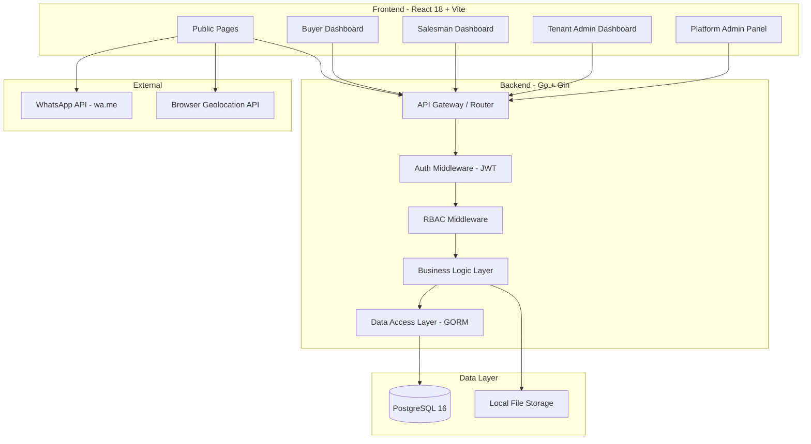
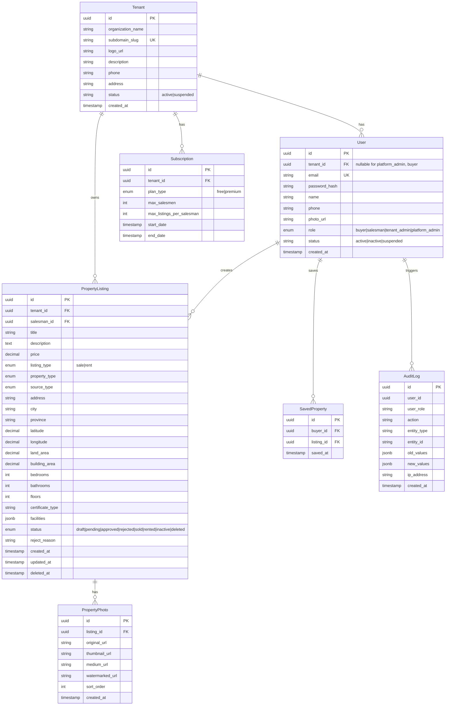
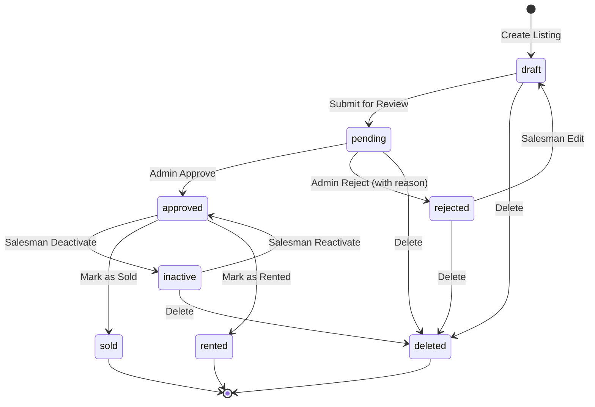
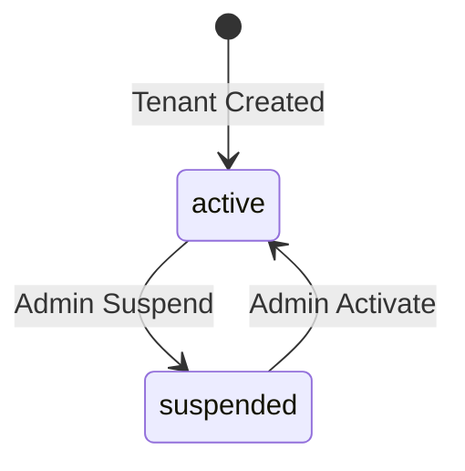
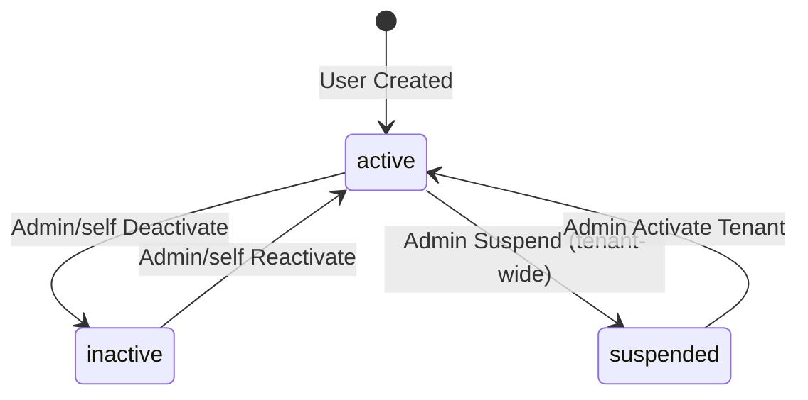

# Software Requirements Specification (SRS) — MVP

## Multi-Tenant Property Information System

| Property          | Value                                     |
| ----------------- | ----------------------------------------- |
| **Project Name**  | Multi-Tenant Property Information System  |
| **Document Type** | Software Requirements Specification (SRS) |
| **Version**       | 1.0.0 MVP                                 |
| **Author**        | System                                    |
| **Date**          | 2026-06-26                                |
| **Status**        | Draft                                     |
| **Reference PRD** | `01-PRD-MVP.md`                           |

---

## 1. Introduction

### 1.1 Purpose

This SRS defines the complete software requirements for the Multi-Tenant Property Information System MVP. It expands the PRD into detailed, testable, and implementable requirements for the development team.

### 1.2 Scope

This document covers:

- System architecture overview
- Detailed functional requirements (FR-XXX)
- Non-functional requirements (NFR-XXX)
- User roles and persona definitions
- Data entities and relationships
- API endpoint inventory
- Business rules

### 1.3 Definitions & Acronyms

| Term               | Definition                                                         |
| ------------------ | ------------------------------------------------------------------ |
| **Tenant**         | An agency, bank, or company organization operating on the platform |
| **Salesman**       | An agent belonging to a tenant who manages property listings       |
| **Buyer/Renter**   | A registered end-user browsing and saving properties               |
| **Guest**          | An unauthenticated visitor                                         |
| **Platform Admin** | Super administrator of the entire platform                         |
| **RBAC**           | Role-Based Access Control                                          |
| **JWT**            | JSON Web Token                                                     |
| **CUD**            | Create, Update, Delete operations                                  |
| **Quota**          | Limit on active listings per salesman based on subscription plan   |

---

## 2. System Architecture Overview

### 2.1 High-Level Architecture

### 2.2 Multi-Tenant Data Isolation

All tenant-scoped tables include `tenant_id` as a foreign key. The API layer enforces `tenant_id` filtering on every query originating from a tenant user (Salesman, Tenant Admin). Platform Admin queries bypass this filter.

---

## 3. User Roles — Detailed Definitions

### 3.1 Guest

| Attribute           | Value                             |
| ------------------- | --------------------------------- |
| **Role Code**       | `guest`                           |
| **Authentication**  | None                              |
| **Access Level**    | Read-only, public data only       |
| **Data Scope**      | Only `status = approved` listings |
| **Onboarding**      | None required                     |
| **Conversion Path** | Register → Buyer/Renter           |

**Capabilities:**

- Browse approved property listings with filters
- View property details with photos and agent info
- Click WhatsApp button to contact sales agent
- Use browser geolocation for nearby properties
- Register as Buyer/Renter

### 3.2 Buyer / Renter

| Attribute          | Value                                                           |
| ------------------ | --------------------------------------------------------------- |
| **Role Code**      | `buyer`                                                         |
| **Authentication** | Email + Password (bcrypt) → JWT                                 |
| **Access Level**   | Authenticated read + personal data write                        |
| **Data Scope**     | Public listings + own saved/bookmarked properties + own profile |
| **Onboarding**     | Self-registration form                                          |

**Capabilities (all Guest capabilities plus):**

- Login / Logout with JWT
- Save / bookmark properties to personal list
- View and manage saved properties list
- View and edit own profile (name, phone, email)

### 3.3 Salesman

| Attribute          | Value                                          |
| ------------------ | ---------------------------------------------- |
| **Role Code**      | `salesman`                                     |
| **Authentication** | Email + Password (bcrypt) → JWT                |
| **Access Level**   | Tenant-scoped CRUD on own listings             |
| **Data Scope**     | Own listings within their tenant + own profile |
| **Onboarding**     | Created by Tenant Admin                        |
| **Quota**          | Max active listings per subscription plan      |

**Capabilities:**

- Login / Logout with JWT
- View personal dashboard with listing stats
- Create property listings (draft)
- Submit listings for approval (pending)
- Upload property photos (auto-watermarked)
- Edit own listings
- Delete / deactivate own listings
- View listing status (draft, pending, approved, rejected, sold, rented, inactive)
- View active listing count vs quota limit
- View and edit own profile

**Constraints:**

- Cannot exceed quota limit (5 active listings on Free plan)
- Cannot modify listings owned by other salesmen
- Cannot modify listings with status `approved` (must contact Platform Admin)
- Cannot access tenant-level admin functions

### 3.4 Tenant Admin / Agency Owner

| Attribute          | Value                           |
| ------------------ | ------------------------------- |
| **Role Code**      | `tenant_admin`                  |
| **Authentication** | Email + Password (bcrypt) → JWT |
| **Access Level**   | Tenant-scoped management        |
| **Data Scope**     | All data within own tenant      |
| **Onboarding**     | Created by Platform Admin       |

**Capabilities (all Salesman capabilities plus):**

- View agency dashboard with all listing stats
- Manage sales team: add salesmen (up to plan limit), remove salesmen, view all salesmen
- View all listings under the tenant (all salesmen)
- Manage tenant profile: logo, name, description, contact info
- View subscription plan details and quota usage
- Request plan upgrade (Free → Premium)

**Constraints:**

- Cannot exceed salesman count per plan (5 on Free plan)
- Cannot manage other tenants
- Cannot approve/reject listings (Platform Admin only)

### 3.5 Platform Admin

| Attribute          | Value                                           |
| ------------------ | ----------------------------------------------- |
| **Role Code**      | `platform_admin`                                |
| **Authentication** | Email + Password (bcrypt) → JWT                 |
| **Access Level**   | Full system access                              |
| **Data Scope**     | All tenants, all listings, all users            |
| **Onboarding**     | Direct database seeding or super-admin creation |

**Capabilities:**

- Login to admin panel
- View all tenants with status (active, suspended)
- Create new tenant accounts
- Suspend / activate tenant accounts
- Approve or reject property listings
- Manage subscription plans (create, edit pricing, features)
- View audit logs for all CUD + approve/reject operations
- View all users across all tenants

**Constraints:**

- Cannot create listings as a salesman (separate role)
- Audit trail records all admin actions

---

## 4. Functional Requirements (FR)

### 4.1 Authentication & Authorization

| ID         | Requirement                                                                                    | Priority | Actor             |
| ---------- | ---------------------------------------------------------------------------------------------- | -------- | ----------------- |
| **FR-A01** | System shall support self-registration for Buyer/Renter role with email, password, name, phone | P0       | Guest → Buyer     |
| **FR-A02** | System shall hash passwords using bcrypt with cost factor 12 before storage                    | P0       | System            |
| **FR-A03** | System shall generate JWT access token on successful login with expiry of 24 hours             | P0       | System            |
| **FR-A04** | System shall validate JWT on every protected endpoint via middleware                           | P0       | System            |
| **FR-A05** | System shall return 401 Unauthorized for missing or invalid JWT                                | P0       | System            |
| **FR-A06** | System shall return 403 Forbidden when user's role lacks permission for the resource           | P0       | System            |
| **FR-A07** | System shall support logout by client-side token discard (stateless JWT)                       | P0       | All authenticated |
| **FR-A08** | Tenant Admin shall be able to create salesman accounts with email, password, name              | P0       | Tenant Admin      |
| **FR-A09** | Platform Admin shall be able to create tenant accounts with org name, admin email, plan        | P0       | Platform Admin    |
| **FR-A10** | Platform Admin shall be able to suspend a tenant, preventing all tenant users from logging in  | P0       | Platform Admin    |
| **FR-A11** | Platform Admin shall be able to re-activate a suspended tenant                                 | P0       | Platform Admin    |

### 4.2 Property Listing Management

| ID         | Requirement                                                                                                                                                                                                                                      | Priority | Actor          |
| ---------- | ------------------------------------------------------------------------------------------------------------------------------------------------------------------------------------------------------------------------------------------------ | -------- | -------------- |
| **FR-L01** | Salesman shall be able to create a listing with: title, description, price, property_type, source_type, address, city, province, latitude, longitude, land_area, building_area, bedrooms, bathrooms, floors, certificate_type, facilities (JSON) | P0       | Salesman       |
| **FR-L02** | New listings shall default to status `draft`                                                                                                                                                                                                     | P0       | System         |
| **FR-L03** | Salesman shall be able to submit a draft listing for review, changing status to `pending`                                                                                                                                                        | P0       | Salesman       |
| **FR-L04** | Salesman shall be able to edit listings with status `draft` or `rejected`                                                                                                                                                                        | P0       | Salesman       |
| **FR-L05** | Salesman shall NOT be able to edit listings with status `pending` or `approved`                                                                                                                                                                  | P0       | System         |
| **FR-L06** | Salesman shall be able to delete (soft delete) listings with status `draft` or `rejected`                                                                                                                                                        | P0       | Salesman       |
| **FR-L07** | Salesman shall be able to deactivate an `approved` listing → status `inactive`                                                                                                                                                                   | P0       | Salesman       |
| **FR-L08** | Salesman shall be able to mark listing as `sold` or `rented`                                                                                                                                                                                     | P0       | Salesman       |
| **FR-L09** | System shall enforce quota: count of listings with status IN (draft, pending, approved) ≤ plan quota                                                                                                                                             | P0       | System         |
| **FR-L10** | System shall prevent quota bypass by counting listings server-side only                                                                                                                                                                          | P0       | System         |
| **FR-L11** | Platform Admin shall be able to view all pending listings across all tenants                                                                                                                                                                     | P0       | Platform Admin |
| **FR-L12** | Platform Admin shall be able to approve a pending listing → status `approved`                                                                                                                                                                    | P0       | Platform Admin |
| **FR-L13** | Platform Admin shall be able to reject a pending listing with a reason → status `rejected`                                                                                                                                                       | P0       | Platform Admin |
| **FR-L14** | Tenant Admin shall be able to view all listings under their tenant with filters by salesman, status                                                                                                                                              | P0       | Tenant Admin   |
| **FR-L15** | Salesman dashboard shall show: total listings, active count, quota remaining, status breakdown                                                                                                                                                   | P0       | Salesman       |

### 4.3 Photo Management

| ID         | Requirement                                                                                  | Priority | Actor    |
| ---------- | -------------------------------------------------------------------------------------------- | -------- | -------- |
| **FR-P01** | Salesman shall be able to upload up to 10 photos per listing                                 | P0       | Salesman |
| **FR-P02** | System shall accept image formats: JPEG, PNG, WebP; max 5 MB per file                        | P0       | System   |
| **FR-P03** | System shall generate thumbnail (400×300) and medium (800×600) versions on upload            | P0       | System   |
| **FR-P04** | System shall apply semi-transparent watermark overlay with tenant name on all listing photos | P0       | System   |
| **FR-P05** | Watermark shall be applied server-side during image processing                               | P0       | System   |
| **FR-P06** | Salesman shall be able to reorder photos                                                     | P1       | Salesman |
| **FR-P07** | Salesman shall be able to delete individual photos                                           | P1       | Salesman |
| **FR-P08** | First photo in order shall serve as the main/cover photo for listing cards                   | P0       | System   |

### 4.4 Public Property Browsing

| ID         | Requirement                                                                                                                                                                                      | Priority | Actor        |
| ---------- | ------------------------------------------------------------------------------------------------------------------------------------------------------------------------------------------------ | -------- | ------------ |
| **FR-B01** | System shall return only `status = approved` listings for unauthenticated and buyer users                                                                                                        | P0       | System       |
| **FR-B02** | System shall support filtering by: property_type, source_type, city, price_min, price_max, listing_type (sale/rent)                                                                              | P0       | Guest, Buyer |
| **FR-B03** | System shall support text search on title and description                                                                                                                                        | P1       | Guest, Buyer |
| **FR-B04** | System shall support pagination with default 20 items per page                                                                                                                                   | P0       | System       |
| **FR-B05** | System shall return total count and page metadata in listing responses                                                                                                                           | P0       | System       |
| **FR-B06** | Property card response shall include: id, title, price, location, property_type, source_type, main_photo_url, salesman_name, salesman_photo_url, salesman_whatsapp, tenant_name, tenant_logo_url | P0       | System       |
| **FR-B07** | System shall accept `latitude`, `longitude`, `radius_km` parameters for nearby property search                                                                                                   | P2       | Guest, Buyer |
| **FR-B08** | System shall return featured properties for "Properti Pilihan di [Lokasi]" carousel filtered by city                                                                                             | P1       | Guest, Buyer |

### 4.5 WhatsApp Integration

| ID         | Requirement                                                                                                          | Priority | Actor        |
| ---------- | -------------------------------------------------------------------------------------------------------------------- | -------- | ------------ |
| **FR-W01** | Each property detail/card shall render a WhatsApp link using `https://wa.me/{phone}?text={encoded_message}`          | P0       | Guest, Buyer |
| **FR-W02** | Pre-filled message format shall be: "Halo, saya tertarik dengan properti {title} yang saya lihat di {platform_name}" | P0       | System       |
| **FR-W03** | WhatsApp number shall be the salesman's phone number from their profile                                              | P0       | System       |
| **FR-W04** | WhatsApp link shall open in new tab (`target="_blank"`)                                                              | P0       | Frontend     |

### 4.6 Buyer/Renter Features

| ID         | Requirement                                                      | Priority | Actor  |
| ---------- | ---------------------------------------------------------------- | -------- | ------ |
| **FR-R01** | Buyer shall be able to save/bookmark a property to personal list | P1       | Buyer  |
| **FR-R02** | Buyer shall be able to remove a saved property from list         | P1       | Buyer  |
| **FR-R03** | Buyer shall be able to view all saved properties with pagination | P1       | Buyer  |
| **FR-R04** | Buyer shall be able to view and edit profile: name, phone, email | P2       | Buyer  |
| **FR-R05** | System shall prevent duplicate saves (same buyer, same property) | P1       | System |

### 4.7 Tenant Management

| ID         | Requirement                                                                                                                         | Priority | Actor          |
| ---------- | ----------------------------------------------------------------------------------------------------------------------------------- | -------- | -------------- |
| **FR-T01** | Platform Admin shall be able to create a new tenant with: organization_name, subdomain_slug, admin_email, admin_password, plan_type | P0       | Platform Admin |
| **FR-T02** | Tenant creation shall auto-create the Tenant Admin user account                                                                     | P0       | System         |
| **FR-T03** | Tenant Admin shall be able to update tenant profile: logo, name, description, phone, address                                        | P0       | Tenant Admin   |
| **FR-T04** | Tenant Admin shall be able to add salesman: name, email, password, phone                                                            | P0       | Tenant Admin   |
| **FR-T05** | System shall enforce max salesman count per plan (5 for Free, unlimited for Premium)                                                | P0       | System         |
| **FR-T06** | Tenant Admin shall be able to remove/deactivate a salesman                                                                          | P0       | Tenant Admin   |
| **FR-T07** | Tenant Admin shall be able to view salesman list with their listing counts                                                          | P0       | Tenant Admin   |
| **FR-T08** | System shall show tenant dashboard: total listings, active listings, salesmen count, quota usage, plan details                      | P0       | Tenant Admin   |

### 4.8 Subscription & Plan Management

| ID         | Requirement                                                                                   | Priority | Actor          |
| ---------- | --------------------------------------------------------------------------------------------- | -------- | -------------- |
| **FR-S01** | System shall define two plans: Free (5 salesmen, 5 listings/salesman) and Premium (unlimited) | P0       | System         |
| **FR-S02** | New tenants shall default to Free plan                                                        | P0       | System         |
| **FR-S03** | Tenant Admin shall be able to view current plan details and quota usage                       | P0       | Tenant Admin   |
| **FR-S04** | Tenant Admin shall be able to request upgrade from Free to Premium                            | P1       | Tenant Admin   |
| **FR-S05** | Platform Admin shall be able to change a tenant's plan type                                   | P1       | Platform Admin |
| **FR-S06** | System shall recalculate quota limits immediately on plan change                              | P1       | System         |

### 4.9 Audit Logging

| ID          | Requirement                                                                                                                                               | Priority | Actor          |
| ----------- | --------------------------------------------------------------------------------------------------------------------------------------------------------- | -------- | -------------- |
| **FR-AL01** | System shall log all CUD operations with: timestamp, user_id, user_role, action, entity_type, entity_id, old_values (JSON), new_values (JSON), ip_address | P1       | System         |
| **FR-AL02** | System shall log all approve/reject listing actions                                                                                                       | P1       | System         |
| **FR-AL03** | System shall log all tenant suspend/activate actions                                                                                                      | P1       | System         |
| **FR-AL04** | Platform Admin shall be able to view audit logs with filters by date range, user, action type                                                             | P1       | Platform Admin |
| **FR-AL05** | Audit logs shall be append-only (immutable after write)                                                                                                   | P1       | System         |

---

## 5. Non-Functional Requirements (NFR)

### 5.1 Performance

| ID          | Requirement                                           | Target                     |
| ----------- | ----------------------------------------------------- | -------------------------- |
| **NFR-P01** | API response time for listing queries (list endpoint) | < 500ms (p95)              |
| **NFR-P02** | API response time for single entity GET               | < 200ms (p95)              |
| **NFR-P03** | Image thumbnail generation                            | < 2 seconds per image      |
| **NFR-P04** | Property search page load time (full page)            | < 3 seconds                |
| **NFR-P05** | Pagination default and max page size                  | Default 20, max 100        |
| **NFR-P06** | Database connection pool                              | Min 10, max 50 connections |
| **NFR-P07** | Concurrent user support (MVP)                         | 100 simultaneous users     |

### 5.2 Security

| ID          | Requirement                                                                |
| ----------- | -------------------------------------------------------------------------- |
| **NFR-S01** | All passwords hashed with bcrypt (cost factor 12)                          |
| **NFR-S02** | All authenticated endpoints behind JWT middleware                          |
| **NFR-S03** | JWT secret stored in environment variable, never hardcoded                 |
| **NFR-S04** | All database queries use parameterized statements (GORM PreparedStatement) |
| **NFR-S05** | Input validation on all request payloads (type, length, format, range)     |
| **NFR-S06** | CORS configured with explicit whitelist, no wildcard `*` in production     |
| **NFR-S07** | No password field in any API response                                      |
| **NFR-S08** | No internal error details exposed in production error responses            |
| **NFR-S09** | Rate limiting on login endpoint (5 attempts per IP per minute)             |
| **NFR-S10** | Photo upload size limit: 5 MB per file                                     |
| **NFR-S11** | Request body size limit: 10 MB                                             |

### 5.3 Reliability & Availability

| ID          | Requirement                                                   | Target                 |
| ----------- | ------------------------------------------------------------- | ---------------------- |
| **NFR-R01** | System uptime                                                 | 99.5% (MVP)            |
| **NFR-R02** | Database transactions for multi-table operations              | Required               |
| **NFR-R03** | Graceful error handling — no panics reaching the client       | Required               |
| **NFR-R04** | Soft delete for all major entities (listings, users, tenants) | Required               |
| **NFR-R05** | Database backups                                              | Daily automated backup |

### 5.4 Scalability

| ID           | Requirement                                                                                 |
| ------------ | ------------------------------------------------------------------------------------------- |
| **NFR-SC01** | Stateless API design — no server-side sessions, JWT only                                    |
| **NFR-SC02** | Multi-tenant isolation via `tenant_id` column on all tenant-scoped tables                   |
| **NFR-SC03** | Image storage path-based; prepared for S3/CDN migration                                     |
| **NFR-SC04** | Database indexes on: tenant_id, status, property_type, source_type, city, price, created_at |

### 5.5 Maintainability

| ID          | Requirement                                                    |
| ----------- | -------------------------------------------------------------- |
| **NFR-M01** | RESTful API design following standard conventions              |
| **NFR-M02** | Consistent error response format (see Error Handling Standard) |
| **NFR-M03** | Code organized by feature/domain modules                       |
| **NFR-M04** | All API endpoints documented                                   |
| **NFR-M05** | Environment-based configuration (dev, staging, production)     |

### 5.6 Usability

| ID          | Requirement                                          |
| ----------- | ---------------------------------------------------- |
| **NFR-U01** | Responsive web design (mobile, tablet, desktop)      |
| **NFR-U02** | Tenant onboarding flow completable in < 5 minutes    |
| **NFR-U03** | Property listing creation completable in < 3 minutes |
| **NFR-U04** | Form validation with inline error messages           |
| **NFR-U05** | Bahasa Indonesia as primary UI language (MVP)        |

---

## 6. Data Entities

### 6.1 Core Entities (Logical)

### 6.2 Entity Status Lifecycle

#### 6.2.1 Listing Status State Machine

#### 6.2.2 Tenant Status

#### 6.2.3 User Status

---

## 7. API Endpoint Inventory

### 7.1 Public Endpoints (No Auth)

| Method | Path                          | Description                                       | FR Ref           |
| ------ | ----------------------------- | ------------------------------------------------- | ---------------- |
| `GET`  | `/api/v1/properties`          | List approved properties with filters, pagination | FR-B01, B02, B04 |
| `GET`  | `/api/v1/properties/:id`      | Get property detail                               | FR-B01           |
| `GET`  | `/api/v1/properties/featured` | Get featured properties by location               | FR-B08           |
| `GET`  | `/api/v1/properties/nearby`   | Get properties near coordinates                   | FR-B07           |
| `POST` | `/api/v1/auth/register`       | Register as Buyer/Renter                          | FR-A01           |
| `POST` | `/api/v1/auth/login`          | Login → JWT                                       | FR-A03           |
| `GET`  | `/api/v1/locations/cities`    | List available cities for filter                  | –                |

### 7.2 Buyer Endpoints

| Method   | Path                           | Description            | FR Ref |
| -------- | ------------------------------ | ---------------------- | ------ |
| `GET`    | `/api/v1/me/profile`           | Get own profile        | –      |
| `PUT`    | `/api/v1/me/profile`           | Update own profile     | FR-R04 |
| `GET`    | `/api/v1/me/saved`             | List saved properties  | FR-R03 |
| `POST`   | `/api/v1/me/saved/:propertyId` | Save/bookmark property | FR-R01 |
| `DELETE` | `/api/v1/me/saved/:propertyId` | Remove saved property  | FR-R02 |

### 7.3 Salesman Endpoints

| Method   | Path                                            | Description                   | FR Ref      |
| -------- | ----------------------------------------------- | ----------------------------- | ----------- |
| `GET`    | `/api/v1/salesman/dashboard`                    | Dashboard stats               | FR-L15      |
| `GET`    | `/api/v1/salesman/listings`                     | List own listings             | –           |
| `POST`   | `/api/v1/salesman/listings`                     | Create listing (draft)        | FR-L01, L02 |
| `GET`    | `/api/v1/salesman/listings/:id`                 | Get own listing detail        | –           |
| `PUT`    | `/api/v1/salesman/listings/:id`                 | Update draft/rejected listing | FR-L04      |
| `DELETE` | `/api/v1/salesman/listings/:id`                 | Soft delete listing           | FR-L06      |
| `POST`   | `/api/v1/salesman/listings/:id/submit`          | Submit for review → pending   | FR-L03      |
| `POST`   | `/api/v1/salesman/listings/:id/deactivate`      | Deactivate → inactive         | FR-L07      |
| `POST`   | `/api/v1/salesman/listings/:id/mark-sold`       | Mark as sold                  | FR-L08      |
| `POST`   | `/api/v1/salesman/listings/:id/mark-rented`     | Mark as rented                | FR-L08      |
| `POST`   | `/api/v1/salesman/listings/:id/photos`          | Upload photos                 | FR-P01      |
| `DELETE` | `/api/v1/salesman/listings/:id/photos/:photoId` | Delete photo                  | FR-P07      |
| `PUT`    | `/api/v1/salesman/listings/:id/photos/reorder`  | Reorder photos                | FR-P06      |
| `GET`    | `/api/v1/salesman/quota`                        | Get quota usage               | FR-L09      |

### 7.4 Tenant Admin Endpoints

| Method   | Path                                  | Description               | FR Ref |
| -------- | ------------------------------------- | ------------------------- | ------ |
| `GET`    | `/api/v1/tenant/dashboard`            | Agency dashboard          | FR-T08 |
| `GET`    | `/api/v1/tenant/profile`              | Get tenant profile        | –      |
| `PUT`    | `/api/v1/tenant/profile`              | Update tenant profile     | FR-T03 |
| `GET`    | `/api/v1/tenant/salesmen`             | List all salesmen         | FR-T07 |
| `POST`   | `/api/v1/tenant/salesmen`             | Add salesman              | FR-T04 |
| `DELETE` | `/api/v1/tenant/salesmen/:id`         | Remove salesman           | FR-T06 |
| `GET`    | `/api/v1/tenant/listings`             | List all tenant listings  | FR-L14 |
| `GET`    | `/api/v1/tenant/subscription`         | View subscription details | FR-S03 |
| `POST`   | `/api/v1/tenant/subscription/upgrade` | Request plan upgrade      | FR-S04 |

### 7.5 Platform Admin Endpoints

| Method | Path                                 | Description                  | FR Ref  |
| ------ | ------------------------------------ | ---------------------------- | ------- |
| `GET`  | `/api/v1/admin/dashboard`            | Platform dashboard           | –       |
| `GET`  | `/api/v1/admin/tenants`              | List all tenants             | –       |
| `POST` | `/api/v1/admin/tenants`              | Create tenant                | FR-T01  |
| `GET`  | `/api/v1/admin/tenants/:id`          | Tenant detail                | –       |
| `POST` | `/api/v1/admin/tenants/:id/suspend`  | Suspend tenant               | FR-A10  |
| `POST` | `/api/v1/admin/tenants/:id/activate` | Activate tenant              | FR-A11  |
| `PUT`  | `/api/v1/admin/tenants/:id/plan`     | Change tenant plan           | FR-S05  |
| `GET`  | `/api/v1/admin/listings/pending`     | List pending listings        | FR-L11  |
| `POST` | `/api/v1/admin/listings/:id/approve` | Approve listing              | FR-L12  |
| `POST` | `/api/v1/admin/listings/:id/reject`  | Reject listing (with reason) | FR-L13  |
| `GET`  | `/api/v1/admin/audit-logs`           | View audit logs              | FR-AL04 |

---

## 8. Business Rules

### 8.1 Quota Enforcement Rules

| Rule       | Description                                                                                                                                       |
| ---------- | ------------------------------------------------------------------------------------------------------------------------------------------------- |
| **BR-Q01** | Quota count = COUNT(listings) WHERE salesman_id = :sid AND status IN ('draft', 'pending', 'approved')                                             |
| **BR-Q02** | Quota check occurs server-side on listing creation and on submit-for-review                                                                       |
| **BR-Q03** | If quota exceeded, return 422 with clear message: "Kuota listing Anda sudah penuh ({current}/{max}). Upgrade ke Premium untuk unlimited listing." |
| **BR-Q04** | `sold`, `rented`, `inactive`, `deleted`, `rejected` statuses do NOT count toward quota                                                            |
| **BR-Q05** | Free plan: max 5 salesmen per tenant, max 5 active listings per salesman                                                                          |
| **BR-Q06** | Premium plan: unlimited salesmen, unlimited active listings per salesman                                                                          |

### 8.2 Approval Workflow Rules

| Rule       | Description                                            |
| ---------- | ------------------------------------------------------ |
| **BR-A01** | Only Platform Admin can approve/reject listings        |
| **BR-A02** | Rejection must include a reason (text, required field) |
| **BR-A03** | Approved listings are immediately publicly visible     |
| **BR-A04** | Rejected listings go back to Salesman for editing      |
| **BR-A05** | Editing a rejected listing resets it to `draft`        |

### 8.3 Tenant Isolation Rules

| Rule       | Description                                                                                    |
| ---------- | ---------------------------------------------------------------------------------------------- |
| **BR-T01** | All tenant-scoped queries MUST filter by `tenant_id` derived from the authenticated user's JWT |
| **BR-T02** | Salesman A in Tenant X cannot see Salesman B's listings in Tenant X (unless Tenant Admin)      |
| **BR-T03** | Tenant Admin can see all listings within their tenant                                          |
| **BR-T04** | Platform Admin queries bypass tenant_id filter                                                 |

---

## 9. Traceability Matrix

### FR → User Story Mapping

| FR ID             | User Story                     | Actor                        |
| ----------------- | ------------------------------ | ---------------------------- |
| FR-A01 ~ FR-A07   | US-B01, US-S01, US-T01, US-P01 | All authenticated            |
| FR-A08            | US-T02                         | Tenant Admin                 |
| FR-A09            | US-P03                         | Platform Admin               |
| FR-A10, FR-A11    | US-P05                         | Platform Admin               |
| FR-L01 ~ FR-L08   | US-S02, US-S04, US-S05, US-S08 | Salesman                     |
| FR-L09, FR-L10    | US-S06, US-S07                 | Salesman                     |
| FR-L11 ~ FR-L13   | US-P04                         | Platform Admin               |
| FR-L14            | US-T04                         | Tenant Admin                 |
| FR-L15            | US-S01                         | Salesman                     |
| FR-P01 ~ FR-P08   | US-S03                         | Salesman                     |
| FR-B01 ~ FR-B08   | US-G01, G02, G03, G06, G07     | Guest, Buyer                 |
| FR-W01 ~ FR-W04   | US-G05                         | Guest, Buyer                 |
| FR-R01 ~ FR-R05   | US-B02, B03, B04               | Buyer                        |
| FR-T01 ~ FR-T08   | US-T02, T03, T05               | Tenant Admin, Platform Admin |
| FR-S01 ~ FR-S06   | US-T06, T07, P06               | Tenant Admin, Platform Admin |
| FR-AL01 ~ FR-AL05 | US-P07                         | Platform Admin               |

---

_Dokumen ini adalah bagian dari Tahap 1. Lanjut ke `03-Permission-Matrix.md`._
