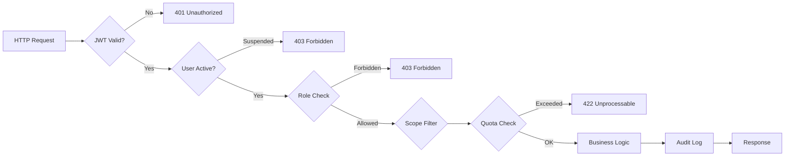

# Permission Matrix — MVP

## Multi-Tenant Property Information System

| Property          | Value                    |
| ----------------- | ------------------------ |
| **Document Type** | Permission Matrix (RBAC) |
| **Version**       | 1.0.0 MVP                |
| **Date**          | 2026-06-26               |
| **Reference**     | `02-SRS-MVP.md`          |

---

## 1. Role Codes

| #   | Role                        | Code             | Scope                       |
| --- | --------------------------- | ---------------- | --------------------------- |
| 1   | Guest                       | `guest`          | Public                      |
| 2   | Buyer / Renter              | `buyer`          | Self                        |
| 3   | Salesman                    | `salesman`       | Tenant-scoped, own listings |
| 4   | Tenant Admin / Agency Owner | `tenant_admin`   | Tenant-scoped, all          |
| 5   | Platform Admin              | `platform_admin` | Global, all                 |

---

## 2. Permission Legend

| Symbol | Meaning                       |
| ------ | ----------------------------- |
| ✅     | Allowed                       |
| ❌     | Forbidden                     |
| 🟡     | Allowed with scope limitation |
| ⚡     | Allowed with quota check      |

---

## 3. Authentication & Session

| Permission        | Guest | Buyer | Salesman | Tenant Admin | Platform Admin |
| ----------------- | ----- | ----- | -------- | ------------ | -------------- |
| Register as Buyer | ✅    | –     | –        | –            | –              |
| Login             | –     | ✅    | ✅       | ✅           | ✅             |
| Logout            | –     | ✅    | ✅       | ✅           | ✅             |
| View own profile  | –     | ✅    | ✅       | ✅           | ✅             |
| Edit own profile  | –     | ✅    | ✅       | ✅           | ✅             |
| Change password   | –     | ✅    | ✅       | ✅           | ✅             |

---

## 4. Property Listings

| Permission                          | Guest | Buyer | Salesman                 | Tenant Admin                       | Platform Admin |
| ----------------------------------- | ----- | ----- | ------------------------ | ---------------------------------- | -------------- |
| **View approved listings (public)** | ✅    | ✅    | ✅                       | ✅                                 | ✅             |
| **View listing detail**             | ✅    | ✅    | ✅                       | ✅                                 | ✅             |
| **Filter & search listings**        | ✅    | ✅    | ✅                       | ✅                                 | ✅             |
| **Create listing**                  | ❌    | ❌    | ⚡ (own)                 | ⚡ (own)                           | ❌             |
| **Edit listing (draft/rejected)**   | ❌    | ❌    | 🟡 (own only)            | 🟡 (any in tenant)                 | ❌             |
| **Edit listing (pending/approved)** | ❌    | ❌    | ❌                       | ❌                                 | ❌             |
| **Delete listing (soft)**           | ❌    | ❌    | 🟡 (own, draft/rejected) | 🟡 (any in tenant, draft/rejected) | ❌             |
| **Submit listing for review**       | ❌    | ❌    | 🟡 (own only)            | 🟡 (any in tenant)                 | ❌             |
| **Deactivate approved listing**     | ❌    | ❌    | 🟡 (own only)            | 🟡 (any in tenant)                 | ❌             |
| **Mark listing as sold/rented**     | ❌    | ❌    | 🟡 (own only)            | 🟡 (any in tenant)                 | ❌             |
| **View own listings**               | ❌    | ❌    | ✅                       | ✅                                 | –              |
| **View all tenant listings**        | ❌    | ❌    | ❌                       | ✅                                 | ✅             |
| **Approve listing**                 | ❌    | ❌    | ❌                       | ❌                                 | ✅             |
| **Reject listing (with reason)**    | ❌    | ❌    | ❌                       | ❌                                 | ✅             |
| **View pending listings (all)**     | ❌    | ❌    | ❌                       | ❌                                 | ✅             |

---

## 5. Photo Management

| Permission                      | Guest | Buyer | Salesman                | Tenant Admin               | Platform Admin |
| ------------------------------- | ----- | ----- | ----------------------- | -------------------------- | -------------- |
| **View photos**                 | ✅    | ✅    | ✅                      | ✅                         | ✅             |
| **Upload photo to own listing** | ❌    | ❌    | 🟡 (own draft/rejected) | 🟡 (tenant draft/rejected) | ❌             |
| **Delete photo from listing**   | ❌    | ❌    | 🟡 (own draft/rejected) | 🟡 (tenant draft/rejected) | ❌             |
| **Reorder photos**              | ❌    | ❌    | 🟡 (own only)           | 🟡 (any in tenant)         | ❌             |
| **Upload tenant logo**          | ❌    | ❌    | ❌                      | ✅                         | ❌             |

---

## 6. Buyer Features

| Permission                 | Guest | Buyer         | Salesman      | Tenant Admin  | Platform Admin |
| -------------------------- | ----- | ------------- | ------------- | ------------- | -------------- |
| **Save/bookmark property** | ❌    | ✅            | ✅            | ✅            | ❌             |
| **Remove saved property**  | ❌    | 🟡 (own only) | 🟡 (own only) | 🟡 (own only) | ❌             |
| **View saved properties**  | ❌    | ✅            | ✅            | ✅            | ❌             |

---

## 7. Tenant Management

| Permission                | Guest | Buyer | Salesman | Tenant Admin    | Platform Admin |
| ------------------------- | ----- | ----- | -------- | --------------- | -------------- |
| **View tenant profile**   | ✅    | ✅    | ✅       | ✅              | ✅             |
| **Edit tenant profile**   | ❌    | ❌    | ❌       | ✅              | ❌             |
| **View salesman list**    | ❌    | ❌    | ❌       | ✅              | ✅             |
| **Add salesman**          | ❌    | ❌    | ❌       | ⚡ (plan limit) | ❌             |
| **Remove salesman**       | ❌    | ❌    | ❌       | ✅              | ❌             |
| **View subscription**     | ❌    | ❌    | ❌       | ✅              | ✅             |
| **Request plan upgrade**  | ❌    | ❌    | ❌       | ✅              | ❌             |
| **View tenant dashboard** | ❌    | ❌    | ❌       | ✅              | ✅             |

---

## 8. Platform Administration

| Permission                    | Guest | Buyer | Salesman | Tenant Admin | Platform Admin |
| ----------------------------- | ----- | ----- | -------- | ------------ | -------------- |
| **Create tenant account**     | ❌    | ❌    | ❌       | ❌           | ✅             |
| **View all tenants**          | ❌    | ❌    | ❌       | ❌           | ✅             |
| **Suspend / activate tenant** | ❌    | ❌    | ❌       | ❌           | ✅             |
| **Change tenant plan**        | ❌    | ❌    | ❌       | ❌           | ✅             |
| **Manage subscription plans** | ❌    | ❌    | ❌       | ❌           | ✅             |
| **View platform dashboard**   | ❌    | ❌    | ❌       | ❌           | ✅             |

---

## 9. Audit & System

| Permission                             | Guest | Buyer | Salesman | Tenant Admin | Platform Admin |
| -------------------------------------- | ----- | ----- | -------- | ------------ | -------------- |
| **View audit logs**                    | ❌    | ❌    | ❌       | ❌           | ✅             |
| **View own listing status history**    | ❌    | ❌    | ✅       | –            | –              |
| **View tenant listing status history** | ❌    | ❌    | ❌       | ✅           | ✅             |

---

## 10. Quota & Limits

| Permission                       | Guest | Buyer | Salesman | Tenant Admin | Platform Admin       |
| -------------------------------- | ----- | ----- | -------- | ------------ | -------------------- |
| **View own quota usage**         | ❌    | ❌    | ✅       | ✅           | –                    |
| **View tenant quota usage**      | ❌    | ❌    | ❌       | ✅           | ✅                   |
| **View all tenants quota usage** | ❌    | ❌    | ❌       | ❌           | ✅                   |
| **Bypass quota limit**           | ❌    | ❌    | ❌       | ❌           | ✅ (via plan change) |

---

## 11. WhatsApp Contact

| Permission                        | Guest | Buyer | Salesman | Tenant Admin | Platform Admin |
| --------------------------------- | ----- | ----- | -------- | ------------ | -------------- |
| **Click WhatsApp button**         | ✅    | ✅    | ✅       | ✅           | ✅             |
| **View salesman WhatsApp number** | ✅    | ✅    | ✅       | ✅           | ✅             |

---

## 12. Scope Limitation Details

### 🟡 "Own Only" — Salesman Scope

A Salesman can only operate on listings where `PropertyListing.salesman_id = authenticated_user.id`. The API middleware enforces this by injecting `WHERE salesman_id = :current_user_id` on all salesman listing queries.

### 🟡 "Any in Tenant" — Tenant Admin Scope

A Tenant Admin can operate on all listings where `PropertyListing.tenant_id = authenticated_user.tenant_id`. No salesman-level restriction.

### ⚡ "Quota Check" — Server-side Enforcement

Before creating or submitting a listing, the system counts active listings (`draft`, `pending`, `approved`) for that salesman and compares against `Subscription.max_listings_per_salesman`. Returns 422 if exceeded.

### 🟡 "Own Saved" — Buyer Scope

A Buyer can only see and remove their own saved/bookmarked properties. `SavedProperty.buyer_id = authenticated_user.id`.

---

## 13. Middleware Enforcement Order

---

_Dokumen ini adalah bagian dari Tahap 1. Lanjut ke `04-Security-Requirements.md`._
