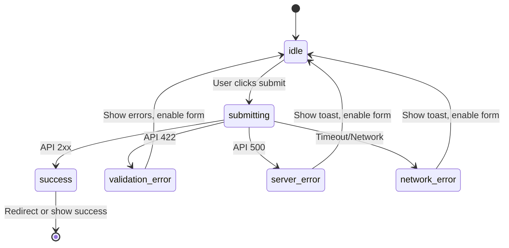

# Error Handling Standard — MVP

## Multi-Tenant Property Information System

| Property          | Value                                          |
| ----------------- | ---------------------------------------------- |
| **Document Type** | Error Handling Standard                        |
| **Version**       | 1.0.0 MVP                                      |
| **Date**          | 2026-06-26                                     |
| **Reference**     | `02-SRS-MVP.md`, `04-Security-Requirements.md` |

---

## 1. Error Response Format

### 1.1 Standard Error Envelope

All error responses use a consistent JSON envelope:

```json
{
  "success": false,
  "error": {
    "code": "ERROR_CODE",
    "message": "Human-readable message in Bahasa Indonesia",
    "details": []
  }
}
```

### 1.2 Field-Level Validation Errors

When validation fails on specific fields, `details` contains an array of field errors:

```json
{
  "success": false,
  "error": {
    "code": "VALIDATION_ERROR",
    "message": "Beberapa field tidak valid. Silakan periksa kembali.",
    "details": [
      {
        "field": "email",
        "message": "Format email tidak valid"
      },
      {
        "field": "password",
        "message": "Password minimal 8 karakter"
      },
      {
        "field": "price",
        "message": "Harga harus berupa angka positif"
      }
    ]
  }
}
```

### 1.3 Success Response Format

```json
{
  "success": true,
  "data": {},
  "meta": {
    "page": 1,
    "per_page": 20,
    "total": 150,
    "total_pages": 8
  }
}
```

---

## 2. HTTP Status Codes

| Status Code | Meaning                | When to Use                                                |
| ----------- | ---------------------- | ---------------------------------------------------------- |
| **200**     | OK                     | Successful GET, PUT, PATCH                                 |
| **201**     | Created                | Successful POST that creates a resource                    |
| **204**     | No Content             | Successful DELETE (no response body)                       |
| **400**     | Bad Request            | Malformed request body, invalid JSON syntax                |
| **401**     | Unauthorized           | Missing or invalid JWT                                     |
| **403**     | Forbidden              | Valid JWT but insufficient role/permission                 |
| **404**     | Not Found              | Resource not found (or filtered out by scope)              |
| **409**     | Conflict               | Duplicate resource (e.g., email already registered)        |
| **413**     | Payload Too Large      | Request body or file exceeds size limit                    |
| **415**     | Unsupported Media Type | Invalid Content-Type header                                |
| **422**     | Unprocessable Entity   | Validation errors, quota exceeded, business rule violation |
| **429**     | Too Many Requests      | Rate limit exceeded                                        |
| **500**     | Internal Server Error  | Unexpected server error                                    |

---

## 3. Error Code Catalog

### 3.1 Authentication Errors (AUTH)

| Code                       | HTTP | Message (Bahasa Indonesia)                                        | Context          |
| -------------------------- | ---- | ----------------------------------------------------------------- | ---------------- |
| `AUTH_INVALID_CREDENTIALS` | 401  | Email atau password salah.                                        | Login failed     |
| `AUTH_TOKEN_MISSING`       | 401  | Token autentikasi diperlukan. Silakan login terlebih dahulu.      | No JWT header    |
| `AUTH_TOKEN_EXPIRED`       | 401  | Sesi Anda telah berakhir. Silakan login kembali.                  | JWT expired      |
| `AUTH_TOKEN_INVALID`       | 401  | Token autentikasi tidak valid.                                    | Bad signature    |
| `AUTH_ACCOUNT_SUSPENDED`   | 403  | Akun organisasi Anda sedang dinonaktifkan. Hubungi administrator. | Tenant suspended |
| `AUTH_ACCOUNT_INACTIVE`    | 403  | Akun Anda tidak aktif. Hubungi administrator.                     | User inactive    |
| `AUTH_EMAIL_REGISTERED`    | 409  | Email sudah terdaftar. Silakan gunakan email lain atau login.     | Duplicate email  |

### 3.2 Authorization Errors (AUTHZ)

| Code                 | HTTP | Message (Bahasa Indonesia)                             | Context              |
| -------------------- | ---- | ------------------------------------------------------ | -------------------- |
| `AUTHZ_FORBIDDEN`    | 403  | Anda tidak memiliki izin untuk mengakses resource ini. | Role mismatch        |
| `AUTHZ_NOT_OWNER`    | 403  | Anda tidak dapat mengubah listing milik sales lain.    | Cross-salesman       |
| `AUTHZ_CROSS_TENANT` | 403  | Data tidak dapat diakses lintas organisasi.            | Cross-tenant attempt |

### 3.3 Validation Errors (VAL)

| Code                      | HTTP | Message (Bahasa Indonesia)                                   | Context                |
| ------------------------- | ---- | ------------------------------------------------------------ | ---------------------- |
| `VAL_INPUT_INVALID`       | 422  | Beberapa field tidak valid. Silakan periksa kembali.         | Generic validation     |
| `VAL_REQUIRED_FIELD`      | 422  | Field {field} wajib diisi.                                   | Missing required field |
| `VAL_INVALID_FORMAT`      | 422  | Format {field} tidak valid.                                  | Wrong format           |
| `VAL_INVALID_ENUM`        | 422  | Nilai {field} tidak valid. Pilihan yang tersedia: {options}. | Enum mismatch          |
| `VAL_OUT_OF_RANGE`        | 422  | Nilai {field} di luar batas ({min} – {max}).                 | Range error            |
| `VAL_STRING_TOO_LONG`     | 422  | {field} maksimal {max} karakter.                             | String length          |
| `VAL_STRING_TOO_SHORT`    | 422  | {field} minimal {min} karakter.                              | String length          |
| `VAL_FILE_TOO_LARGE`      | 413  | Ukuran file maksimal 5 MB per foto.                          | File size              |
| `VAL_FILE_INVALID_TYPE`   | 415  | Format file tidak didukung. Gunakan JPEG, PNG, atau WebP.    | Bad MIME               |
| `VAL_FILE_COUNT_EXCEEDED` | 422  | Maksimal 10 foto per listing.                                | Photo limit            |
| `VAL_JSON_INVALID`        | 400  | Format JSON tidak valid.                                     | Malformed JSON         |

### 3.4 Resource Errors (RES)

| Code                    | HTTP | Message (Bahasa Indonesia)                 | Context              |
| ----------------------- | ---- | ------------------------------------------ | -------------------- |
| `RES_NOT_FOUND`         | 404  | Data tidak ditemukan.                      | Generic not found    |
| `RES_LISTING_NOT_FOUND` | 404  | Listing properti tidak ditemukan.          | Listing ID not found |
| `RES_USER_NOT_FOUND`    | 404  | Pengguna tidak ditemukan.                  | User ID not found    |
| `RES_TENANT_NOT_FOUND`  | 404  | Organisasi tidak ditemukan.                | Tenant ID not found  |
| `RES_ALREADY_SAVED`     | 409  | Properti sudah ada di daftar favorit Anda. | Duplicate save       |
| `RES_ALREADY_EXISTS`    | 409  | Data dengan {field} tersebut sudah ada.    | Generic duplicate    |

### 3.5 Business Rule Errors (BIZ)

| Code                            | HTTP | Message (Bahasa Indonesia)                                                                                            | Context              |
| ------------------------------- | ---- | --------------------------------------------------------------------------------------------------------------------- | -------------------- |
| `BIZ_QUOTA_EXCEEDED`            | 422  | Kuota listing Anda sudah penuh ({current}/{max}). Upgrade ke Premium untuk listing unlimited.                         | Quota limit          |
| `BIZ_SALESMAN_LIMIT`            | 422  | Jumlah salesman sudah mencapai batas ({current}/{max}). Upgrade ke Premium untuk menambah salesman.                   | Salesman limit       |
| `BIZ_LISTING_NOT_EDITABLE`      | 422  | Listing dengan status {status} tidak dapat diedit. Hanya listing dengan status draft atau rejected yang dapat diedit. | Wrong status         |
| `BIZ_LISTING_NOT_DELETABLE`     | 422  | Listing dengan status {status} tidak dapat dihapus.                                                                   | Wrong status         |
| `BIZ_LISTING_NOT_SUBMITTABLE`   | 422  | Hanya listing dengan status draft atau rejected yang dapat diajukan.                                                  | Wrong status         |
| `BIZ_CANNOT_APPROVE_OWN`        | 422  | Anda tidak dapat menyetujui listing dari organisasi sendiri.                                                          | Conflict of interest |
| `BIZ_PLAN_LIMIT_REACHED`        | 422  | Fitur ini hanya tersedia untuk paket Premium. Upgrade sekarang?                                                       | Plan restriction     |
| `BIZ_TENANT_SUSPENDED`          | 403  | Organisasi ini sedang dinonaktifkan. Semua operasi ditangguhkan.                                                      | Tenant suspended     |
| `BIZ_INVALID_STATUS_TRANSITION` | 422  | Tidak dapat mengubah status dari {from} ke {to}.                                                                      | Invalid transition   |
| `BIZ_REJECT_REASON_REQUIRED`    | 422  | Alasan penolakan wajib diisi (minimal 10 karakter).                                                                   | Missing reason       |

### 3.6 Rate Limit Errors (RATE)

| Code                | HTTP | Message (Bahasa Indonesia)                                       | Context           |
| ------------------- | ---- | ---------------------------------------------------------------- | ----------------- |
| `RATE_LOGIN_LIMIT`  | 429  | Terlalu banyak percobaan login. Silakan coba lagi dalam 1 menit. | Login rate limit  |
| `RATE_GLOBAL_LIMIT` | 429  | Terlalu banyak permintaan. Silakan coba lagi nanti.              | Global rate limit |

### 3.7 Server Errors (SRV)

| Code                        | HTTP | Message (Bahasa Indonesia)                                     | Context          |
| --------------------------- | ---- | -------------------------------------------------------------- | ---------------- |
| `SRV_INTERNAL_ERROR`        | 500  | Terjadi kesalahan pada server. Silakan coba lagi nanti.        | Unexpected error |
| `SRV_DATABASE_ERROR`        | 500  | Terjadi kesalahan pada database. Tim kami sedang menanganinya. | DB error         |
| `SRV_FILE_UPLOAD_ERROR`     | 500  | Gagal mengunggah file. Silakan coba lagi.                      | Upload failed    |
| `SRV_FILE_PROCESSING_ERROR` | 500  | Gagal memproses gambar. Pastikan file tidak rusak.             | Image processing |

---

## 4. Error Handling Rules

### 4.1 Production vs Development

| Rule                    | Production            | Development                |
| ----------------------- | --------------------- | -------------------------- |
| Error message detail    | Generic, no internals | Detailed with stack trace  |
| Stack trace in response | ❌ Never              | ✅ Allowed                 |
| SQL query in response   | ❌ Never              | ❌ Never                   |
| File paths in response  | ❌ Never              | ❌ Never                   |
| Debug info header       | ❌                    | ✅ `X-Debug-Info` optional |

### 4.2 Logging Requirements

| Rule        | Detail                                                                         |
| ----------- | ------------------------------------------------------------------------------ |
| **ERR-L01** | All 500 errors must be logged with full stack trace (server-side only)         |
| **ERR-L02** | All 4xx errors logged with request ID, user ID (if authenticated), and context |
| **ERR-L03** | Log level mapping: 5xx → ERROR, 4xx → WARN, validation → INFO                  |
| **ERR-L04** | Never log passwords, JWT tokens, or full credit card numbers                   |
| **ERR-L05** | Log format: `[LEVEL] [timestamp] [request_id] [user_id] message`               |

### 4.3 Panic Recovery

| Rule        | Detail                                                            |
| ----------- | ----------------------------------------------------------------- |
| **ERR-P01** | Gin recovery middleware must catch all panics                     |
| **ERR-P02** | Panic → log full stack trace → return 500 with generic message    |
| **ERR-P03** | After panic recovery, server must continue serving other requests |

---

## 5. Frontend Error Handling

### 5.1 API Error Display

| HTTP Status | Frontend Behavior                                     |
| ----------- | ----------------------------------------------------- |
| 401         | Redirect to login page, clear stored token            |
| 403         | Show toast: "Anda tidak memiliki izin." Stay on page. |
| 404         | Show "Data tidak ditemukan" state (not error toast)   |
| 409         | Show message inline on the conflicting field          |
| 422         | Show field-level validation messages inline           |
| 429         | Show toast with retry countdown                       |
| 500         | Show toast: "Terjadi kesalahan. Silakan coba lagi."   |

### 5.2 Network Error Handling

| Scenario                | Behavior                                                 |
| ----------------------- | -------------------------------------------------------- |
| Network disconnected    | Show toast: "Tidak ada koneksi internet." Retry button.  |
| Request timeout (> 30s) | Show toast: "Server tidak merespons. Silakan coba lagi." |
| CORS error              | Log to console (dev), show generic error toast (prod)    |

### 5.3 Form Submission States



---

## 6. Backend Implementation Pattern (Go/Gin)

### 6.1 Error Helper Functions (Conceptual)

```go
// Conceptual — not actual code
// appError(code, message) → unified error type
// validationError(details) → 422 with field errors
// Wrap all handler errors through centralized error middleware
```

### 6.2 Middleware Stack Order

```mermaid
flowchart LR
    A[Request] --> B[CORS Middleware]
    B --> C[Rate Limit Middleware]
    C --> D[Recovery Middleware]
    D --> E[Request ID Middleware]
    E --> F[Logger Middleware]
    F --> G[JWT Middleware]
    G --> H[RBAC Middleware]
    H --> I[Scope Middleware]
    I --> J[Handler]
    J --> K[Error Middleware]
    K --> L[Response]
```



---

## 7. Error Response Examples

### 7.1 401 — Missing Token

```json
{
  "success": false,
  "error": {
    "code": "AUTH_TOKEN_MISSING",
    "message": "Token autentikasi diperlukan. Silakan login terlebih dahulu.",
    "details": []
  }
}
```

### 7.2 422 — Quota Exceeded

```json
{
  "success": false,
  "error": {
    "code": "BIZ_QUOTA_EXCEEDED",
    "message": "Kuota listing Anda sudah penuh (5/5). Upgrade ke Premium untuk listing unlimited.",
    "details": []
  }
}
```

### 7.3 422 — Validation with Field Details

```json
{
  "success": false,
  "error": {
    "code": "VAL_INPUT_INVALID",
    "message": "Beberapa field tidak valid. Silakan periksa kembali.",
    "details": [
      { "field": "title", "message": "Judul minimal 5 karakter" },
      { "field": "price", "message": "Harga harus berupa angka positif" },
      {
        "field": "property_type",
        "message": "Nilai property_type tidak valid. Pilihan yang tersedia: house, land, apartment, shophouse, warehouse, office, villa"
      }
    ]
  }
}
```

### 7.4 403 — Cross-Tenant Attempt

```json
{
  "success": false,
  "error": {
    "code": "AUTHZ_CROSS_TENANT",
    "message": "Data tidak dapat diakses lintas organisasi.",
    "details": []
  }
}
```

### 7.5 500 — Internal Server Error

```json
{
  "success": false,
  "error": {
    "code": "SRV_INTERNAL_ERROR",
    "message": "Terjadi kesalahan pada server. Silakan coba lagi nanti.",
    "details": []
  }
}
```

### 7.6 429 — Rate Limited

```json
{
  "success": false,
  "error": {
    "code": "RATE_LOGIN_LIMIT",
    "message": "Terlalu banyak percobaan login. Silakan coba lagi dalam 1 menit.",
    "details": []
  }
}
```

---

_Dokumen ini adalah bagian dari Tahap 1. Lanjut ke `06-MVP-Scope-Acceptance.md`._
