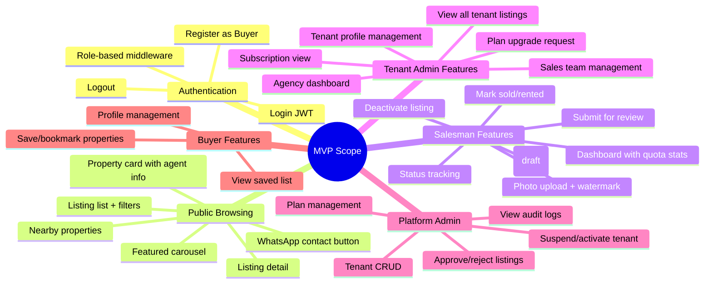

# MVP Scope, Out of Scope & Acceptance Criteria

## Multi-Tenant Property Information System

| Property          | Value                                  |
| ----------------- | -------------------------------------- |
| **Document Type** | Scope Definition + Acceptance Criteria |
| **Version**       | 1.0.0 MVP                              |
| **Date**          | 2026-06-26                             |
| **Reference**     | `01-PRD-MVP.md`, `02-SRS-MVP.md`       |

---

## 1. MVP Scope — Detailed

### 1.1 Core Feature Set

### 1.2 Detailed In-Scope Items

#### 1.2.1 Authentication & User Management

| #   | Item                                                                 | Priority |
| --- | -------------------------------------------------------------------- | -------- |
| 1   | Self-registration for Buyer/Renter with email, password, name, phone | P0       |
| 2   | Login with JWT generation (24h expiry), bcrypt cost 12               | P0       |
| 3   | Logout (client-side token discard)                                   | P0       |
| 4   | JWT middleware on all protected routes                               | P0       |
| 5   | RBAC middleware enforcing 4 authenticated roles                      | P0       |
| 6   | Tenant Admin creates salesman accounts                               | P0       |
| 7   | Platform Admin creates tenant accounts (with auto-created admin)     | P0       |
| 8   | Platform Admin suspends/activates tenants                            | P0       |

#### 1.2.2 Property Listings

| #   | Item                                                                                                                                                                                                            | Priority |
| --- | --------------------------------------------------------------------------------------------------------------------------------------------------------------------------------------------------------------- | -------- |
| 9   | Create listing with: title, description, price, property_type, source_type, listing_type, address, city, province, lat/lng, land_area, building_area, bedrooms, bathrooms, floors, certificate_type, facilities | P0       |
| 10  | 7 property types: house, land, apartment, shophouse, warehouse, office, villa                                                                                                                                   | P0       |
| 11  | 3 source types: regular, bank_auction, company_asset                                                                                                                                                            | P0       |
| 12  | 8 listing statuses: draft, pending, approved, rejected, sold, rented, inactive, deleted                                                                                                                         | P0       |
| 13  | Listing status state machine with transition rules                                                                                                                                                              | P0       |
| 14  | Edit draft/rejected listings                                                                                                                                                                                    | P0       |
| 15  | Soft delete for draft/rejected listings                                                                                                                                                                         | P0       |
| 16  | Submit listing for review (draft → pending)                                                                                                                                                                     | P0       |
| 17  | Deactivate approved listing (approved → inactive)                                                                                                                                                               | P0       |
| 18  | Mark listing as sold/rented                                                                                                                                                                                     | P0       |
| 19  | Salesman dashboard: listing counts by status, quota remaining                                                                                                                                                   | P0       |
| 20  | Tenant Admin: view all tenant listings with filters                                                                                                                                                             | P0       |

#### 1.2.3 Photo Management

| #   | Item                                                               | Priority |
| --- | ------------------------------------------------------------------ | -------- |
| 21  | Upload up to 10 photos per listing (JPEG, PNG, WebP, max 5MB each) | P0       |
| 22  | Server-side watermark overlay with tenant name                     | P0       |
| 23  | Thumbnail generation (400×300) and medium (800×600)                | P0       |
| 24  | First photo = cover photo for cards                                | P0       |
| 25  | Reorder photos                                                     | P1       |
| 26  | Delete individual photos                                           | P1       |
| 27  | Strip EXIF metadata                                                | P0       |
| 28  | UUID-based random filename                                         | P0       |

#### 1.2.4 Public Property Browsing

| #   | Item                                                                                                                        | Priority |
| --- | --------------------------------------------------------------------------------------------------------------------------- | -------- |
| 29  | List approved properties with pagination (default 20/page)                                                                  | P0       |
| 30  | Filter: property_type, source_type, city, price_min, price_max, listing_type                                                | P0       |
| 31  | Text search on title and description                                                                                        | P1       |
| 32  | Property detail view with all photos, description, specs, agent info                                                        | P0       |
| 33  | Property card with: main photo, title, price, location, type badge, source badge, agent photo, tenant logo, WhatsApp button | P0       |
| 34  | Featured properties carousel: "Properti Pilihan di [Kota]"                                                                  | P1       |
| 35  | Nearby properties: browser geolocation + radius filter                                                                      | P2       |

#### 1.2.5 WhatsApp Integration

| #   | Item                                                                                                 | Priority |
| --- | ---------------------------------------------------------------------------------------------------- | -------- |
| 36  | WhatsApp link on every property card and detail page                                                 | P0       |
| 37  | Pre-filled message: "Halo, saya tertarik dengan properti {title} yang saya lihat di {platform_name}" | P0       |
| 38  | Open WhatsApp in new tab                                                                             | P0       |

#### 1.2.6 Buyer Features

| #   | Item                                    | Priority |
| --- | --------------------------------------- | -------- |
| 39  | Save/bookmark property to personal list | P1       |
| 40  | View saved properties with pagination   | P1       |
| 41  | Remove saved property                   | P1       |
| 42  | Prevent duplicate saves                 | P1       |
| 43  | View and edit own profile               | P2       |

#### 1.2.7 Tenant Management

| #   | Item                                                         | Priority |
| --- | ------------------------------------------------------------ | -------- |
| 44  | Agency dashboard: listings, salesmen, quota                  | P0       |
| 45  | Add salesman (enforce plan limits)                           | P0       |
| 46  | Remove/deactivate salesman                                   | P0       |
| 47  | View salesman list with listing counts                       | P0       |
| 48  | Edit tenant profile: logo, name, description, phone, address | P0       |

#### 1.2.8 Subscription & Quota

| #   | Item                                                             | Priority |
| --- | ---------------------------------------------------------------- | -------- |
| 49  | Free plan: max 5 salesmen, max 5 active listings per salesman    | P0       |
| 50  | Premium plan: unlimited salesmen, unlimited listings             | P0       |
| 51  | New tenants default to Free plan                                 | P0       |
| 52  | Server-side quota enforcement on listing creation and submission | P0       |
| 53  | Tenant Admin: view plan details and quota usage                  | P0       |
| 54  | Tenant Admin: request upgrade from Free to Premium               | P1       |
| 55  | Platform Admin: change tenant plan type                          | P1       |

#### 1.2.9 Platform Administration

| #   | Item                                            | Priority |
| --- | ----------------------------------------------- | -------- |
| 56  | View all tenants with status                    | P0       |
| 57  | Create new tenant account                       | P0       |
| 58  | Suspend / activate tenant                       | P0       |
| 59  | View pending listings across all tenants        | P0       |
| 60  | Approve listing (pending → approved)            | P0       |
| 61  | Reject listing with reason (pending → rejected) | P0       |
| 62  | View audit logs                                 | P1       |

#### 1.2.10 Non-Functional

| #   | Item                                                           | Priority |
| --- | -------------------------------------------------------------- | -------- |
| 63  | API response < 500ms (p95) for listing queries                 | P0       |
| 64  | Pagination on all list endpoints                               | P0       |
| 65  | bcrypt password hashing cost 12                                | P0       |
| 66  | JWT authentication with env-variable secret                    | P0       |
| 67  | RBAC on all protected endpoints                                | P0       |
| 68  | CORS whitelist (no `*` in production)                          | P0       |
| 69  | Input validation on all endpoints                              | P0       |
| 70  | Parameterized queries (GORM)                                   | P0       |
| 71  | Audit logging for CUD + approve/reject                         | P1       |
| 72  | Responsive web design (mobile, tablet, desktop)                | P0       |
| 73  | Database transactions for critical operations                  | P0       |
| 74  | Soft delete for major entities                                 | P0       |
| 75  | Consistent error response format (see Error Handling Standard) | P0       |

---

## 2. Out of Scope (Future Phases)

### 2.1 Payment & Monetization

| #     | Item                                                   | Why Out of Scope                | Future Phase |
| ----- | ------------------------------------------------------ | ------------------------------- | ------------ |
| OS-01 | Payment gateway integration (Midtrans, Xendit, Stripe) | Complex integration, regulatory | Phase 2      |
| OS-02 | Automated subscription billing                         | Requires payment gateway        | Phase 2      |
| OS-03 | Invoice generation                                     | Requires payment gateway        | Phase 2      |
| OS-04 | Commission tracking                                    | Requires billing system         | Phase 3      |

### 2.2 Communication

| #     | Item                                                   | Why Out of Scope                 | Future Phase |
| ----- | ------------------------------------------------------ | -------------------------------- | ------------ |
| OS-05 | Real-time chat between buyer and salesman              | High complexity, WebSocket infra | Phase 3      |
| OS-06 | Email notifications (listing approved, rejected, etc.) | Email service integration        | Phase 2      |
| OS-07 | SMS notifications                                      | SMS gateway cost                 | Phase 3      |
| OS-08 | In-app notification center                             | Additional infra                 | Phase 3      |

### 2.3 Advanced Features

| #     | Item                                           | Why Out of Scope             | Future Phase |
| ----- | ---------------------------------------------- | ---------------------------- | ------------ |
| OS-09 | Property comparison (side-by-side)             | Complex UI/UX                | Phase 3      |
| OS-10 | Advanced analytics dashboard (charts, trends)  | Requires data aggregation    | Phase 2      |
| OS-11 | Property visit scheduling / calendar           | Additional domain complexity | Phase 3      |
| OS-12 | Social media sharing (Facebook, Twitter, etc.) | Nice-to-have                 | Phase 2      |
| OS-13 | Property video upload                          | Storage and bandwidth cost   | Phase 3      |
| OS-14 | Virtual tour / 360° view                       | High complexity              | Phase 4      |
| OS-15 | Mortgage calculator (KPR simulator)            | Domain-specific logic        | Phase 3      |
| OS-16 | PDF brochure generation                        | Rendering complexity         | Phase 2      |

### 2.4 Platform

| #     | Item                                    | Why Out of Scope             | Future Phase |
| ----- | --------------------------------------- | ---------------------------- | ------------ |
| OS-17 | Native mobile apps (iOS, Android)       | Separate development track   | Phase 3      |
| OS-18 | Multi-language / i18n                   | Translation infra            | Phase 2      |
| OS-19 | White-label custom domains per tenant   | DNS/proxy complexity         | Phase 3      |
| OS-20 | SSO / OAuth login (Google, Facebook)    | Integration complexity       | Phase 2      |
| OS-21 | Password reset flow (self-service)      | Email integration needed     | Phase 2      |
| OS-22 | Account lockout after N failed attempts | Additional security infra    | Phase 2      |
| OS-23 | JWT refresh token mechanism             | Additional auth complexity   | Phase 2      |
| OS-24 | CDN integration for photos              | Cost, setup complexity       | Phase 2      |
| OS-25 | S3-compatible object storage            | Migration from local storage | Phase 2      |

### 2.5 Data & Reporting

| #     | Item                            | Why Out of Scope       | Future Phase |
| ----- | ------------------------------- | ---------------------- | ------------ |
| OS-26 | Export listings to Excel/CSV    | Reporting feature      | Phase 2      |
| OS-27 | Custom report builder           | Complex query builder  | Phase 4      |
| OS-28 | Data import / bulk upload       | CSV parsing complexity | Phase 3      |
| OS-29 | Automated data backup dashboard | DevOps concern         | Phase 2      |

---

## 3. Acceptance Criteria

### 3.1 Guest User Acceptance

| ID         | Criteria                      | Given                           | When                                | Then                                                             |
| ---------- | ----------------------------- | ------------------------------- | ----------------------------------- | ---------------------------------------------------------------- |
| **AC-G01** | Browse listings without login | Guest visits homepage           | Page loads                          | See paginated list of approved properties                        |
| **AC-G02** | Filter properties             | Guest on listing page           | Applies city + property_type filter | List refreshes with matching results only                        |
| **AC-G03** | View property detail          | Guest clicks a property card    | Detail page loads                   | See all photos, description, specs, agent info, tenant logo      |
| **AC-G04** | WhatsApp contact              | Guest on property detail        | Clicks WhatsApp button              | New tab opens to `wa.me/{agent_phone}` with pre-filled message   |
| **AC-G05** | Register account              | Guest on register page          | Fills form with valid data          | Account created, redirected to login                             |
| **AC-G06** | Register validation           | Guest on register page          | Submits existing email              | See error "Email sudah terdaftar"                                |
| **AC-G07** | Cannot access protected pages | Guest navigates to `/dashboard` | Page attempts to load               | Redirected to login or shown 401                                 |
| **AC-G08** | Featured carousel             | Guest on homepage               | Page loads                          | See "Properti Pilihan di [Kota]" carousel with featured listings |

### 3.2 Buyer Acceptance

| ID         | Criteria               | Given                           | When                        | Then                                                       |
| ---------- | ---------------------- | ------------------------------- | --------------------------- | ---------------------------------------------------------- |
| **AC-B01** | Login success          | Buyer with valid credentials    | Logs in                     | Redirected to homepage, token stored, navbar shows profile |
| **AC-B02** | Login fail             | Buyer with wrong password       | Logs in                     | See "Email atau password salah."                           |
| **AC-B03** | Save property          | Logged-in buyer on detail page  | Clicks "Simpan" / bookmark  | Property added to saved list, button state changes         |
| **AC-B04** | Prevent duplicate save | Buyer on already-saved property | Clicks "Simpan"             | See "Properti sudah ada di daftar favorit Anda."           |
| **AC-B05** | View saved list        | Buyer on saved page             | Page loads                  | See paginated list of saved properties with remove button  |
| **AC-B06** | Remove saved           | Buyer on saved list             | Clicks remove on a property | Property removed from list, count decreases                |
| **AC-B07** | Edit profile           | Buyer on profile page           | Changes phone number, saves | Profile updated, see success message                       |
| **AC-B08** | Token expiry           | Buyer with expired JWT          | Makes API request           | See "Sesi Anda telah berakhir. Silakan login kembali."     |

### 3.3 Salesman Acceptance

| ID         | Criteria                      | Given                            | When                                      | Then                                                                 |
| ---------- | ----------------------------- | -------------------------------- | ----------------------------------------- | -------------------------------------------------------------------- |
| **AC-S01** | Dashboard view                | Logged-in salesman               | Visits dashboard                          | See: total listings, active count, quota remaining, status breakdown |
| **AC-S02** | Create draft listing          | Salesman with quota available    | Fills create form, saves                  | Listing created with status `draft`, quota count increases           |
| **AC-S03** | Quota enforcement             | Salesman at quota limit (5/5)    | Tries to create listing                   | See "Kuota listing Anda sudah penuh (5/5). Upgrade ke Premium..."    |
| **AC-S04** | Submit for review             | Salesman with draft listing      | Clicks "Ajukan Review"                    | Listing status changes to `pending`                                  |
| **AC-S05** | Upload photo                  | Salesman editing draft           | Uploads valid JPEG < 5MB                  | Photo uploaded, watermark applied, thumbnails generated              |
| **AC-S06** | Upload invalid file           | Salesman editing draft           | Uploads PDF file                          | See "Format file tidak didukung. Gunakan JPEG, PNG, atau WebP."      |
| **AC-S07** | Edit draft listing            | Salesman on own draft            | Changes title, saves                      | Listing updated, status remains `draft`                              |
| **AC-S08** | Cannot edit pending           | Salesman on pending listing      | Attempts to edit                          | See "Listing dengan status pending tidak dapat diedit."              |
| **AC-S09** | Delete draft listing          | Salesman on own draft            | Clicks delete, confirms                   | Listing soft-deleted, no longer visible, quota freed                 |
| **AC-S10** | Deactivate approved           | Salesman on own approved listing | Clicks "Nonaktifkan"                      | Status changes to `inactive`, quota freed                            |
| **AC-S11** | Mark as sold                  | Salesman on own approved listing | Clicks "Tandai Terjual"                   | Status changes to `sold`                                             |
| **AC-S12** | Cannot access other's listing | Salesman A                       | Tries to view Salesman B's listing detail | See "Anda tidak dapat mengubah listing milik sales lain."            |

### 3.4 Tenant Admin Acceptance

| ID         | Criteria                    | Given                                 | When                            | Then                                                                    |
| ---------- | --------------------------- | ------------------------------------- | ------------------------------- | ----------------------------------------------------------------------- |
| **AC-T01** | Agency dashboard            | Logged-in tenant admin                | Visits dashboard                | See: total tenant listings, active salesmen, quota usage, plan details  |
| **AC-T02** | Add salesman (within limit) | Tenant admin with 3/5 salesmen        | Adds new salesman               | Salesman created, count becomes 4/5                                     |
| **AC-T03** | Add salesman (at limit)     | Tenant admin with 5/5 salesmen (Free) | Tries to add salesman           | See "Jumlah salesman sudah mencapai batas (5/5). Upgrade ke Premium..." |
| **AC-T04** | Remove salesman             | Tenant admin                          | Removes a salesman              | Salesman deactivated, count decreases                                   |
| **AC-T05** | View all tenant listings    | Tenant admin                          | Visits listings page            | See all listings from all salesmen in tenant                            |
| **AC-T06** | Edit tenant profile         | Tenant admin                          | Uploads new logo, changes phone | Profile updated, new logo appears on property cards                     |
| **AC-T07** | View subscription           | Tenant admin                          | Visits subscription page        | See plan type, quota limits, usage                                      |
| **AC-T08** | Request upgrade             | Tenant admin on Free plan             | Clicks "Upgrade ke Premium"     | Upgrade request submitted, confirmation shown                           |

### 3.5 Platform Admin Acceptance

| ID         | Criteria              | Given                              | When                                    | Then                                                                |
| ---------- | --------------------- | ---------------------------------- | --------------------------------------- | ------------------------------------------------------------------- |
| **AC-P01** | View all tenants      | Logged-in platform admin           | Visits tenants page                     | See list of all tenants with status, plan, created date             |
| **AC-P02** | Create tenant         | Platform admin                     | Fills tenant form, submits              | Tenant created, tenant admin account auto-created                   |
| **AC-P03** | Suspend tenant        | Platform admin on active tenant    | Clicks "Suspend", confirms              | Tenant status → suspended, all tenant users get 403 on next request |
| **AC-P04** | Activate tenant       | Platform admin on suspended tenant | Clicks "Activate", confirms             | Tenant status → active, users can log in again                      |
| **AC-P05** | Approve listing       | Platform admin on pending listing  | Reviews content, clicks "Setujui"       | Listing status → `approved`, publicly visible                       |
| **AC-P06** | Reject listing        | Platform admin on pending listing  | Enters rejection reason, clicks "Tolak" | Listing status → `rejected`, reason saved                           |
| **AC-P07** | Reject without reason | Platform admin                     | Clicks "Tolak" without reason           | See "Alasan penolakan wajib diisi (minimal 10 karakter)."           |
| **AC-P08** | View audit logs       | Platform admin                     | Visits audit log page                   | See paginated list of all CUD + approve/reject actions              |
| **AC-P09** | Change tenant plan    | Platform admin                     | Changes tenant from Free to Premium     | Quota limits updated immediately                                    |

### 3.6 Cross-Cutting Acceptance

| ID         | Criteria                 | Given                        | When                                      | Then                                                                |
| ---------- | ------------------------ | ---------------------------- | ----------------------------------------- | ------------------------------------------------------------------- |
| **AC-X01** | Tenant data isolation    | Salesman from Tenant X       | Queries API for listings                  | Never sees listings from Tenant Y                                   |
| **AC-X02** | CORS enforcement         | Request from unknown origin  | Calls API                                 | CORS error, request blocked                                         |
| **AC-X03** | Rate limit login         | Attacker                     | 6 login attempts in 1 minute from same IP | 6th returns 429 "Terlalu banyak percobaan login."                   |
| **AC-X04** | Password not in response | Any user                     | GET profile or listing with agent         | Response never contains password or password_hash                   |
| **AC-X05** | Soft delete              | Entity deleted               | Check database                            | `deleted_at` timestamp set, row not physically removed              |
| **AC-X06** | Responsive design        | User on mobile (320px width) | Browses site                              | All content accessible, no horizontal scroll                        |
| **AC-X07** | Error consistency        | Any error scenario           | API returns error                         | Response matches error envelope format from Error Handling Standard |
| **AC-X08** | Audit trail              | Any CUD operation            | Check audit log                           | New entry with timestamp, user, action, entity details              |

---

## 4. Priority Classification

### P0 — Must Have (MVP Launch Blocker)

All 48 P0 items from the detailed scope list above. The MVP cannot launch without these.

### P1 — Should Have (MVP, Can Slip Slightly)

- Photo reorder (25)
- Delete individual photos (26)
- Text search on listings (31)
- Featured properties carousel (34)
- Save/bookmark properties (39)
- View saved list (40)
- Remove saved (41)
- Prevent duplicate save (42)
- Tenant upgrade request (54)
- Platform Admin plan change (55)
- Audit logging (62, 71)

### P2 — Nice to Have (MVP if Time Allows)

- Nearby properties (35)
- Buyer profile edit (43)

---

## 5. MVP Exit Criteria (Go/No-Go)

| #   | Criterion                                    | Threshold            | Gate |
| --- | -------------------------------------------- | -------------------- | ---- |
| 1   | All P0 acceptance criteria pass              | 100%                 | Go   |
| 2   | All P1 acceptance criteria pass              | ≥ 90%                | Go   |
| 3   | Zero critical security vulnerabilities       | 0                    | Go   |
| 4   | API response time (listing list)             | p95 < 500ms          | Go   |
| 5   | Property search page load                    | < 3 seconds          | Go   |
| 6   | Cross-tenant isolation test passes           | 100%                 | Go   |
| 7   | Login rate limiting functional               | 5/min enforced       | Go   |
| 8   | All RBAC routes verified                     | 100%                 | Go   |
| 9   | Responsive design on 3 breakpoints           | No horizontal scroll | Go   |
| 10  | Error format consistent across all endpoints | 100% match           | Go   |

---

## 6. Document Traceability

| This Document Section           | References                                                  |
| ------------------------------- | ----------------------------------------------------------- |
| MVP Scope (Sec 1)               | `01-PRD-MVP.md` Sec 2–3, `02-SRS-MVP.md` Sec 4              |
| Out of Scope (Sec 2)            | `01-PRD-MVP.md` Sec 5                                       |
| Acceptance Criteria (Sec 3)     | `02-SRS-MVP.md` Sec 4 (FR-XXX), Sec 9 (Traceability Matrix) |
| Priority Classification (Sec 4) | `01-PRD-MVP.md` Sec 2 (Priority column)                     |
| MVP Exit Criteria (Sec 5)       | `01-PRD-MVP.md` Sec 7 (Success Metrics)                     |

---

_Dokumen ini adalah dokumen terakhir dari Tahap 1._
_Tahap 1 — PRD dan SRS MVP: SELESAI._
_Ketik **LANJUT** untuk masuk ke Tahap 2._
