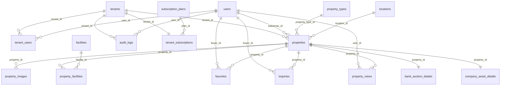

# ERD & Database Schema — Complete

## Multi-Tenant Property Information System

| Property          | Value                            |
| ----------------- | -------------------------------- |
| **Document Type** | Database Schema & ERD            |
| **Version**       | 2.0.0                            |
| **Date**          | 2026-06-26                       |
| **Database**      | PostgreSQL 16                    |
| **ORM**           | GORM                             |
| **Reference**     | `01-PRD-MVP.md`, `02-SRS-MVP.md` |

---

## 1. ERD (Entity Relationship Diagram)



---

## 2. Daftar Tabel (17 Tabel)

| #   | Table                   | Deskripsi                                                      | Baris Estimasi |
| --- | ----------------------- | -------------------------------------------------------------- | -------------- |
| 1   | `tenants`               | Organisasi/agency pengguna platform                            | ~50            |
| 2   | `users`                 | Semua pengguna (buyer, salesman, tenant_admin, platform_admin) | ~2,000         |
| 3   | `tenant_users`          | Relasi many-to-many user↔tenant dengan role                    | ~500           |
| 4   | `subscription_plans`    | Master paket langganan (Free, Premium)                         | ~5             |
| 5   | `tenant_subscriptions`  | Langganan aktif setiap tenant                                  | ~50            |
| 6   | `property_types`        | Master tipe properti (house, land, apartment, dll)             | ~10            |
| 7   | `locations`             | Master lokasi (kota+provinsi)                                  | ~500           |
| 8   | `facilities`            | Master fasilitas (carport, garden, pool, dll)                  | ~30            |
| 9   | `properties`            | Listing properti dari semua tenant                             | ~10,000        |
| 10  | `property_images`       | Foto properti dengan watermark                                 | ~50,000        |
| 11  | `property_facilities`   | Junction: properti↔fasilitas                                   | ~80,000        |
| 12  | `bank_auction_details`  | Detail properti lelang bank (1:1)                              | ~500           |
| 13  | `company_asset_details` | Detail aset properti perusahaan (1:1)                          | ~300           |
| 14  | `inquiries`             | Pesan/pertanyaan buyer tentang properti                        | ~5,000         |
| 15  | `favorites`             | Bookmark properti oleh buyer                                   | ~5,000         |
| 16  | `property_views`        | Log view properti (guest/user)                                 | ~200,000       |
| 17  | `audit_logs`            | Log seluruh aktivitas (append-only)                            | ~100,000       |

---

## 3. Detail Tabel & Kolom

### 3.1 `tenants`

| #   | Column              | Type           | Constraints          | Default             | Deskripsi             |
| --- | ------------------- | -------------- | -------------------- | ------------------- | --------------------- |
| 1   | `id`                | `UUID`         | **PK**               | `gen_random_uuid()` | Primary key           |
| 2   | `organization_name` | `VARCHAR(200)` | **NOT NULL**         | –                   | Nama organisasi       |
| 3   | `subdomain_slug`    | `VARCHAR(100)` | **UNIQUE, NOT NULL** | –                   | Slug unik tenant      |
| 4   | `logo_url`          | `VARCHAR(500)` | –                    | `NULL`              | URL logo              |
| 5   | `whatsapp_number`   | `VARCHAR(20)`  | –                    | `NULL`              | Nomor WhatsApp tenant |
| 6   | `show_whatsapp`     | `BOOLEAN`      | **NOT NULL**         | `true`              | Tampilkan tombol WA?  |
| 7   | `description`       | `TEXT`         | –                    | `NULL`              | Deskripsi organisasi  |
| 8   | `phone`             | `VARCHAR(20)`  | –                    | `NULL`              | Nomor telepon         |
| 9   | `address`           | `TEXT`         | –                    | `NULL`              | Alamat                |
| 10  | `status`            | `VARCHAR(20)`  | **NOT NULL**         | `'active'`          | `active`/`suspended`  |
| 11  | `created_at`        | `TIMESTAMPTZ`  | **NOT NULL**         | `now()`             | Waktu dibuat          |
| 12  | `updated_at`        | `TIMESTAMPTZ`  | –                    | `NULL`              | Waktu update          |
| 13  | `deleted_at`        | `TIMESTAMPTZ`  | –                    | `NULL`              | Soft delete           |

**Enum `status`:** `'active'`, `'suspended'`

### 3.2 `users`

| #   | Column            | Type           | Constraints          | Default             | Deskripsi                                          |
| --- | ----------------- | -------------- | -------------------- | ------------------- | -------------------------------------------------- |
| 1   | `id`              | `UUID`         | **PK**               | `gen_random_uuid()` | Primary key                                        |
| 2   | `email`           | `VARCHAR(255)` | **UNIQUE, NOT NULL** | –                   | Email login                                        |
| 3   | `password_hash`   | `VARCHAR(255)` | **NOT NULL**         | –                   | bcrypt cost 12                                     |
| 4   | `name`            | `VARCHAR(200)` | **NOT NULL**         | –                   | Nama lengkap                                       |
| 5   | `phone`           | `VARCHAR(20)`  | –                    | `NULL`              | Nomor telepon                                      |
| 6   | `photo_url`       | `VARCHAR(500)` | –                    | `NULL`              | URL foto profil                                    |
| 7   | `whatsapp_number` | `VARCHAR(20)`  | –                    | `NULL`              | Nomor WA (bisa beda dr phone)                      |
| 8   | `show_whatsapp`   | `BOOLEAN`      | **NOT NULL**         | `true`              | Tampilkan tombol WA?                               |
| 9   | `role`            | `VARCHAR(20)`  | **NOT NULL**         | –                   | `buyer`/`salesman`/`tenant_admin`/`platform_admin` |
| 10  | `status`          | `VARCHAR(20)`  | **NOT NULL**         | `'active'`          | `active`/`inactive`/`suspended`                    |
| 11  | `created_at`      | `TIMESTAMPTZ`  | **NOT NULL**         | `now()`             | Waktu registrasi                                   |
| 12  | `updated_at`      | `TIMESTAMPTZ`  | –                    | `NULL`              | Waktu update                                       |
| 13  | `deleted_at`      | `TIMESTAMPTZ`  | –                    | `NULL`              | Soft delete                                        |

**Aturan `role` vs `tenant_id` (via `tenant_users`):**

| Role             | Tenant Scope                            |
| ---------------- | --------------------------------------- |
| `buyer`          | Tidak terikat tenant                    |
| `salesman`       | Wajib terikat tenant via `tenant_users` |
| `tenant_admin`   | Wajib terikat tenant via `tenant_users` |
| `platform_admin` | Tidak terikat tenant                    |

### 3.3 `tenant_users`

| #   | Column        | Type          | Constraints                 | Default             | Deskripsi                 |
| --- | ------------- | ------------- | --------------------------- | ------------------- | ------------------------- |
| 1   | `id`          | `UUID`        | **PK**                      | `gen_random_uuid()` | Primary key               |
| 2   | `tenant_id`   | `UUID`        | **FK→tenants.id, NOT NULL** | –                   | Tenant                    |
| 3   | `user_id`     | `UUID`        | **FK→users.id, NOT NULL**   | –                   | User                      |
| 4   | `tenant_role` | `VARCHAR(20)` | **NOT NULL**                | –                   | `tenant_admin`/`salesman` |
| 5   | `created_at`  | `TIMESTAMPTZ` | **NOT NULL**                | `now()`             | Waktu ditambahkan         |

**Unique:** `UNIQUE(tenant_id, user_id)`

### 3.4 `subscription_plans`

| #   | Column                      | Type           | Constraints          | Default             | Deskripsi            |
| --- | --------------------------- | -------------- | -------------------- | ------------------- | -------------------- |
| 1   | `id`                        | `UUID`         | **PK**               | `gen_random_uuid()` | Primary key          |
| 2   | `name`                      | `VARCHAR(100)` | **UNIQUE, NOT NULL** | –                   | Nama paket           |
| 3   | `slug`                      | `VARCHAR(50)`  | **UNIQUE, NOT NULL** | –                   | `free`/`premium`     |
| 4   | `max_salesmen`              | `INTEGER`      | **NOT NULL**         | `5`                 | Max salesman         |
| 5   | `max_listings_per_salesman` | `INTEGER`      | **NOT NULL**         | `5`                 | Max listing/salesman |
| 6   | `description`               | `TEXT`         | –                    | `NULL`              | Deskripsi            |
| 7   | `is_active`                 | `BOOLEAN`      | **NOT NULL**         | `true`              | Tersedia?            |
| 8   | `created_at`                | `TIMESTAMPTZ`  | **NOT NULL**         | `now()`             | Waktu dibuat         |

### 3.5 `tenant_subscriptions`

| #   | Column       | Type          | Constraints                            | Default             | Deskripsi                                        |
| --- | ------------ | ------------- | -------------------------------------- | ------------------- | ------------------------------------------------ |
| 1   | `id`         | `UUID`        | **PK**                                 | `gen_random_uuid()` | Primary key                                      |
| 2   | `tenant_id`  | `UUID`        | **FK→tenants.id, UNIQUE, NOT NULL**    | –                   | Tenant (1:1)                                     |
| 3   | `plan_id`    | `UUID`        | **FK→subscription_plans.id, NOT NULL** | –                   | Paket                                            |
| 4   | `start_date` | `TIMESTAMPTZ` | **NOT NULL**                           | `now()`             | Awal periode                                     |
| 5   | `end_date`   | `TIMESTAMPTZ` | –                                      | `NULL`              | Akhir (NULL=unlimited)                           |
| 6   | `status`     | `VARCHAR(20)` | **NOT NULL**                           | `'active'`          | `active`/`expired`/`cancelled`/`pending_upgrade` |
| 7   | `created_at` | `TIMESTAMPTZ` | **NOT NULL**                           | `now()`             | Waktu dibuat                                     |
| 8   | `updated_at` | `TIMESTAMPTZ` | –                                      | `NULL`              | Waktu update                                     |

### 3.6 `property_types`

| #   | Column        | Type          | Constraints          | Default             | Deskripsi          |
| --- | ------------- | ------------- | -------------------- | ------------------- | ------------------ |
| 1   | `id`          | `UUID`        | **PK**               | `gen_random_uuid()` | Primary key        |
| 2   | `name`        | `VARCHAR(50)` | **UNIQUE, NOT NULL** | –                   | Nama tipe          |
| 3   | `slug`        | `VARCHAR(50)` | **UNIQUE, NOT NULL** | –                   | `house`/`land`/dll |
| 4   | `description` | `TEXT`        | –                    | `NULL`              | Deskripsi          |
| 5   | `is_active`   | `BOOLEAN`     | **NOT NULL**         | `true`              | Tersedia?          |

### 3.7 `locations`

| #   | Column      | Type            | Constraints  | Default             | Deskripsi            |
| --- | ----------- | --------------- | ------------ | ------------------- | -------------------- |
| 1   | `id`        | `UUID`          | **PK**       | `gen_random_uuid()` | Primary key          |
| 2   | `city`      | `VARCHAR(100)`  | **NOT NULL** | –                   | Nama kota            |
| 3   | `province`  | `VARCHAR(100)`  | **NOT NULL** | –                   | Nama provinsi        |
| 4   | `country`   | `VARCHAR(50)`   | **NOT NULL** | `'Indonesia'`       | Negara               |
| 5   | `latitude`  | `DECIMAL(10,7)` | –            | `NULL`              | Koordinat pusat kota |
| 6   | `longitude` | `DECIMAL(10,7)` | –            | `NULL`              | Koordinat pusat kota |
| 7   | `is_active` | `BOOLEAN`       | **NOT NULL** | `true`              | Aktif?               |

**Unique:** `UNIQUE(city, province)`

### 3.8 `facilities`

| #   | Column      | Type           | Constraints          | Default             | Deskripsi          |
| --- | ----------- | -------------- | -------------------- | ------------------- | ------------------ |
| 1   | `id`        | `UUID`         | **PK**               | `gen_random_uuid()` | Primary key        |
| 2   | `name`      | `VARCHAR(100)` | **UNIQUE, NOT NULL** | –                   | Nama fasilitas     |
| 3   | `icon`      | `VARCHAR(50)`  | –                    | `NULL`              | Nama icon (Lucide) |
| 4   | `is_active` | `BOOLEAN`      | **NOT NULL**         | `true`              | Tersedia?          |

### 3.9 `properties`

| #   | Column             | Type            | Constraints                 | Default             | Deskripsi                                |
| --- | ------------------ | --------------- | --------------------------- | ------------------- | ---------------------------------------- |
| 1   | `id`               | `UUID`          | **PK**                      | `gen_random_uuid()` | Primary key                              |
| 2   | `tenant_id`        | `UUID`          | **FK→tenants.id, NOT NULL** | –                   | Tenant pemilik                           |
| 3   | `salesman_id`      | `UUID`          | **FK→users.id, NOT NULL**   | –                   | Salesman pembuat                         |
| 4   | `property_type_id` | `UUID`          | **FK→property_types.id**    | `NULL`              | Tipe properti                            |
| 5   | `location_id`      | `UUID`          | **FK→locations.id**         | `NULL`              | Lokasi                                   |
| 6   | `title`            | `VARCHAR(300)`  | **NOT NULL**                | –                   | Judul listing                            |
| 7   | `description`      | `TEXT`          | –                           | `NULL`              | Deskripsi                                |
| 8   | `price`            | `DECIMAL(16,2)` | **NOT NULL**                | –                   | Harga (IDR)                              |
| 9   | `listing_type`     | `VARCHAR(10)`   | **NOT NULL**                | –                   | `sale`/`rent`                            |
| 10  | `source_type`      | `VARCHAR(20)`   | **NOT NULL**                | `'regular'`         | `regular`/`bank_auction`/`company_asset` |
| 11  | `rent_period`      | `VARCHAR(20)`   | –                           | `NULL`              | `daily`/`monthly`/`yearly`               |
| 12  | `address`          | `TEXT`          | –                           | `NULL`              | Alamat lengkap                           |
| 13  | `latitude`         | `DECIMAL(10,7)` | –                           | `NULL`              | Koordinat                                |
| 14  | `longitude`        | `DECIMAL(10,7)` | –                           | `NULL`              | Koordinat                                |
| 15  | `land_area`        | `DECIMAL(12,2)` | –                           | `NULL`              | Luas tanah (m²)                          |
| 16  | `building_area`    | `DECIMAL(12,2)` | –                           | `NULL`              | Luas bangunan (m²)                       |
| 17  | `bedrooms`         | `INTEGER`       | –                           | `NULL`              | Kamar tidur                              |
| 18  | `bathrooms`        | `INTEGER`       | –                           | `NULL`              | Kamar mandi                              |
| 19  | `floors`           | `INTEGER`       | –                           | `NULL`              | Jumlah lantai                            |
| 20  | `certificate_type` | `VARCHAR(20)`   | –                           | `NULL`              | `SHM`/`SHGB`/`Girik`/`Lainnya`           |
| 21  | `status`           | `VARCHAR(20)`   | **NOT NULL**                | `'draft'`           | Status listing                           |
| 22  | `reject_reason`    | `TEXT`          | –                           | `NULL`              | Alasan penolakan                         |
| 23  | `approved_by`      | `UUID`          | **FK→users.id, nullable**   | `NULL`              | Admin penyetuju                          |
| 24  | `approved_at`      | `TIMESTAMPTZ`   | –                           | `NULL`              | Waktu disetujui                          |
| 25  | `created_at`       | `TIMESTAMPTZ`   | **NOT NULL**                | `now()`             | Waktu dibuat                             |
| 26  | `updated_at`       | `TIMESTAMPTZ`   | –                           | `NULL`              | Waktu update                             |
| 27  | `deleted_at`       | `TIMESTAMPTZ`   | –                           | `NULL`              | Soft delete                              |

### 3.10 `property_images`

| #   | Column                  | Type           | Constraints                    | Default             | Deskripsi                                |
| --- | ----------------------- | -------------- | ------------------------------ | ------------------- | ---------------------------------------- |
| 1   | `id`                    | `UUID`         | **PK**                         | `gen_random_uuid()` | Primary key                              |
| 2   | `property_id`           | `UUID`         | **FK→properties.id, NOT NULL** | –                   | Properti                                 |
| 3   | `file_name`             | `VARCHAR(255)` | –                              | `NULL`              | Nama file asli                           |
| 4   | `image_url`             | `VARCHAR(500)` | **NOT NULL**                   | –                   | URL gambar original                      |
| 5   | `watermarked_image_url` | `VARCHAR(500)` | **NOT NULL**                   | –                   | URL gambar+watermark                     |
| 6   | `watermark_status`      | `VARCHAR(20)`  | **NOT NULL**                   | `'pending'`         | `pending`/`processed`/`failed`/`skipped` |
| 7   | `thumbnail_url`         | `VARCHAR(500)` | –                              | `NULL`              | Thumbnail 150×150                        |
| 8   | `medium_url`            | `VARCHAR(500)` | –                              | `NULL`              | Medium 800×600                           |
| 9   | `is_primary`            | `BOOLEAN`      | **NOT NULL**                   | `false`             | Foto cover?                              |
| 10  | `sort_order`            | `INTEGER`      | **NOT NULL**                   | `0`                 | Urutan tampil                            |
| 11  | `created_at`            | `TIMESTAMPTZ`  | **NOT NULL**                   | `now()`             | Waktu upload                             |

### 3.11 `property_facilities`

| #   | Column        | Type   | Constraints                    | Default             | Deskripsi               |
| --- | ------------- | ------ | ------------------------------ | ------------------- | ----------------------- |
| 1   | `id`          | `UUID` | **PK**                         | `gen_random_uuid()` | Primary key             |
| 2   | `property_id` | `UUID` | **FK→properties.id, NOT NULL** | –                   | Properti                |
| 3   | `facility_id` | `UUID` | **FK→facilities.id, NOT NULL** | –                   | Fasilitas               |
| 4   | `value`       | `TEXT` | –                              | `NULL`              | Nilai (contoh: "2200W") |

**Unique:** `UNIQUE(property_id, facility_id)`

### 3.12 `bank_auction_details`

| #   | Column                 | Type            | Constraints                            | Default             | Deskripsi                                     |
| --- | ---------------------- | --------------- | -------------------------------------- | ------------------- | --------------------------------------------- |
| 1   | `id`                   | `UUID`          | **PK**                                 | `gen_random_uuid()` | Primary key                                   |
| 2   | `property_id`          | `UUID`          | **FK→properties.id, UNIQUE, NOT NULL** | –                   | Properti (1:1)                                |
| 3   | `bank_name`            | `VARCHAR(200)`  | **NOT NULL**                           | –                   | Nama bank                                     |
| 4   | `auction_number`       | `VARCHAR(100)`  | –                                      | `NULL`              | Nomor lelang                                  |
| 5   | `auction_limit_price`  | `DECIMAL(16,2)` | –                                      | `NULL`              | Harga limit                                   |
| 6   | `auction_deposit`      | `DECIMAL(16,2)` | –                                      | `NULL`              | Uang jaminan                                  |
| 7   | `auction_date`         | `TIMESTAMPTZ`   | –                                      | `NULL`              | Tanggal lelang                                |
| 8   | `auction_location`     | `TEXT`          | –                                      | `NULL`              | Lokasi lelang                                 |
| 9   | `auction_document_url` | `VARCHAR(500)`  | –                                      | `NULL`              | URL dokumen                                   |
| 10  | `auction_status`       | `VARCHAR(20)`   | **NOT NULL**                           | `'upcoming'`        | `upcoming`/`open`/`closed`/`cancelled`/`sold` |
| 11  | `notes`                | `TEXT`          | –                                      | `NULL`              | Catatan                                       |
| 12  | `created_at`           | `TIMESTAMPTZ`   | **NOT NULL**                           | `now()`             | Waktu dibuat                                  |
| 13  | `updated_at`           | `TIMESTAMPTZ`   | –                                      | `NULL`              | Waktu update                                  |

### 3.13 `company_asset_details`

| #   | Column                | Type           | Constraints                            | Default             | Deskripsi                                             |
| --- | --------------------- | -------------- | -------------------------------------- | ------------------- | ----------------------------------------------------- |
| 1   | `id`                  | `UUID`         | **PK**                                 | `gen_random_uuid()` | Primary key                                           |
| 2   | `property_id`         | `UUID`         | **FK→properties.id, UNIQUE, NOT NULL** | –                   | Properti (1:1)                                        |
| 3   | `company_name`        | `VARCHAR(200)` | **NOT NULL**                           | –                   | Nama perusahaan                                       |
| 4   | `company_asset_code`  | `VARCHAR(100)` | –                                      | `NULL`              | Kode aset                                             |
| 5   | `disposal_type`       | `VARCHAR(20)`  | **NOT NULL**                           | –                   | `sale`/`rent`/`lease`                                 |
| 6   | `asset_status`        | `VARCHAR(20)`  | **NOT NULL**                           | `'available'`       | `available`/`under_review`/`sold`/`rented`/`inactive` |
| 7   | `pic_name`            | `VARCHAR(200)` | –                                      | `NULL`              | Nama PIC                                              |
| 8   | `pic_phone`           | `VARCHAR(20)`  | –                                      | `NULL`              | Telepon PIC                                           |
| 9   | `pic_whatsapp_number` | `VARCHAR(20)`  | –                                      | `NULL`              | WhatsApp PIC                                          |
| 10  | `document_url`        | `VARCHAR(500)` | –                                      | `NULL`              | URL dokumen                                           |
| 11  | `internal_note`       | `TEXT`         | –                                      | `NULL`              | Catatan internal                                      |
| 12  | `created_at`          | `TIMESTAMPTZ`  | **NOT NULL**                           | `now()`             | Waktu dibuat                                          |
| 13  | `updated_at`          | `TIMESTAMPTZ`  | –                                      | `NULL`              | Waktu update                                          |

### 3.14 `inquiries`

| #   | Column        | Type          | Constraints                    | Default             | Deskripsi                          |
| --- | ------------- | ------------- | ------------------------------ | ------------------- | ---------------------------------- |
| 1   | `id`          | `UUID`        | **PK**                         | `gen_random_uuid()` | Primary key                        |
| 2   | `property_id` | `UUID`        | **FK→properties.id, NOT NULL** | –                   | Properti                           |
| 3   | `buyer_id`    | `UUID`        | **FK→users.id, NOT NULL**      | –                   | Buyer                              |
| 4   | `message`     | `TEXT`        | –                              | `NULL`              | Isi pesan                          |
| 5   | `status`      | `VARCHAR(20)` | **NOT NULL**                   | `'unread'`          | `unread`/`read`/`replied`/`closed` |
| 6   | `created_at`  | `TIMESTAMPTZ` | **NOT NULL**                   | `now()`             | Waktu dikirim                      |
| 7   | `updated_at`  | `TIMESTAMPTZ` | –                              | `NULL`              | Waktu update                       |

### 3.15 `favorites`

| #   | Column        | Type          | Constraints                    | Default             | Deskripsi      |
| --- | ------------- | ------------- | ------------------------------ | ------------------- | -------------- |
| 1   | `id`          | `UUID`        | **PK**                         | `gen_random_uuid()` | Primary key    |
| 2   | `buyer_id`    | `UUID`        | **FK→users.id, NOT NULL**      | –                   | Buyer          |
| 3   | `property_id` | `UUID`        | **FK→properties.id, NOT NULL** | –                   | Properti       |
| 4   | `created_at`  | `TIMESTAMPTZ` | **NOT NULL**                   | `now()`             | Waktu disimpan |

**Unique:** `UNIQUE(buyer_id, property_id)`

### 3.16 `property_views`

| #   | Column        | Type          | Constraints                    | Default             | Deskripsi          |
| --- | ------------- | ------------- | ------------------------------ | ------------------- | ------------------ |
| 1   | `id`          | `UUID`        | **PK**                         | `gen_random_uuid()` | Primary key        |
| 2   | `property_id` | `UUID`        | **FK→properties.id, NOT NULL** | –                   | Properti           |
| 3   | `user_id`     | `UUID`        | **FK→users.id, nullable**      | `NULL`              | User (NULL=guest)  |
| 4   | `ip_address`  | `VARCHAR(45)` | –                              | `NULL`              | IP address         |
| 5   | `user_agent`  | `TEXT`        | –                              | `NULL`              | Browser user agent |
| 6   | `created_at`  | `TIMESTAMPTZ` | **NOT NULL**                   | `now()`             | Waktu view         |

### 3.17 `audit_logs`

| #   | Column         | Type          | Constraints                 | Default             | Deskripsi                                                |
| --- | -------------- | ------------- | --------------------------- | ------------------- | -------------------------------------------------------- |
| 1   | `id`           | `UUID`        | **PK**                      | `gen_random_uuid()` | Primary key                                              |
| 2   | `user_id`      | `UUID`        | **FK→users.id, nullable**   | `NULL`              | Pelaku (NULL=system)                                     |
| 3   | `tenant_id`    | `UUID`        | **FK→tenants.id, nullable** | `NULL`              | Tenant terkait                                           |
| 4   | `action`       | `VARCHAR(50)` | **NOT NULL**                | –                   | Kode aksi                                                |
| 5   | `module`       | `VARCHAR(50)` | **NOT NULL**                | –                   | Modul (`property`/`tenant`/`user`/`subscription`/`auth`) |
| 6   | `reference_id` | `VARCHAR(36)` | **NOT NULL**                | –                   | ID entitas                                               |
| 7   | `description`  | `TEXT`        | –                           | `NULL`              | Deskripsi                                                |
| 8   | `old_data`     | `JSONB`       | –                           | `NULL`              | Data sebelum                                             |
| 9   | `new_data`     | `JSONB`       | –                           | `NULL`              | Data sesudah                                             |
| 10  | `ip_address`   | `VARCHAR(45)` | –                           | `NULL`              | IP address                                               |
| 11  | `user_agent`   | `TEXT`        | –                           | `NULL`              | Browser UA                                               |
| 12  | `created_at`   | `TIMESTAMPTZ` | **NOT NULL**                | `now()`             | Waktu kejadian                                           |

---

## 4. Primary Keys

Semua 17 tabel menggunakan UUID PK dengan default `gen_random_uuid()`.

## 5. Foreign Keys

| #   | Child Table             | FK Column          | Parent Table            | ON DELETE |
| --- | ----------------------- | ------------------ | ----------------------- | --------- |
| 1   | `tenant_users`          | `tenant_id`        | `tenants.id`            | CASCADE   |
| 2   | `tenant_users`          | `user_id`          | `users.id`              | CASCADE   |
| 3   | `tenant_subscriptions`  | `tenant_id`        | `tenants.id`            | CASCADE   |
| 4   | `tenant_subscriptions`  | `plan_id`          | `subscription_plans.id` | RESTRICT  |
| 5   | `properties`            | `tenant_id`        | `tenants.id`            | CASCADE   |
| 6   | `properties`            | `salesman_id`      | `users.id`              | RESTRICT  |
| 7   | `properties`            | `property_type_id` | `property_types.id`     | SET NULL  |
| 8   | `properties`            | `location_id`      | `locations.id`          | SET NULL  |
| 9   | `properties`            | `approved_by`      | `users.id`              | SET NULL  |
| 10  | `property_images`       | `property_id`      | `properties.id`         | CASCADE   |
| 11  | `property_facilities`   | `property_id`      | `properties.id`         | CASCADE   |
| 12  | `property_facilities`   | `facility_id`      | `facilities.id`         | RESTRICT  |
| 13  | `bank_auction_details`  | `property_id`      | `properties.id`         | CASCADE   |
| 14  | `company_asset_details` | `property_id`      | `properties.id`         | CASCADE   |
| 15  | `inquiries`             | `property_id`      | `properties.id`         | CASCADE   |
| 16  | `inquiries`             | `buyer_id`         | `users.id`              | CASCADE   |
| 17  | `favorites`             | `buyer_id`         | `users.id`              | CASCADE   |
| 18  | `favorites`             | `property_id`      | `properties.id`         | CASCADE   |
| 19  | `property_views`        | `property_id`      | `properties.id`         | CASCADE   |
| 20  | `property_views`        | `user_id`          | `users.id`              | SET NULL  |
| 21  | `audit_logs`            | `user_id`          | `users.id`              | SET NULL  |
| 22  | `audit_logs`            | `tenant_id`        | `tenants.id`            | SET NULL  |

## 6. Unique Constraints

| #   | Table                   | Column(s)                    | Keterangan                  |
| --- | ----------------------- | ---------------------------- | --------------------------- |
| 1   | `tenants`               | `subdomain_slug`             | Slug unik                   |
| 2   | `users`                 | `email`                      | Email unik                  |
| 3   | `tenant_users`          | `(tenant_id, user_id)`       | 1 user 1 role per tenant    |
| 4   | `subscription_plans`    | `name`                       | Nama paket unik             |
| 5   | `subscription_plans`    | `slug`                       | Slug paket unik             |
| 6   | `tenant_subscriptions`  | `tenant_id`                  | 1 tenant 1 subscription     |
| 7   | `property_types`        | `name`                       | Nama tipe unik              |
| 8   | `property_types`        | `slug`                       | Slug tipe unik              |
| 9   | `locations`             | `(city, province)`           | Kombinasi unik              |
| 10  | `facilities`            | `name`                       | Nama fasilitas unik         |
| 11  | `property_facilities`   | `(property_id, facility_id)` | 1 fasilitas 1× per properti |
| 12  | `bank_auction_details`  | `property_id`                | 1:1 dengan properti         |
| 13  | `company_asset_details` | `property_id`                | 1:1 dengan properti         |
| 14  | `favorites`             | `(buyer_id, property_id)`    | Anti-duplikat               |

## 7. Indexes

| #   | Table             | Column(s)                          | Type       | Tujuan             |
| --- | ----------------- | ---------------------------------- | ---------- | ------------------ |
| 1   | `properties`      | `(tenant_id, status)`              | B-tree     | Quota check        |
| 2   | `properties`      | `(status, location_id)`            | B-tree     | Browse by location |
| 3   | `properties`      | `(status, property_type_id)`       | B-tree     | Filter type        |
| 4   | `properties`      | `(status, source_type)`            | B-tree     | Filter source      |
| 5   | `properties`      | `(status, price)`                  | B-tree     | Price range        |
| 6   | `properties`      | `(status, created_at DESC)`        | B-tree     | Default sort       |
| 7   | `properties`      | `(latitude, longitude)`            | GiST       | Nearby search      |
| 8   | `properties`      | `(tenant_id, salesman_id, status)` | B-tree     | Salesman quota     |
| 9   | `properties`      | `(title, description)`             | GIN (trgm) | Text search        |
| 10  | `tenant_users`    | `(tenant_id, tenant_role)`         | B-tree     | List salesman      |
| 11  | `property_images` | `(property_id, is_primary)`        | B-tree     | Cover photo        |
| 12  | `property_images` | `(property_id, sort_order)`        | B-tree     | Gallery order      |
| 13  | `favorites`       | `(buyer_id, created_at DESC)`      | B-tree     | Saved list         |
| 14  | `property_views`  | `(property_id, created_at DESC)`   | B-tree     | View count         |
| 15  | `audit_logs`      | `(created_at DESC)`                | B-tree     | Chronological      |
| 16  | `audit_logs`      | `(module, reference_id)`           | B-tree     | Entity trail       |
| 17  | `audit_logs`      | `(user_id, created_at DESC)`       | B-tree     | User trail         |
| 18  | `audit_logs`      | `(tenant_id, created_at DESC)`     | B-tree     | Tenant trail       |

---

## 8. Enum Statuses — Rangkuman

| Tabel                   | Kolom              | Nilai                                                                                                                                                                                                                                                                                                       |
| ----------------------- | ------------------ | ----------------------------------------------------------------------------------------------------------------------------------------------------------------------------------------------------------------------------------------------------------------------------------------------------------- |
| `tenants`               | `status`           | `active`, `suspended`                                                                                                                                                                                                                                                                                       |
| `users`                 | `role`             | `buyer`, `salesman`, `tenant_admin`, `platform_admin`                                                                                                                                                                                                                                                       |
| `users`                 | `status`           | `active`, `inactive`, `suspended`                                                                                                                                                                                                                                                                           |
| `tenant_users`          | `tenant_role`      | `tenant_admin`, `salesman`                                                                                                                                                                                                                                                                                  |
| `tenant_subscriptions`  | `status`           | `active`, `expired`, `cancelled`, `pending_upgrade`                                                                                                                                                                                                                                                         |
| `properties`            | `status`           | `draft`, `pending`, `approved`, `rejected`, `sold`, `rented`, `inactive`, `deleted`                                                                                                                                                                                                                         |
| `properties`            | `listing_type`     | `sale`, `rent`                                                                                                                                                                                                                                                                                              |
| `properties`            | `source_type`      | `regular`, `bank_auction`, `company_asset`                                                                                                                                                                                                                                                                  |
| `properties`            | `rent_period`      | `daily`, `monthly`, `yearly`                                                                                                                                                                                                                                                                                |
| `properties`            | `certificate_type` | `SHM`, `SHGB`, `Girik`, `Lainnya`                                                                                                                                                                                                                                                                           |
| `property_images`       | `watermark_status` | `pending`, `processed`, `failed`, `skipped`                                                                                                                                                                                                                                                                 |
| `bank_auction_details`  | `auction_status`   | `upcoming`, `open`, `closed`, `cancelled`, `sold`                                                                                                                                                                                                                                                           |
| `company_asset_details` | `disposal_type`    | `sale`, `rent`, `lease`                                                                                                                                                                                                                                                                                     |
| `company_asset_details` | `asset_status`     | `available`, `under_review`, `sold`, `rented`, `inactive`                                                                                                                                                                                                                                                   |
| `inquiries`             | `status`           | `unread`, `read`, `replied`, `closed`                                                                                                                                                                                                                                                                       |
| `audit_logs`            | `action`           | `CREATE_PROPERTY`, `UPDATE_PROPERTY`, `DELETE_PROPERTY`, `SUBMIT_PROPERTY`, `APPROVE_PROPERTY`, `REJECT_PROPERTY`, `CREATE_TENANT`, `UPDATE_TENANT`, `SUSPEND_TENANT`, `ACTIVATE_TENANT`, `INVITE_SALESMAN`, `DEACTIVATE_SALESMAN`, `UPDATE_SUBSCRIPTION`, `LOGIN_FAILED`, `LOGIN_SUCCESS`, `REGISTER_USER` |
| `audit_logs`            | `module`           | `property`, `tenant`, `user`, `subscription`, `auth`                                                                                                                                                                                                                                                        |

---

## 9. Relasi Antar Tabel

```
tenants 1──N tenant_users N──1 users
tenants 1──1 tenant_subscriptions N──1 subscription_plans
tenants 1──N properties N──1 users (salesman)
properties N──1 property_types
properties N──1 locations
properties 1──N property_images
properties 1──N property_facilities N──1 facilities
properties 1──0..1 bank_auction_details (source_type=bank_auction)
properties 1──0..1 company_asset_details (source_type=company_asset)
users (buyer) 1──N favorites N──1 properties
users (buyer) 1──N inquiries N──1 properties
users 1──N property_views N──1 properties
users 1──N audit_logs
tenants 1──N audit_logs
```

---

## 10. Business Rules

| ID    | Aturan                                                          |
| ----- | --------------------------------------------------------------- |
| BR-01 | Soft delete via `deleted_at` untuk tenants, users, properties   |
| BR-02 | Free plan: max 5 salesman aktif, max 5 listing aktif/salesman   |
| BR-03 | Premium plan: unlimited salesman & listing                      |
| BR-04 | Status `sold`/`rented`/`inactive`/`deleted` tidak hitung kuota  |
| BR-05 | Max 10 foto per properti (aplikasi)                             |
| BR-06 | Email unik global (`users.email` UNIQUE)                        |
| BR-07 | Subdomain unik (`tenants.subdomain_slug` UNIQUE)                |
| BR-08 | `bank_auction_details` hanya untuk `source_type=bank_auction`   |
| BR-09 | `company_asset_details` hanya untuk `source_type=company_asset` |
| BR-10 | Property approved: title/price/source_type tidak bisa diubah    |
| BR-11 | Tenant suspended → semua listing jadi inactive                  |
| BR-12 | Audit logs append-only (no UPDATE/DELETE)                       |
| BR-13 | `old_data` NULL saat create, `new_data` NULL saat delete        |

---

## 11. Seed Data

### Seed Order

```
01. subscription_plans (free + premium)
02. property_types (7 tipe)
03. facilities (15 fasilitas)
04. locations (8 kota)
05. tenants (PropertiJaya demo)
06. users (admin + tenant_admin + salesman + buyer)
07. tenant_users (2 relasi)
08. tenant_subscriptions (free untuk PropertiJaya)
09. properties (regular + bank_auction + company_asset)
10. bank_auction_details
11. company_asset_details
12. property_images
13. property_facilities
14. inquiries
15. favorites
16. property_views
17. audit_logs
```

### Akun Demo

| Role           | Email                  | Password    |
| -------------- | ---------------------- | ----------- |
| Platform Admin | `admin@propertyhub.id` | `Admin@123` |
| Tenant Admin   | `budi@propertijaya.id` | `Budi@123`  |
| Salesman       | `andi@propertijaya.id` | `Andi@123`  |
| Buyer          | `rina@email.com`       | `Rina@123`  |

---

## 12. Migration Order

```
Phase 1 — Master (no FK):
  01. subscription_plans
  02. property_types
  03. facilities
  04. locations
  05. tenants
  06. users

Phase 2 — Junction + Subscription:
  07. tenant_users
  08. tenant_subscriptions

Phase 3 — Properties:
  09. properties

Phase 4 — Detail:
  10. property_images
  11. property_facilities
  12. bank_auction_details
  13. company_asset_details

Phase 5 — Interactions:
  14. inquiries
  15. favorites
  16. property_views

Phase 6 — Audit:
  17. audit_logs
```

---

## 13. Seed Order

Sama dengan §11 — seed data harus di-insert dengan urutan yang menghormati FK constraints.

---

**📄 Phase 2 complete.** 17 tabel, 22 FK, 14 unique constraints, 18 indexes, 16 enum groups, 13 business rules. Siap lanjut ke Phase 3 (API Contract).
