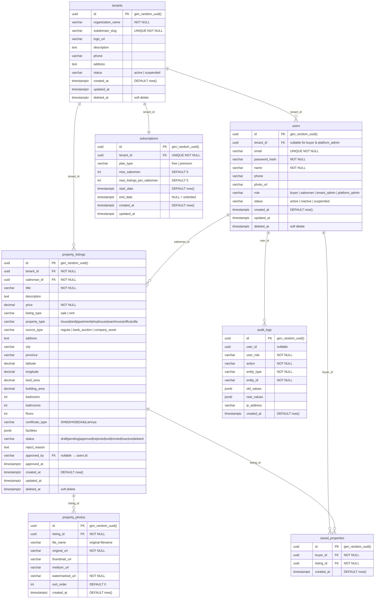
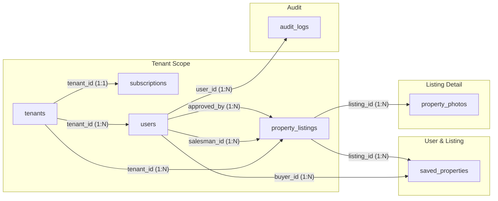

# ERD & Database Schema — Complete

## Multi-Tenant Property Information System

| Property          | Value                            |
| ----------------- | -------------------------------- |
| **Document Type** | Database Schema & ERD            |
| **Version**       | 2.0.0                            |
| **Date**          | 2026-06-26                       |
| **Database**      | PostgreSQL 16                    |
| **ORM**           | GORM                             |
| **Reference**     | `01-PRD-MVP.md`, `02-SRS-MVP.md` |

---

## 1. ERD (Entity Relationship Diagram)

```mermaid
erDiagram
    %% ── Core ──
    tenants ||--o{ tenant_users : "tenant_id"
    tenants ||--o{ properties : "tenant_id"
    tenants ||--o{ audit_logs : "tenant_id"
    tenants ||--|| tenant_subscriptions : "tenant_id"

    users ||--o{ tenant_users : "user_id"
    users ||--o{ properties : "salesman_id"
    users ||--o{ properties : "approved_by"
    users ||--o{ favorites : "buyer_id"
    users ||--o{ inquiries : "buyer_id"
    users ||--o{ property_views : "user_id"
    users ||--o{ audit_logs : "user_id"

    subscription_plans ||--o{ tenant_subscriptions : "plan_id"

    %% ── Property detail ──
    properties ||--o{ property_images : "property_id"
    properties ||--o{ property_facilities : "property_id"
    properties ||--o{ favorites : "property_id"
    properties ||--o{ inquiries : "property_id"
    properties ||--o{ property_views : "property_id"
    properties ||--|| bank_auction_details : "property_id"
    properties ||--|| company_asset_details : "property_id"

    property_types ||--o{ properties : "property_type_id"
    locations ||--o{ properties : "location_id"
    facilities ||--o{ property_facilities : "facility_id"

    tenants {
        uuid id PK
        varchar organization_name
        varchar subdomain_slug UK
        varchar logo_url
        varchar whatsapp_number
        boolean show_whatsapp
        text description
        varchar phone
        text address
        varchar status
        timestamptz created_at
        timestamptz updated_at
        timestamptz deleted_at
    }

    users {
        uuid id PK
        varchar email UK
        varchar password_hash
        varchar name
        varchar phone
        varchar photo_url
        varchar whatsapp_number
        boolean show_whatsapp
        varchar role
        varchar status
        timestamptz created_at
        timestamptz updated_at
        timestamptz deleted_at
    }

    tenant_users {
        uuid id PK
        uuid tenant_id FK
        uuid user_id FK
        varchar tenant_role
        timestamptz created_at
    }

    subscription_plans {
        uuid id PK
        varchar name UK
        varchar slug UK
        int max_salesmen
        int max_listings_per_salesman
        text description
        boolean is_active
        timestamptz created_at
    }

    tenant_subscriptions {
        uuid id PK
        uuid tenant_id FK_UK
        uuid plan_id FK
        timestamptz start_date
        timestamptz end_date
        varchar status
        timestamptz created_at
        timestamptz updated_at
    }

    property_types {
        uuid id PK
        varchar name UK
        varchar slug UK
        text description
        boolean is_active
    }

    locations {
        uuid id PK
        varchar city
        varchar province
        varchar country
        decimal latitude
        decimal longitude
        boolean is_active
    }

    facilities {
        uuid id PK
        varchar name UK
        varchar icon
        boolean is_active
    }

    properties {
        uuid id PK
        uuid tenant_id FK
        uuid salesman_id FK
        uuid property_type_id FK
        uuid location_id FK
        varchar title
        text description
        decimal price
        varchar listing_type
        varchar source_type
        varchar rent_period
        text address
        decimal latitude
        decimal longitude
        decimal land_area
        decimal building_area
        int bedrooms
        int bathrooms
        int floors
        varchar certificate_type
        varchar status
        text reject_reason
        uuid approved_by FK
        timestamptz approved_at
        timestamptz created_at
        timestamptz updated_at
        timestamptz deleted_at
    }

    property_images {
        uuid id PK
        uuid property_id FK
        varchar file_name
        varchar image_url
        varchar watermarked_image_url
        varchar watermark_status
        varchar thumbnail_url
        varchar medium_url
        boolean is_primary
        int sort_order
        timestamptz created_at
    }

    property_facilities {
        uuid id PK
        uuid property_id FK
        uuid facility_id FK
        text value
    }

    bank_auction_details {
        uuid id PK
        uuid property_id FK_UK
        varchar bank_name
        varchar auction_number
        decimal auction_limit_price
        decimal auction_deposit
        timestamptz auction_date
        text auction_location
        varchar auction_document_url
        varchar auction_status
        text notes
        timestamptz created_at
        timestamptz updated_at
    }

    company_asset_details {
        uuid id PK
        uuid property_id FK_UK
        varchar company_name
        varchar company_asset_code
        varchar disposal_type
        varchar asset_status
        varchar pic_name
        varchar pic_phone
        varchar pic_whatsapp_number
        varchar document_url
        text internal_note
        timestamptz created_at
        timestamptz updated_at
    }

    inquiries {
        uuid id PK
        uuid property_id FK
        uuid buyer_id FK
        text message
        varchar status
        timestamptz created_at
        timestamptz updated_at
    }

    favorites {
        uuid id PK
        uuid buyer_id FK
        uuid property_id FK
        timestamptz created_at
    }

    property_views {
        uuid id PK
        uuid property_id FK
        uuid user_id FK "nullable"
        varchar ip_address
        varchar user_agent
        timestamptz created_at
    }

    audit_logs {
        uuid id PK
        uuid user_id FK "nullable"
        uuid tenant_id FK "nullable"
        varchar action
        varchar module
        varchar reference_id
        text description
        jsonb old_data
        jsonb new_data
        varchar ip_address
        varchar user_agent
        timestamptz created_at
    }
```

This is a preview of the new content. The full document is being generated and will be written in the next step.

| Property          | Value                                 |
| ----------------- | ------------------------------------- |
| **Document Type** | Database Schema & ERD                 |
| **Version**       | 1.0.0 MVP                             |
| **Date**          | 2026-06-26                            |
| **Database**      | PostgreSQL 16                         |
| **ORM**           | GORM                                  |
| **Reference**     | `02-SRS-MVP.md` Sec 6 (Data Entities) |

---

## 1. ERD (Entity Relationship Diagram)



---

## 2. Daftar Tabel

| #   | Table               | Deskripsi                                                      | Baris Estimasi (MVP) |
| --- | ------------------- | -------------------------------------------------------------- | -------------------- |
| 1   | `tenants`           | Organisasi/agency yang menggunakan platform                    | ~50                  |
| 2   | `users`             | Semua pengguna (buyer, salesman, tenant_admin, platform_admin) | ~2,000               |
| 3   | `subscriptions`     | Paket langganan per tenant (1:1)                               | ~50                  |
| 4   | `property_listings` | Listing properti dari semua tenant                             | ~10,000              |
| 5   | `property_photos`   | Foto properti (max 10 per listing)                             | ~50,000              |
| 6   | `saved_properties`  | Properti yang disimpan/bookmark oleh buyer                     | ~5,000               |
| 7   | `audit_logs`        | Log semua operasi CUD + approve/reject                         | ~100,000             |

---

## 3. Detail Tabel

### 3.1 `tenants`

| #   | Column              | Type           | Constraints          | Default             | Deskripsi                           |
| --- | ------------------- | -------------- | -------------------- | ------------------- | ----------------------------------- |
| 1   | `id`                | `UUID`         | **PK**               | `gen_random_uuid()` | Primary key                         |
| 2   | `organization_name` | `VARCHAR(200)` | **NOT NULL**         | –                   | Nama organisasi                     |
| 3   | `subdomain_slug`    | `VARCHAR(100)` | **UNIQUE, NOT NULL** | –                   | Slug unik untuk identifikasi tenant |
| 4   | `logo_url`          | `VARCHAR(500)` | –                    | `NULL`              | URL logo tenant                     |
| 5   | `description`       | `TEXT`         | –                    | `NULL`              | Deskripsi singkat organisasi        |
| 6   | `phone`             | `VARCHAR(20)`  | –                    | `NULL`              | Nomor telepon tenant                |
| 7   | `address`           | `TEXT`         | –                    | `NULL`              | Alamat tenant                       |
| 8   | `status`            | `VARCHAR(20)`  | **NOT NULL**         | `'active'`          | `active` / `suspended`              |
| 9   | `created_at`        | `TIMESTAMPTZ`  | **NOT NULL**         | `now()`             | Waktu dibuat                        |
| 10  | `updated_at`        | `TIMESTAMPTZ`  | –                    | `NULL`              | Waktu update terakhir               |
| 11  | `deleted_at`        | `TIMESTAMPTZ`  | –                    | `NULL`              | Soft delete (GORM)                  |

**Enum:** `status` → `'active'`, `'suspended'`

---

### 3.2 `users`

| #   | Column          | Type           | Constraints                   | Default             | Deskripsi                                  |
| --- | --------------- | -------------- | ----------------------------- | ------------------- | ------------------------------------------ |
| 1   | `id`            | `UUID`         | **PK**                        | `gen_random_uuid()` | Primary key                                |
| 2   | `tenant_id`     | `UUID`         | **FK → tenants.id**, nullable | `NULL`              | Tenant (NULL untuk buyer & platform_admin) |
| 3   | `email`         | `VARCHAR(255)` | **UNIQUE, NOT NULL**          | –                   | Email login                                |
| 4   | `password_hash` | `VARCHAR(255)` | **NOT NULL**                  | –                   | bcrypt hash, cost 12                       |
| 5   | `name`          | `VARCHAR(200)` | **NOT NULL**                  | –                   | Nama lengkap                               |
| 6   | `phone`         | `VARCHAR(20)`  | –                             | `NULL`              | Nomor WhatsApp/telepon                     |
| 7   | `photo_url`     | `VARCHAR(500)` | –                             | `NULL`              | URL foto profil                            |
| 8   | `role`          | `VARCHAR(20)`  | **NOT NULL**                  | –                   | Role pengguna                              |
| 9   | `status`        | `VARCHAR(20)`  | **NOT NULL**                  | `'active'`          | Status akun                                |
| 10  | `created_at`    | `TIMESTAMPTZ`  | **NOT NULL**                  | `now()`             | Waktu registrasi                           |
| 11  | `updated_at`    | `TIMESTAMPTZ`  | –                             | `NULL`              | Waktu update terakhir                      |
| 12  | `deleted_at`    | `TIMESTAMPTZ`  | –                             | `NULL`              | Soft delete                                |

**Enum `role`:** `'buyer'`, `'salesman'`, `'tenant_admin'`, `'platform_admin'`

**Enum `status`:** `'active'`, `'inactive'`, `'suspended'`

**Aturan `tenant_id`:**
| Role | `tenant_id` |
|------|-------------|
| `buyer` | `NULL` (tidak terikat tenant) |
| `salesman` | **Wajib diisi** (terikat tenant) |
| `tenant_admin` | **Wajib diisi** (terikat tenant) |
| `platform_admin` | `NULL` (mengelola semua tenant) |

---

### 3.3 `subscriptions`

| #   | Column                      | Type          | Constraints                           | Default             | Deskripsi                                      |
| --- | --------------------------- | ------------- | ------------------------------------- | ------------------- | ---------------------------------------------- |
| 1   | `id`                        | `UUID`        | **PK**                                | `gen_random_uuid()` | Primary key                                    |
| 2   | `tenant_id`                 | `UUID`        | **FK → tenants.id, UNIQUE, NOT NULL** | –                   | 1 tenant = 1 subscription                      |
| 3   | `plan_type`                 | `VARCHAR(20)` | **NOT NULL**                          | `'free'`            | Tipe paket                                     |
| 4   | `max_salesmen`              | `INTEGER`     | **NOT NULL**                          | `5`                 | Maksimum salesman                              |
| 5   | `max_listings_per_salesman` | `INTEGER`     | **NOT NULL**                          | `5`                 | Maksimum listing aktif per salesman            |
| 6   | `start_date`                | `TIMESTAMPTZ` | **NOT NULL**                          | `now()`             | Awal periode                                   |
| 7   | `end_date`                  | `TIMESTAMPTZ` | –                                     | `NULL`              | Akhir periode (NULL = unlimited/tidak expired) |
| 8   | `created_at`                | `TIMESTAMPTZ` | **NOT NULL**                          | `now()`             | Waktu dibuat                                   |
| 9   | `updated_at`                | `TIMESTAMPTZ` | –                                     | `NULL`              | Waktu update terakhir                          |

**Enum `plan_type`:** `'free'`, `'premium'`

**Plan Defaults:**

| Plan      | `max_salesmen`     | `max_listings_per_salesman` |
| --------- | ------------------ | --------------------------- |
| `free`    | 5                  | 5                           |
| `premium` | 999999 (unlimited) | 999999 (unlimited)          |

---

### 3.4 `property_listings`

| #   | Column             | Type            | Constraints                   | Default             | Deskripsi                |
| --- | ------------------ | --------------- | ----------------------------- | ------------------- | ------------------------ |
| 1   | `id`               | `UUID`          | **PK**                        | `gen_random_uuid()` | Primary key              |
| 2   | `tenant_id`        | `UUID`          | **FK → tenants.id, NOT NULL** | –                   | Tenant pemilik listing   |
| 3   | `salesman_id`      | `UUID`          | **FK → users.id, NOT NULL**   | –                   | Salesman pembuat listing |
| 4   | `title`            | `VARCHAR(300)`  | **NOT NULL**                  | –                   | Judul listing            |
| 5   | `description`      | `TEXT`          | –                             | `NULL`              | Deskripsi properti       |
| 6   | `price`            | `DECIMAL(16,2)` | **NOT NULL**                  | –                   | Harga (dalam IDR)        |
| 7   | `listing_type`     | `VARCHAR(10)`   | **NOT NULL**                  | –                   | Tipe penawaran           |
| 8   | `property_type`    | `VARCHAR(20)`   | **NOT NULL**                  | –                   | Tipe properti            |
| 9   | `source_type`      | `VARCHAR(20)`   | **NOT NULL**                  | `'regular'`         | Sumber listing           |
| 10  | `address`          | `TEXT`          | –                             | `NULL`              | Alamat lengkap           |
| 11  | `city`             | `VARCHAR(100)`  | –                             | `NULL`              | Kota                     |
| 12  | `province`         | `VARCHAR(100)`  | –                             | `NULL`              | Provinsi                 |
| 13  | `latitude`         | `DECIMAL(10,7)` | –                             | `NULL`              | Koordinat latitude       |
| 14  | `longitude`        | `DECIMAL(10,7)` | –                             | `NULL`              | Koordinat longitude      |
| 15  | `land_area`        | `DECIMAL(12,2)` | –                             | `NULL`              | Luas tanah (m²)          |
| 16  | `building_area`    | `DECIMAL(12,2)` | –                             | `NULL`              | Luas bangunan (m²)       |
| 17  | `bedrooms`         | `INTEGER`       | –                             | `NULL`              | Jumlah kamar tidur       |
| 18  | `bathrooms`        | `INTEGER`       | –                             | `NULL`              | Jumlah kamar mandi       |
| 19  | `floors`           | `INTEGER`       | –                             | `NULL`              | Jumlah lantai            |
| 20  | `certificate_type` | `VARCHAR(20)`   | –                             | `NULL`              | Tipe sertifikat          |
| 21  | `facilities`       | `JSONB`         | –                             | `'{}'`              | Fasilitas (JSON)         |
| 22  | `status`           | `VARCHAR(20)`   | **NOT NULL**                  | `'draft'`           | Status listing           |
| 23  | `reject_reason`    | `TEXT`          | –                             | `NULL`              | Alasan penolakan         |
| 24  | `approved_by`      | `UUID`          | **FK → users.id**, nullable   | `NULL`              | Admin yang menyetujui    |
| 25  | `approved_at`      | `TIMESTAMPTZ`   | –                             | `NULL`              | Waktu disetujui          |
| 26  | `created_at`       | `TIMESTAMPTZ`   | **NOT NULL**                  | `now()`             | Waktu dibuat             |
| 27  | `updated_at`       | `TIMESTAMPTZ`   | –                             | `NULL`              | Waktu update terakhir    |
| 28  | `deleted_at`       | `TIMESTAMPTZ`   | –                             | `NULL`              | Soft delete              |

**Enum `listing_type`:** `'sale'`, `'rent'`

**Enum `property_type`:** `'house'`, `'land'`, `'apartment'`, `'shophouse'`, `'warehouse'`, `'office'`, `'villa'`

**Enum `source_type`:** `'regular'`, `'bank_auction'`, `'company_asset'`

**Enum `certificate_type`:** `'SHM'`, `'SHGB'`, `'Girik'`, `'Lainnya'`

**Enum `status`:** `'draft'`, `'pending'`, `'approved'`, `'rejected'`, `'sold'`, `'rented'`, `'inactive'`, `'deleted'`

**Contoh `facilities` JSONB:**

```json
{
  "carport": true,
  "garden": true,
  "swimming_pool": false,
  "security_24h": true,
  "gym": false,
  "furnished": "full"
}
```

---

### 3.5 `property_photos`

| #   | Column            | Type           | Constraints                             | Default             | Deskripsi                        |
| --- | ----------------- | -------------- | --------------------------------------- | ------------------- | -------------------------------- |
| 1   | `id`              | `UUID`         | **PK**                                  | `gen_random_uuid()` | Primary key                      |
| 2   | `listing_id`      | `UUID`         | **FK → property_listings.id, NOT NULL** | –                   | Listing terkait                  |
| 3   | `file_name`       | `VARCHAR(255)` | –                                       | `NULL`              | Nama file asli (untuk referensi) |
| 4   | `original_url`    | `VARCHAR(500)` | **NOT NULL**                            | –                   | Path/URL foto original           |
| 5   | `thumbnail_url`   | `VARCHAR(500)` | –                                       | `NULL`              | Path/URL thumbnail (400×300)     |
| 6   | `medium_url`      | `VARCHAR(500)` | –                                       | `NULL`              | Path/URL medium (800×600)        |
| 7   | `watermarked_url` | `VARCHAR(500)` | **NOT NULL**                            | –                   | Path/URL foto dengan watermark   |
| 8   | `sort_order`      | `INTEGER`      | **NOT NULL**                            | `0`                 | Urutan tampil (0 = cover)        |
| 9   | `created_at`      | `TIMESTAMPTZ`  | **NOT NULL**                            | `now()`             | Waktu upload                     |

**Catatan:**

- Foto dengan `sort_order = 0` adalah foto utama/cover.
- `original_url`, `thumbnail_url`, `medium_url`, `watermarked_url` menyimpan path relatif dari storage root (contoh: `uploads/listings/{listing_id}/abc123_thumb.jpg`).

---

### 3.6 `saved_properties`

| #   | Column       | Type          | Constraints                             | Default             | Deskripsi             |
| --- | ------------ | ------------- | --------------------------------------- | ------------------- | --------------------- |
| 1   | `id`         | `UUID`        | **PK**                                  | `gen_random_uuid()` | Primary key           |
| 2   | `buyer_id`   | `UUID`        | **FK → users.id, NOT NULL**             | –                   | Buyer yang menyimpan  |
| 3   | `listing_id` | `UUID`        | **FK → property_listings.id, NOT NULL** | –                   | Listing yang disimpan |
| 4   | `created_at` | `TIMESTAMPTZ` | **NOT NULL**                            | `now()`             | Waktu disimpan        |

**Unique Constraint:** `UNIQUE(buyer_id, listing_id)` — mencegah duplikat save.

---

### 3.7 `audit_logs`

| #   | Column        | Type          | Constraints  | Default             | Deskripsi                                                         |
| --- | ------------- | ------------- | ------------ | ------------------- | ----------------------------------------------------------------- |
| 1   | `id`          | `UUID`        | **PK**       | `gen_random_uuid()` | Primary key                                                       |
| 2   | `user_id`     | `UUID`        | –            | `NULL`              | User yang melakukan aksi                                          |
| 3   | `user_role`   | `VARCHAR(20)` | **NOT NULL** | –                   | Role user saat aksi                                               |
| 4   | `action`      | `VARCHAR(50)` | **NOT NULL** | –                   | Aksi (create, update, delete, approve, reject, suspend, activate) |
| 5   | `entity_type` | `VARCHAR(50)` | **NOT NULL** | –                   | Tipe entitas (listing, user, tenant, subscription)                |
| 6   | `entity_id`   | `VARCHAR(36)` | **NOT NULL** | –                   | ID entitas yang diubah                                            |
| 7   | `old_values`  | `JSONB`       | –            | `NULL`              | Nilai sebelum perubahan                                           |
| 8   | `new_values`  | `JSONB`       | –            | `NULL`              | Nilai setelah perubahan                                           |
| 9   | `ip_address`  | `VARCHAR(45)` | –            | `NULL`              | IP address pengguna                                               |
| 10  | `created_at`  | `TIMESTAMPTZ` | **NOT NULL** | `now()`             | Waktu kejadian                                                    |

**Catatan:**

- Audit logs bersifat **append-only** — tidak ada UPDATE atau DELETE pada tabel ini.
- `user_id` bisa NULL jika aksi dilakukan oleh sistem (misal: auto status change).
- `old_values` NULL pada operasi create.
- `new_values` NULL pada operasi delete.

---

## 4. Relasi Antar Tabel



### Ringkasan Foreign Keys

| #   | Child Table         | FK Column     | Parent Table           | ON DELETE |
| --- | ------------------- | ------------- | ---------------------- | --------- |
| 1   | `users`             | `tenant_id`   | `tenants.id`           | SET NULL  |
| 2   | `subscriptions`     | `tenant_id`   | `tenants.id`           | CASCADE   |
| 3   | `property_listings` | `tenant_id`   | `tenants.id`           | CASCADE   |
| 4   | `property_listings` | `salesman_id` | `users.id`             | RESTRICT  |
| 5   | `property_listings` | `approved_by` | `users.id`             | SET NULL  |
| 6   | `property_photos`   | `listing_id`  | `property_listings.id` | CASCADE   |
| 7   | `saved_properties`  | `buyer_id`    | `users.id`             | CASCADE   |
| 8   | `saved_properties`  | `listing_id`  | `property_listings.id` | CASCADE   |

---

## 5. Unique Constraints

| #   | Table              | Column(s)                | Keterangan                   |
| --- | ------------------ | ------------------------ | ---------------------------- |
| 1   | `tenants`          | `subdomain_slug`         | Slug unik per tenant         |
| 2   | `users`            | `email`                  | Email unik di seluruh sistem |
| 3   | `subscriptions`    | `tenant_id`              | 1 tenant = 1 subscription    |
| 4   | `saved_properties` | `(buyer_id, listing_id)` | Mencegah duplikat save       |

---

## 6. Index

### 6.1 Primary Key Index (otomatis)

Semua `id` column (UUID PK) memiliki B-tree index otomatis.

### 6.2 Foreign Key Index

| #   | Table               | Column        | Index Name                    |
| --- | ------------------- | ------------- | ----------------------------- |
| 1   | `users`             | `tenant_id`   | `idx_users_tenant_id`         |
| 2   | `subscriptions`     | `tenant_id`   | `idx_subscriptions_tenant_id` |
| 3   | `property_listings` | `tenant_id`   | `idx_listings_tenant_id`      |
| 4   | `property_listings` | `salesman_id` | `idx_listings_salesman_id`    |
| 5   | `property_photos`   | `listing_id`  | `idx_photos_listing_id`       |
| 6   | `saved_properties`  | `buyer_id`    | `idx_saved_buyer_id`          |
| 7   | `saved_properties`  | `listing_id`  | `idx_saved_listing_id`        |

### 6.3 Query Performance Index

| #   | Table               | Column(s)                          | Index Type | Tujuan                         |
| --- | ------------------- | ---------------------------------- | ---------- | ------------------------------ |
| 1   | `property_listings` | `(tenant_id, status)`              | B-tree     | Quota check + listing queries  |
| 2   | `property_listings` | `(status, city)`                   | B-tree     | Public listing browse by city  |
| 3   | `property_listings` | `(status, property_type)`          | B-tree     | Filter by property type        |
| 4   | `property_listings` | `(status, source_type)`            | B-tree     | Filter by source type          |
| 5   | `property_listings` | `(status, price)`                  | B-tree     | Price range filter + sort      |
| 6   | `property_listings` | `(status, created_at DESC)`        | B-tree     | Newest listings default sort   |
| 7   | `property_listings` | `(city, status)`                   | B-tree     | Featured carousel by city      |
| 8   | `property_listings` | `(latitude, longitude)`            | GiST       | Nearby/geospatial search       |
| 9   | `users`             | `(tenant_id, role)`                | B-tree     | List salesmen per tenant       |
| 10  | `users`             | `(role, status)`                   | B-tree     | Admin user management          |
| 11  | `audit_logs`        | `(created_at DESC)`                | B-tree     | Audit log chronological view   |
| 12  | `audit_logs`        | `(entity_type, entity_id)`         | B-tree     | Audit trail per entity         |
| 13  | `audit_logs`        | `(user_id, created_at DESC)`       | B-tree     | Audit trail per user           |
| 14  | `property_listings` | `(tenant_id, salesman_id, status)` | B-tree     | Salesman dashboard quota count |

### 6.4 Full-Text Search Index (P1)

| #   | Table               | Column                 | Index Type     | Tujuan                   |
| --- | ------------------- | ---------------------- | -------------- | ------------------------ |
| 1   | `property_listings` | `(title, description)` | GIN (tsvector) | Text search pada listing |

---

## 7. Status Enum — Rangkuman

### 7.1 `tenants.status`

| Value       | Deskripsi                                         |
| ----------- | ------------------------------------------------- |
| `active`    | Tenant aktif, semua user bisa login               |
| `suspended` | Tenant dinonaktifkan, semua user tidak bisa login |

### 7.2 `users.role`

| Value            | Deskripsi                       |
| ---------------- | ------------------------------- |
| `buyer`          | Pembeli/penyewa terdaftar       |
| `salesman`       | Agen properti di bawah tenant   |
| `tenant_admin`   | Admin/pemilik organisasi tenant |
| `platform_admin` | Super admin seluruh platform    |

### 7.3 `users.status`

| Value       | Deskripsi                                            |
| ----------- | ---------------------------------------------------- |
| `active`    | Akun aktif                                           |
| `inactive`  | Akun dinonaktifkan (oleh admin atau self-deactivate) |
| `suspended` | Akun tidak bisa diakses karena tenant di-suspend     |

### 7.4 `subscriptions.plan_type`

| Value     | Deskripsi                                     |
| --------- | --------------------------------------------- |
| `free`    | Paket gratis (5 salesman, 5 listing/salesman) |
| `premium` | Paket premium (unlimited)                     |

### 7.5 `property_listings.listing_type`

| Value  | Deskripsi |
| ------ | --------- |
| `sale` | Dijual    |
| `rent` | Disewakan |

### 7.6 `property_listings.property_type`

| Value       | Deskripsi    |
| ----------- | ------------ |
| `house`     | Rumah        |
| `land`      | Tanah        |
| `apartment` | Apartemen    |
| `shophouse` | Ruko         |
| `warehouse` | Gudang       |
| `office`    | Ruang Kantor |
| `villa`     | Villa        |

### 7.7 `property_listings.source_type`

| Value           | Deskripsi                 |
| --------------- | ------------------------- |
| `regular`       | Listing reguler dari agen |
| `bank_auction`  | Aset lelang bank          |
| `company_asset` | Aset properti perusahaan  |

### 7.8 `property_listings.certificate_type`

| Value     | Deskripsi                       |
| --------- | ------------------------------- |
| `SHM`     | Sertifikat Hak Milik            |
| `SHGB`    | Sertifikat Hak Guna Bangunan    |
| `Girik`   | Girik (bukti kepemilikan tanah) |
| `Lainnya` | Tipe sertifikat lainnya         |

### 7.9 `property_listings.status`

| Value      | Deskripsi                    | Hitung Kuota? |
| ---------- | ---------------------------- | :-----------: |
| `draft`    | Draft, belum diajukan review |      ✅       |
| `pending`  | Menunggu review admin        |      ✅       |
| `approved` | Disetujui, tampil publik     |      ✅       |
| `rejected` | Ditolak admin, bisa diedit   |      ❌       |
| `sold`     | Terjual                      |      ❌       |
| `rented`   | Tersewakan                   |      ❌       |
| `inactive` | Dinonaktifkan sales          |      ❌       |
| `deleted`  | Soft delete                  |      ❌       |

### Status Transition Rules

```
draft     → pending (submit), deleted
pending   → approved, rejected
rejected  → draft (edit ulang), deleted
approved  → inactive, sold, rented
inactive  → approved (reaktivasi), deleted
sold      → (final)
rented    → (final)
deleted   → (final, soft delete)
```

---

## 8. Seed Data Awal

### 8.1 Platform Admin

```sql
-- Platform Admin (tidak terikat tenant)
INSERT INTO users (id, tenant_id, email, password_hash, name, phone, role, status)
VALUES (
  'a0000000-0000-0000-0000-000000000001',
  NULL,
  'admin@propertyhub.id',
  '$2a$12$...',  -- bcrypt hash dari "Admin@123"
  'Super Admin',
  '081100000001',
  'platform_admin',
  'active'
);
```

### 8.2 Tenant — Agensi Properti

```sql
-- Tenant 1: PropertiJaya
INSERT INTO tenants (id, organization_name, subdomain_slug, description, phone, address, status)
VALUES (
  'b0000000-0000-0000-0000-000000000001',
  'PropertiJaya Agency',
  'propertijaya',
  'Agensi properti terpercaya sejak 2010. Melayani jual-beli dan sewa rumah, apartemen, dan ruko di Jabodetabek.',
  '0215551234',
  'Jl. Sudirman No. 123, Jakarta Pusat',
  'active'
);

-- Subscription Free untuk PropertiJaya
INSERT INTO subscriptions (id, tenant_id, plan_type, max_salesmen, max_listings_per_salesman)
VALUES (
  'c0000000-0000-0000-0000-000000000001',
  'b0000000-0000-0000-0000-000000000001',
  'free',
  5,
  5
);

-- Tenant Admin PropertiJaya
INSERT INTO users (id, tenant_id, email, password_hash, name, phone, role, status)
VALUES (
  'd0000000-0000-0000-0000-000000000001',
  'b0000000-0000-0000-0000-000000000001',
  'budi@propertijaya.id',
  '$2a$12$...',  -- bcrypt hash dari "Budi@123"
  'Budi Santoso',
  '081200000001',
  'tenant_admin',
  'active'
);
```

### 8.3 Salesman — PropertiJaya

```sql
-- Salesman 1
INSERT INTO users (id, tenant_id, email, password_hash, name, phone, role, status)
VALUES (
  'e0000000-0000-0000-0000-000000000001',
  'b0000000-0000-0000-0000-000000000001',
  'andi@propertijaya.id',
  '$2a$12$...',  -- "Andi@123"
  'Andi Pratama',
  '081200000002',
  'salesman',
  'active'
);

-- Salesman 2
INSERT INTO users (id, tenant_id, email, password_hash, name, phone, role, status)
VALUES (
  'e0000000-0000-0000-0000-000000000002',
  'b0000000-0000-0000-0000-000000000001',
  'siti@propertijaya.id',
  '$2a$12$...',  -- "Siti@123"
  'Siti Nurhaliza',
  '081200000003',
  'salesman',
  'active'
);

-- Salesman 3
INSERT INTO users (id, tenant_id, email, password_hash, name, phone, role, status)
VALUES (
  'e0000000-0000-0000-0000-000000000003',
  'b0000000-0000-0000-0000-000000000001',
  'rudi@propertijaya.id',
  '$2a$12$...',  -- "Rudi@123"
  'Rudi Hermawan',
  '081200000004',
  'salesman',
  'active'
);
```

### 8.4 Buyer (Pembeli)

```sql
-- Buyer 1
INSERT INTO users (id, tenant_id, email, password_hash, name, phone, role, status)
VALUES (
  'f0000000-0000-0000-0000-000000000001',
  NULL,
  'rina@email.com',
  '$2a$12$...',  -- "Rina@123"
  'Rina Wijaya',
  '081300000001',
  'buyer',
  'active'
);

-- Buyer 2
INSERT INTO users (id, tenant_id, email, password_hash, name, phone, role, status)
VALUES (
  'f0000000-0000-0000-0000-000000000002',
  NULL,
  'doni@email.com',
  '$2a$12$...',  -- "Doni@123"
  'Doni Kusuma',
  '081300000002',
  'buyer',
  'active'
);
```

### 8.5 Tenant Kedua — Bank

```sql
-- Tenant 2: BankMaju (source_type: bank_auction)
INSERT INTO tenants (id, organization_name, subdomain_slug, description, phone, address, status)
VALUES (
  'b0000000-0000-0000-0000-000000000002',
  'BankMaju Asset Management',
  'bankmaju',
  'Divisi pengelolaan aset dan lelang BankMaju. Menyediakan listing properti hasil lelang dan agunan.',
  '0215555678',
  'Jl. Thamrin No. 45, Jakarta Pusat',
  'active'
);

INSERT INTO subscriptions (id, tenant_id, plan_type, max_salesmen, max_listings_per_salesman)
VALUES (
  'c0000000-0000-0000-0000-000000000002',
  'b0000000-0000-0000-0000-000000000002',
  'premium',
  999999,
  999999
);

INSERT INTO users (id, tenant_id, email, password_hash, name, phone, role, status)
VALUES (
  'd0000000-0000-0000-0000-000000000002',
  'b0000000-0000-0000-0000-000000000002',
  'admin@bankmaju.id',
  '$2a$12$...',  -- "Bank@123"
  'Hendra Gunawan',
  '081100000002',
  'tenant_admin',
  'active'
);
```

### 8.6 Sample Listings (Berbagai Status)

```sql
-- Listing 1: Approved (Rumah, Jakarta Selatan)
INSERT INTO property_listings (
  id, tenant_id, salesman_id, title, description, price, listing_type,
  property_type, source_type, address, city, province,
  latitude, longitude, land_area, building_area,
  bedrooms, bathrooms, floors, certificate_type,
  facilities, status, approved_by, approved_at
) VALUES (
  '10000000-0000-0000-0000-000000000001',
  'b0000000-0000-0000-0000-000000000001',
  'e0000000-0000-0000-0000-000000000001',
  'Rumah Minimalis 2 Lantai di Kebayoran Baru',
  'Rumah minimalis modern 2 lantai dengan desain elegan. Lokasi strategis di jantung Jakarta Selatan, dekat dengan pusat perbelanjaan, sekolah internasional, dan akses tol.',
  2500000000,
  'sale', 'house', 'regular',
  'Jl. Melati No. 15, Kebayoran Baru', 'Jakarta Selatan', 'DKI Jakarta',
  -6.2431, 106.7988, 200, 150,
  4, 3, 2, 'SHM',
  '{"carport": true, "garden": true, "security_24h": true, "furnished": "semi"}',
  'approved',
  'a0000000-0000-0000-0000-000000000001',
  '2026-06-20 10:00:00+07'
);

-- Listing 2: Approved (Apartemen, Jakarta Pusat)
INSERT INTO property_listings (
  id, tenant_id, salesman_id, title, description, price, listing_type,
  property_type, source_type, address, city, province,
  latitude, longitude, land_area, building_area,
  bedrooms, bathrooms, floors, certificate_type,
  facilities, status, approved_by, approved_at
) VALUES (
  '10000000-0000-0000-0000-000000000002',
  'b0000000-0000-0000-0000-000000000001',
  'e0000000-0000-0000-0000-000000000001',
  'Apartemen Studio Fully Furnished Thamrin Residence',
  'Unit studio siap huni di Thamrin Residence. Fully furnished dengan interior modern. Akses langsung ke mall dan MRT.',
  850000000,
  'sale', 'apartment', 'regular',
  'Jl. Thamrin No. 10, Menteng', 'Jakarta Pusat', 'DKI Jakarta',
  -6.1865, 106.8227, NULL, 32,
  1, 1, NULL, 'SHGB',
  '{"swimming_pool": true, "gym": true, "security_24h": true, "furnished": "full"}',
  'approved',
  'a0000000-0000-0000-0000-000000000001',
  '2026-06-21 14:30:00+07'
);

-- Listing 3: Approved (Ruko, Tangerang)
INSERT INTO property_listings (
  id, tenant_id, salesman_id, title, description, price, listing_type,
  property_type, source_type, address, city, province,
  latitude, longitude, land_area, building_area,
  bedrooms, bathrooms, floors, certificate_type,
  facilities, status, approved_by, approved_at
) VALUES (
  '10000000-0000-0000-0000-000000000003',
  'b0000000-0000-0000-0000-000000000001',
  'e0000000-0000-0000-0000-000000000002',
  'Ruko Strategis 3 Lantai Gading Serpong',
  'Ruko strategis di kawasan bisnis Gading Serpong. Cocok untuk kantor, restoran, atau retail. Parkir luas, akses 24 jam.',
  3500000000,
  'sale', 'shophouse', 'regular',
  'Jl. Boulevard Gading Serpong Blok A No. 5', 'Tangerang', 'Banten',
  -6.2367, 106.6319, 120, 250,
  NULL, 2, 3, 'SHGB',
  '{"parking": true, "security_24h": true, "accessible_24h": true}',
  'approved',
  'a0000000-0000-0000-0000-000000000001',
  '2026-06-22 09:15:00+07'
);

-- Listing 4: Pending (Villa, Bandung)
INSERT INTO property_listings (
  id, tenant_id, salesman_id, title, description, price, listing_type,
  property_type, source_type, address, city, province,
  latitude, longitude, land_area, building_area,
  bedrooms, bathrooms, floors, certificate_type,
  facilities, status
) VALUES (
  '10000000-0000-0000-0000-000000000004',
  'b0000000-0000-0000-0000-000000000001',
  'e0000000-0000-0000-0000-000000000002',
  'Villa Mewah Pemandangan Gunung Lembang',
  'Villa bergaya modern dengan pemandangan pegunungan. Udara sejuk, cocok untuk investasi atau tempat peristirahatan.',
  1800000000,
  'sale', 'villa', 'regular',
  'Jl. Raya Lembang No. 200, Lembang', 'Bandung', 'Jawa Barat',
  -6.8117, 107.6178, 500, 300,
  5, 4, 2, 'SHM',
  '{"swimming_pool": true, "garden": true, "carport": true, "bbq_area": true, "fireplace": true}',
  'pending'
);

-- Listing 5: Draft (Tanah, Bogor)
INSERT INTO property_listings (
  id, tenant_id, salesman_id, title, description, price, listing_type,
  property_type, source_type, address, city, province,
  latitude, longitude, land_area,
  certificate_type, status
) VALUES (
  '10000000-0000-0000-0000-000000000005',
  'b0000000-0000-0000-0000-000000000001',
  'e0000000-0000-0000-0000-000000000001',
  'Tanah Kavling Strategis Sentul City',
  'Tanah kavling siap bangun di Sentul City. Dekat dengan tol, AEON Mall, dan kawasan perumahan elite.',
  450000000,
  'sale', 'land', 'regular',
  'Sentul City, Babakan Madang', 'Bogor', 'Jawa Barat',
  -6.5717, 106.8618, 300,
  'SHM',
  'draft'
);

-- Listing 6: Rejected (Gudang, Bekasi)
INSERT INTO property_listings (
  id, tenant_id, salesman_id, title, description, price, listing_type,
  property_type, source_type, address, city, province,
  latitude, longitude, land_area, building_area,
  certificate_type, status, reject_reason
) VALUES (
  '10000000-0000-0000-0000-000000000006',
  'b0000000-0000-0000-0000-000000000001',
  'e0000000-0000-0000-0000-000000000003',
  'Gudang Industri Cikarang',
  'Gudang dengan akses kontainer, cocok untuk industri atau logistik. Langsung jalan utama.',
  5200000000,
  'rent', 'warehouse', 'regular',
  'Jl. Industri No. 50, Cikarang', 'Bekasi', 'Jawa Barat',
  -6.2723, 107.1304, 2000, 1500,
  'SHGB',
  'rejected',
  'Foto yang diunggah tidak sesuai dengan deskripsi properti. Mohon unggah foto asli gudang.'
);

-- Listing 7: Sold (Rumah, Depok)
INSERT INTO property_listings (
  id, tenant_id, salesman_id, title, description, price, listing_type,
  property_type, source_type, address, city, province,
  latitude, longitude, land_area, building_area,
  bedrooms, bathrooms, certificate_type,
  status, approved_by, approved_at
) VALUES (
  '10000000-0000-0000-0000-000000000007',
  'b0000000-0000-0000-0000-000000000001',
  'e0000000-0000-0000-0000-000000000003',
  'Rumah Tipe 36 Cluster Merak Depok (TERJUAL)',
  'Rumah sederhana tipe 36/72 di perumahan Cluster Merak. Sudah terjual.',
  450000000,
  'sale', 'house', 'regular',
  'Cluster Merak Blok C No. 8, Cimanggis', 'Depok', 'Jawa Barat',
  -6.3653, 106.8541, 72, 36,
  2, 1, 'SHM',
  'sold',
  'a0000000-0000-0000-0000-000000000001',
  '2026-05-15 11:00:00+07'
);

-- Listing 8: Bank Auction (Lelang Bank)
INSERT INTO property_listings (
  id, tenant_id, salesman_id, title, description, price, listing_type,
  property_type, source_type, address, city, province,
  latitude, longitude, land_area, building_area,
  bedrooms, bathrooms, certificate_type,
  facilities, status, approved_by, approved_at
) VALUES (
  '10000000-0000-0000-0000-000000000008',
  'b0000000-0000-0000-0000-000000000002',
  'd0000000-0000-0000-0000-000000000002',
  'Lelang: Rumah Tipe 45 di Bintaro Sektor 9',
  'Rumah hasil lelang BankMaju. Kondisi baik, harga di bawah pasar. Berlaku sampai 31 Agustus 2026.',
  720000000,
  'sale', 'house', 'bank_auction',
  'Bintaro Sektor 9, Jl. Cendana No. 3', 'Tangerang Selatan', 'Banten',
  -6.2767, 106.7292, 120, 45,
  2, 2, 'SHM',
  '{"carport": true}',
  'approved',
  'a0000000-0000-0000-0000-000000000001',
  '2026-06-25 08:00:00+07'
);
```

### 8.7 Sample Shared Properties (Saved)

```sql
-- Rina menyimpan 2 properti
INSERT INTO saved_properties (buyer_id, listing_id) VALUES
  ('f0000000-0000-0000-0000-000000000001', '10000000-0000-0000-0000-000000000001'),
  ('f0000000-0000-0000-0000-000000000001', '10000000-0000-0000-0000-000000000002');

-- Doni menyimpan 1 properti
INSERT INTO saved_properties (buyer_id, listing_id) VALUES
  ('f0000000-0000-0000-0000-000000000002', '10000000-0000-0000-0000-000000000003');
```

### 8.8 Ringkasan Seed Data

| Entitas          | Jumlah | Detail                                             |
| ---------------- | ------ | -------------------------------------------------- |
| Platform Admin   | 1      | `admin@propertyhub.id`                             |
| Tenant           | 2      | PropertiJaya (free), BankMaju (premium)            |
| Tenant Admin     | 2      | 1 per tenant                                       |
| Salesman         | 3      | 3 salesman di PropertiJaya                         |
| Buyer            | 2      | Rina, Doni                                         |
| Listing          | 8      | 4 approved, 1 pending, 1 draft, 1 rejected, 1 sold |
| Saved Properties | 3      | Rina (2), Doni (1)                                 |

---

## 9. SQL Migration — Kerangka DDL

```sql
-- ============================================================
-- EXTENSION
-- ============================================================
CREATE EXTENSION IF NOT EXISTS "uuid-ossp";
CREATE EXTENSION IF NOT EXISTS "pgcrypto";

-- ============================================================
-- ENUM TYPES
-- ============================================================
CREATE TYPE user_role AS ENUM ('buyer', 'salesman', 'tenant_admin', 'platform_admin');
CREATE TYPE user_status AS ENUM ('active', 'inactive', 'suspended');
CREATE TYPE tenant_status AS ENUM ('active', 'suspended');
CREATE TYPE plan_type AS ENUM ('free', 'premium');
CREATE TYPE listing_type AS ENUM ('sale', 'rent');
CREATE TYPE property_type AS ENUM ('house', 'land', 'apartment', 'shophouse', 'warehouse', 'office', 'villa');
CREATE TYPE source_type AS ENUM ('regular', 'bank_auction', 'company_asset');
CREATE TYPE certificate_type AS ENUM ('SHM', 'SHGB', 'Girik', 'Lainnya');
CREATE TYPE listing_status AS ENUM ('draft', 'pending', 'approved', 'rejected', 'sold', 'rented', 'inactive', 'deleted');

-- ============================================================
-- TABLES
-- ============================================================

-- 1. tenants
CREATE TABLE tenants (
    id                UUID PRIMARY KEY DEFAULT gen_random_uuid(),
    organization_name VARCHAR(200) NOT NULL,
    subdomain_slug    VARCHAR(100) NOT NULL UNIQUE,
    logo_url          VARCHAR(500),
    description       TEXT,
    phone             VARCHAR(20),
    address           TEXT,
    status            tenant_status NOT NULL DEFAULT 'active',
    created_at        TIMESTAMPTZ NOT NULL DEFAULT now(),
    updated_at        TIMESTAMPTZ,
    deleted_at        TIMESTAMPTZ
);

-- 2. users
CREATE TABLE users (
    id            UUID PRIMARY KEY DEFAULT gen_random_uuid(),
    tenant_id     UUID REFERENCES tenants(id) ON DELETE SET NULL,
    email         VARCHAR(255) NOT NULL UNIQUE,
    password_hash VARCHAR(255) NOT NULL,
    name          VARCHAR(200) NOT NULL,
    phone         VARCHAR(20),
    photo_url     VARCHAR(500),
    role          user_role NOT NULL,
    status        user_status NOT NULL DEFAULT 'active',
    created_at    TIMESTAMPTZ NOT NULL DEFAULT now(),
    updated_at    TIMESTAMPTZ,
    deleted_at    TIMESTAMPTZ
);

-- 3. subscriptions
CREATE TABLE subscriptions (
    id                       UUID PRIMARY KEY DEFAULT gen_random_uuid(),
    tenant_id                UUID NOT NULL UNIQUE REFERENCES tenants(id) ON DELETE CASCADE,
    plan_type                plan_type NOT NULL DEFAULT 'free',
    max_salesmen             INTEGER NOT NULL DEFAULT 5,
    max_listings_per_salesman INTEGER NOT NULL DEFAULT 5,
    start_date               TIMESTAMPTZ NOT NULL DEFAULT now(),
    end_date                 TIMESTAMPTZ,
    created_at               TIMESTAMPTZ NOT NULL DEFAULT now(),
    updated_at               TIMESTAMPTZ
);

-- 4. property_listings
CREATE TABLE property_listings (
    id               UUID PRIMARY KEY DEFAULT gen_random_uuid(),
    tenant_id        UUID NOT NULL REFERENCES tenants(id) ON DELETE CASCADE,
    salesman_id      UUID NOT NULL REFERENCES users(id) ON DELETE RESTRICT,
    title            VARCHAR(300) NOT NULL,
    description      TEXT,
    price            DECIMAL(16,2) NOT NULL,
    listing_type     listing_type NOT NULL,
    property_type    property_type NOT NULL,
    source_type      source_type NOT NULL DEFAULT 'regular',
    address          TEXT,
    city             VARCHAR(100),
    province         VARCHAR(100),
    latitude         DECIMAL(10,7),
    longitude        DECIMAL(10,7),
    land_area        DECIMAL(12,2),
    building_area    DECIMAL(12,2),
    bedrooms         INTEGER,
    bathrooms        INTEGER,
    floors           INTEGER,
    certificate_type certificate_type,
    facilities       JSONB DEFAULT '{}',
    status           listing_status NOT NULL DEFAULT 'draft',
    reject_reason    TEXT,
    approved_by      UUID REFERENCES users(id) ON DELETE SET NULL,
    approved_at      TIMESTAMPTZ,
    created_at       TIMESTAMPTZ NOT NULL DEFAULT now(),
    updated_at       TIMESTAMPTZ,
    deleted_at       TIMESTAMPTZ
);

-- 5. property_photos
CREATE TABLE property_photos (
    id              UUID PRIMARY KEY DEFAULT gen_random_uuid(),
    listing_id      UUID NOT NULL REFERENCES property_listings(id) ON DELETE CASCADE,
    file_name       VARCHAR(255),
    original_url    VARCHAR(500) NOT NULL,
    thumbnail_url   VARCHAR(500),
    medium_url      VARCHAR(500),
    watermarked_url VARCHAR(500) NOT NULL,
    sort_order      INTEGER NOT NULL DEFAULT 0,
    created_at      TIMESTAMPTZ NOT NULL DEFAULT now()
);

-- 6. saved_properties
CREATE TABLE saved_properties (
    id         UUID PRIMARY KEY DEFAULT gen_random_uuid(),
    buyer_id   UUID NOT NULL REFERENCES users(id) ON DELETE CASCADE,
    listing_id UUID NOT NULL REFERENCES property_listings(id) ON DELETE CASCADE,
    created_at TIMESTAMPTZ NOT NULL DEFAULT now(),
    UNIQUE(buyer_id, listing_id)
);

-- 7. audit_logs
CREATE TABLE audit_logs (
    id          UUID PRIMARY KEY DEFAULT gen_random_uuid(),
    user_id     UUID,
    user_role   VARCHAR(20) NOT NULL,
    action      VARCHAR(50) NOT NULL,
    entity_type VARCHAR(50) NOT NULL,
    entity_id   VARCHAR(36) NOT NULL,
    old_values  JSONB,
    new_values  JSONB,
    ip_address  VARCHAR(45),
    created_at  TIMESTAMPTZ NOT NULL DEFAULT now()
);

-- ============================================================
-- INDEXES
-- ============================================================

-- Foreign key indexes
CREATE INDEX idx_users_tenant_id ON users(tenant_id);
CREATE INDEX idx_subscriptions_tenant_id ON subscriptions(tenant_id);
CREATE INDEX idx_listings_tenant_id ON property_listings(tenant_id);
CREATE INDEX idx_listings_salesman_id ON property_listings(salesman_id);
CREATE INDEX idx_photos_listing_id ON property_photos(listing_id);
CREATE INDEX idx_saved_buyer_id ON saved_properties(buyer_id);
CREATE INDEX idx_saved_listing_id ON saved_properties(listing_id);

-- Query performance indexes — Listing
CREATE INDEX idx_listings_tenant_status ON property_listings(tenant_id, status);
CREATE INDEX idx_listings_status_city ON property_listings(status, city);
CREATE INDEX idx_listings_status_property_type ON property_listings(status, property_type);
CREATE INDEX idx_listings_status_source_type ON property_listings(status, source_type);
CREATE INDEX idx_listings_status_price ON property_listings(status, price);
CREATE INDEX idx_listings_status_created ON property_listings(status, created_at DESC);
CREATE INDEX idx_listings_city_status ON property_listings(city, status);
CREATE INDEX idx_listings_geo ON property_listings USING gist (
  ll_to_earth(latitude, longitude)
) WHERE latitude IS NOT NULL AND longitude IS NOT NULL;
CREATE INDEX idx_listings_tenant_salesman_status ON property_listings(tenant_id, salesman_id, status);

-- Query performance indexes — Users
CREATE INDEX idx_users_tenant_role ON users(tenant_id, role);
CREATE INDEX idx_users_role_status ON users(role, status);

-- Query performance indexes — Audit
CREATE INDEX idx_audit_created ON audit_logs(created_at DESC);
CREATE INDEX idx_audit_entity ON audit_logs(entity_type, entity_id);
CREATE INDEX idx_audit_user ON audit_logs(user_id, created_at DESC);

-- Full-text search (P1)
CREATE INDEX idx_listings_fts ON property_listings USING gin(
  to_tsvector('indonesian', coalesce(title, '') || ' ' || coalesce(description, ''))
);
```

---

## 10. Catatan Implementasi

### 10.1 Konvensi Nama

- Tabel: `snake_case`, jamak (`tenants`, `users`, `property_listings`)
- Kolom: `snake_case`
- Index: `idx_{tabel}_{kolom}`
- Foreign key: `{tabel_referensi}_id`

### 10.2 Soft Delete

- Tabel dengan soft delete: `tenants`, `users`, `property_listings`
- Tabel tanpa soft delete: `subscriptions`, `property_photos`, `saved_properties`, `audit_logs`
- GORM mendeteksi `deleted_at TIMESTAMPTZ` untuk soft delete otomatis.

### 10.3 UUID Generation

- Menggunakan `gen_random_uuid()` dari extension `pgcrypto`.
- UUID mencegah enumeration attack (tidak bisa menebak ID berikutnya).

### 10.4 Geospatial

- Menggunakan `ll_to_earth()` dari extension `earthdistance` untuk pencarian nearby.
- Index GiST pada `(latitude, longitude)`.
- Alternatif: PostGIS jika kebutuhan geospatial lebih kompleks di masa depan.

### 10.5 Facilities JSONB

- Fleksibel untuk menambah fasilitas tanpa mengubah skema.
- Validasi struktur JSON tetap dilakukan di application layer.
- Query: `WHERE facilities @> '{"swimming_pool": true}'` untuk filter fasilitas.

---

_Dokumen ini adalah Tahap 2. Lanjut ke Tahap 3 setelah mengetik: **LANJUT**._
