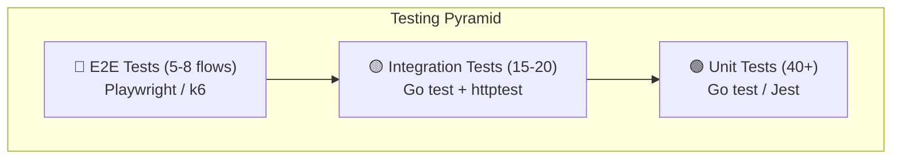

# Testing & QA Plan — MVP

## Multi-Tenant Property Information System

| Property          | Value                                                               |
| ----------------- | ------------------------------------------------------------------- |
| **Document Type** | Testing & Quality Assurance Plan                                    |
| **Version**       | 1.0.0 MVP                                                           |
| **Date**          | 2026-06-26                                                          |
| **Reference**     | `02-SRS-MVP.md`, `06-MVP-Scope-Acceptance.md`, `08-API-Contract.md` |

---

## 1. Testing Strategy

### 1.1 Testing Pyramid (MVP)



| Layer           | Tool                   | Count Target | Scope                                     |
| --------------- | ---------------------- | ------------ | ----------------------------------------- |
| **Unit**        | `go test` / `Jest`     | 40+          | Models, utils, validation, business rules |
| **Integration** | `go test` + `httptest` | 15–20        | API endpoints, middleware, DB queries     |
| **E2E**         | Playwright / k6        | 5–8 flows    | Critical user journeys end-to-end         |
| **Security**    | Manual + Script        | All SEC-\*   | Security requirements checklist           |
| **Performance** | k6                     | 3 scenarios  | Load testing critical endpoints           |

### 1.2 Test Environment Matrix

| Environment    | Purpose                | Database             | Seed Data       |
| -------------- | ---------------------- | -------------------- | --------------- |
| **Local**      | Developer testing      | Local PostgreSQL     | Auto-seeded     |
| **CI**         | Automated pipeline     | Docker PostgreSQL    | Auto-seeded     |
| **Staging**    | Pre-release validation | Dedicated PostgreSQL | Production-like |
| **Production** | Smoke tests only       | Production           | Live data       |

---

## 2. Unit Tests

### 2.1 Backend — Go Unit Tests

| #   | Package                           | Test File                  | What to Test                                                                         |
| --- | --------------------------------- | -------------------------- | ------------------------------------------------------------------------------------ |
| 1   | `utils/password_test.go`          | bcrypt hash + verify       | Hash produces valid output; CheckPassword returns true for match, false for mismatch |
| 2   | `utils/jwt_test.go`               | Token generation + parsing | Generate valid token; Parse returns correct claims; Expired token rejected           |
| 3   | `utils/pagination_test.go`        | Pagination params          | Default values; Clamp page<1; Clamp perPage>100                                      |
| 4   | `utils/response_test.go`          | Response helpers           | Success/Error structs have correct shape                                             |
| 5   | `models/property_listing_test.go` | Status helpers             | IsQuotaCounted for each status; CanBeEdited/Deleted/Submitted; IsValidTransition     |
| 6   | `models/user_test.go`             | Role constants             | All 4 role constants defined correctly                                               |
| 7   | `config/config_test.go`           | Config loader              | Default values loaded; Env overrides work; DSN format correct                        |
| 8   | `middleware/auth_test.go`         | Auth middleware            | Missing token → 401; Invalid token → 401; Valid token sets context                   |
| 9   | `middleware/rbac_test.go`         | RBAC middleware            | Wrong role → 403; Correct role → pass; Multi-role works                              |
| 10  | `handlers/auth_test.go`           | Register handler           | Valid input → 201; Duplicate email → 409; Invalid input → 422                        |
| 11  | `handlers/auth_test.go`           | Login handler              | Valid credentials → 200 + token; Wrong password → 401; Suspended → 403               |

### 2.2 Frontend — React Unit Tests

| #   | Component        | What to Test                                                                                        |
| --- | ---------------- | --------------------------------------------------------------------------------------------------- |
| 1   | `PropertyCard`   | Renders title, price, city; Shows sale/rent badge; Shows WA button; Shows save button for buyer     |
| 2   | `PropertyFilter` | Renders all filter inputs; Submit calls onFilter; Reset clears all filters                          |
| 3   | `Loading`        | Renders spinner; fullScreen variant covers viewport                                                 |
| 4   | `Navbar`         | Shows login/register when unauthenticated; Shows user menu when authenticated; Role-based nav links |
| 5   | `AuthContext`    | Login stores token; Logout clears token; Register calls API                                         |

---

## 3. Integration Tests

### 3.1 Backend API Integration Tests

All tests use `httptest.NewServer` with Gin router + test database.

| #          | Endpoint                             | Test Case                                   | Expected                           |
| ---------- | ------------------------------------ | ------------------------------------------- | ---------------------------------- |
| **INT-01** | `POST /auth/register`                | Register buyer with valid data              | 201, user created                  |
| **INT-02** | `POST /auth/register`                | Register with duplicate email               | 409                                |
| **INT-03** | `POST /auth/login`                   | Login as buyer                              | 200, valid JWT, user object        |
| **INT-04** | `POST /auth/login`                   | Login with wrong password                   | 401                                |
| **INT-05** | `GET /properties`                    | List approved properties (no auth)          | 200, paginated list                |
| **INT-06** | `GET /properties`                    | Filter by property_type=house               | 200, only houses                   |
| **INT-07** | `GET /properties/:id`                | Get approved listing detail                 | 200, full detail                   |
| **INT-08** | `GET /properties/:id`                | Get non-existent listing                    | 404                                |
| **INT-09** | `GET /me/profile`                    | Get own profile (authenticated)             | 200, user data, no password        |
| **INT-10** | `POST /salesman/listings`            | Create listing (salesman)                   | 201, draft status                  |
| **INT-11** | `POST /salesman/listings`            | Create listing (quota exceeded)             | 422, BIZ_QUOTA_EXCEEDED            |
| **INT-12** | `POST /salesman/listings/:id/submit` | Submit draft → pending                      | 200, status=pending                |
| **INT-13** | `PUT /salesman/listings/:id`         | Edit draft listing                          | 200, updated                       |
| **INT-14** | `PUT /salesman/listings/:id`         | Edit approved listing                       | 422, BIZ_LISTING_NOT_EDITABLE      |
| **INT-15** | `POST /admin/listings/:id/approve`   | Approve pending listing                     | 200, status=approved               |
| **INT-16** | `POST /admin/listings/:id/reject`    | Reject pending listing                      | 200, status=rejected               |
| **INT-17** | `POST /admin/tenants`                | Create new tenant                           | 201, tenant + admin + subscription |
| **INT-18** | `POST /admin/tenants/:id/suspend`    | Suspend tenant                              | 200, status=suspended              |
| **INT-19** | `GET /salesman/listings`             | Salesman sees own listings only             | Only salesman_id matches           |
| **INT-20** | Cross-tenant isolation               | Salesman A tries to access Tenant Y listing | 403 or 404                         |

### 3.2 Database Integration Tests

| #         | Test               | What to Verify                                                                  |
| --------- | ------------------ | ------------------------------------------------------------------------------- |
| **DB-01** | Auto-migration     | All 7 tables created with correct columns                                       |
| **DB-02** | Index verification | All FK and query indexes exist                                                  |
| **DB-03** | Unique constraints | Duplicate email rejected; Duplicate subdomain rejected; Duplicate save rejected |
| **DB-04** | Soft delete        | Deleted listing has deleted_at set; Not returned in normal queries              |
| **DB-05** | Seed data          | Count users = 10; Count tenants = 2; Count listings > 0                         |
| **DB-06** | JSONB facilities   | Store + retrieve facilities object correctly                                    |

---

## 4. End-to-End (E2E) Tests

### 4.1 Critical User Journeys (Playwright)

| #          | Flow                      | Steps                                                                                | Success Criteria                                                |
| ---------- | ------------------------- | ------------------------------------------------------------------------------------ | --------------------------------------------------------------- |
| **E2E-01** | Guest Browse              | Homepage → filter by city → filter by type → click property → view detail → click WA | WA link opens with correct message                              |
| **E2E-02** | Buyer Register + Save     | Register → login → browse → save property → view saved → unsave                      | Property appears/removes from saved list                        |
| **E2E-03** | Salesman Create Listing   | Login → dashboard → new listing → fill form → upload photo → save draft → submit     | Listing status changes draft→draft (save) then pending (submit) |
| **E2E-04** | Admin Approve             | Login admin → pending list → review listing → approve                                | Listing appears on public page                                  |
| **E2E-05** | Admin Reject              | Login admin → pending list → review listing → reject with reason                     | Rejected, salesman sees reject reason                           |
| **E2E-06** | Tenant Suspend            | Admin → tenants list → suspend tenant → login as tenant user                         | 403 Forbidden                                                   |
| **E2E-07** | Salesman Quota            | Create 5 listings (Free plan) → try create 6th                                       | 422 Quota exceeded                                              |
| **E2E-08** | Tenant Admin Add Salesman | Login tenant admin → add salesman → verify login works                               | New salesman can login and create listings                      |

---

## 5. Security Testing

### 5.1 Security Test Cases

| #          | Test                     | Method                                          | Expected                               |
| ---------- | ------------------------ | ----------------------------------------------- | -------------------------------------- |
| **SEC-01** | Password not in response | Check all user endpoints                        | No `password` or `password_hash` field |
| **SEC-02** | JWT required             | Call protected endpoint without token           | 401 AUTH_TOKEN_MISSING                 |
| **SEC-03** | Invalid JWT              | Call with tampered token                        | 401 AUTH_TOKEN_INVALID                 |
| **SEC-04** | Role escalation          | Buyer calls salesman endpoint                   | 403 AUTHZ_FORBIDDEN                    |
| **SEC-05** | Cross-tenant access      | Salesman A tries to edit Salesman B's listing   | 403                                    |
| **SEC-06** | SQL injection            | `GET /properties?city='; DROP TABLE--`          | No error, parameterized                |
| **SEC-07** | XSS in listing title     | Create listing with `<script>alert(1)</script>` | Escaped in response                    |
| **SEC-08** | Rate limit login         | 6 login attempts in 1 minute                    | 6th returns 429                        |
| **SEC-09** | File upload MIME         | Upload PDF as photo                             | 415 rejected                           |
| **SEC-10** | File upload size         | Upload 10 MB photo                              | 413 rejected                           |
| **SEC-11** | CORS origin              | Request from unauthorized origin                | No CORS allow header                   |

---

## 6. Performance Testing

### 6.1 Load Test Scenarios (k6)

| #           | Scenario       | VUs | Duration | Endpoint              | Threshold   |
| ----------- | -------------- | --- | -------- | --------------------- | ----------- |
| **PERF-01** | Listing browse | 50  | 2 min    | `GET /properties`     | p95 < 500ms |
| **PERF-02** | Listing detail | 30  | 2 min    | `GET /properties/:id` | p95 < 200ms |
| **PERF-03** | Login          | 10  | 1 min    | `POST /auth/login`    | p95 < 300ms |

### 6.2 Performance KPIs

| Metric                        | Target      | Measurement     |
| ----------------------------- | ----------- | --------------- |
| API response (list)           | p95 < 500ms | k6 / APM        |
| API response (single)         | p95 < 200ms | k6 / APM        |
| Page load (LCP)               | < 3s        | Lighthouse      |
| Time to Interactive           | < 4s        | Lighthouse      |
| Database query (listing list) | < 100ms     | EXPLAIN ANALYZE |
| Concurrent users              | 100         | k6 stress test  |

---

## 7. Regression Test Checklist (Go-Live)

### 7.1 Pre-Deployment Checklist

| #   | Check                                     | Owner  | Status |
| --- | ----------------------------------------- | ------ | ------ |
| 1   | All unit tests pass                       | Dev    | ☐      |
| 2   | All integration tests pass                | Dev    | ☐      |
| 3   | All E2E tests pass                        | QA     | ☐      |
| 4   | Security checklist (15 items) all pass    | Dev    | ☐      |
| 5   | Database indexes verified                 | Dev    | ☐      |
| 6   | No hardcoded secrets in codebase          | Dev    | ☐      |
| 7   | `.env` in `.gitignore`                    | Dev    | ☐      |
| 8   | Docker build succeeds                     | DevOps | ☐      |
| 9   | `docker compose up` runs all services     | DevOps | ☐      |
| 10  | Health check endpoints respond            | DevOps | ☐      |
| 11  | CORS configured correctly                 | Dev    | ☐      |
| 12  | HTTPS configured (production)             | DevOps | ☐      |
| 13  | Database backup configured                | DevOps | ☐      |
| 14  | Error responses consistent format         | QA     | ☐      |
| 15  | All acceptance criteria (40+ AC) verified | QA     | ☐      |

### 7.2 Go-Live Gate

| Gate   | Criteria                        | Pass? |
| ------ | ------------------------------- | ----- |
| **G1** | All P0 AC pass (100%)           | ☐     |
| **G2** | All P1 AC pass (≥90%)           | ☐     |
| **G3** | Zero critical security issues   | ☐     |
| **G4** | Performance thresholds met      | ☐     |
| **G5** | Cross-tenant isolation verified | ☐     |

---

## 8. Test Data & Fixtures

### 8.1 Default Test Users

| Role           | Email                  | Password    | Tenant              |
| -------------- | ---------------------- | ----------- | ------------------- |
| Platform Admin | `admin@propertyhub.id` | `Admin@123` | –                   |
| Tenant Admin 1 | `budi@propertijaya.id` | `Budi@123`  | PropertiJaya (Free) |
| Salesman 1     | `andi@propertijaya.id` | `Andi@123`  | PropertiJaya (Free) |
| Salesman 2     | `siti@propertijaya.id` | `Siti@123`  | PropertiJaya (Free) |
| Tenant Admin 2 | `admin@bankmaju.id`    | `Bank@123`  | BankMaju (Premium)  |
| Buyer 1        | `rina@email.com`       | `Rina@123`  | –                   |
| Buyer 2        | `doni@email.com`       | `Doni@123`  | –                   |

### 8.2 Test Listings

| #   | Status   | Property Type        | Tenant       |
| --- | -------- | -------------------- | ------------ |
| 1   | approved | house                | PropertiJaya |
| 2   | approved | apartment            | PropertiJaya |
| 3   | approved | shophouse            | PropertiJaya |
| 4   | pending  | villa                | PropertiJaya |
| 5   | draft    | land                 | PropertiJaya |
| 6   | rejected | warehouse            | PropertiJaya |
| 7   | sold     | house                | PropertiJaya |
| 8   | approved | house (bank_auction) | BankMaju     |

---

## 9. Bug Severity Classification

| Severity     | Definition                                  | SLA Fix     |
| ------------ | ------------------------------------------- | ----------- |
| **Critical** | System down, data loss, security breach     | 2 hours     |
| **High**     | Core feature broken, blocking               | 8 hours     |
| **Medium**   | Feature partially broken, workaround exists | 24 hours    |
| **Low**      | Cosmetic, minor                             | Next sprint |

---

## 10. Test Automation CI/CD

```yaml
# .github/workflows/test.yml (conceptual)
name: Test Pipeline
on: [push, pull_request]
jobs:
  backend-test:
    runs-on: ubuntu-latest
    services:
      postgres:
        image: postgres:16-alpine
        env:
          POSTGRES_USER: propertyhub
          POSTGRES_PASSWORD: test
          POSTGRES_DB: propertyhub_test
    steps:
      - uses: actions/checkout@v4
      - uses: actions/setup-go@v5
        with:
          go-version: "1.22"
      - run: go test ./... -v -cover
        working-directory: backend
  frontend-test:
    runs-on: ubuntu-latest
    steps:
      - uses: actions/checkout@v4
      - run: npm ci && npm test
        working-directory: frontend
  e2e-test:
    needs: [backend-test, frontend-test]
    runs-on: ubuntu-latest
    steps:
      - uses: actions/checkout@v4
      - run: docker compose up -d
      - uses: playwright/test@v1
```

---

_Dokumen ini adalah bagian dari Tahap 7. Lanjut ke dokumen berikutnya._
