# Business Workflows — MVP
## Multi-Tenant Property Information System

| Property | Value |
|---|---|
| **Document Type** | Business Workflow Documentation |
| **Version** | 1.0.0 MVP |
| **Date** | 2026-06-26 |
| **Reference** | `02-SRS-MVP.md`, `03-Permission-Matrix.md`, `08-API-Contract.md` |

---

## 1. Authentication & Registration Flows

### 1.1 Buyer Registration + Login

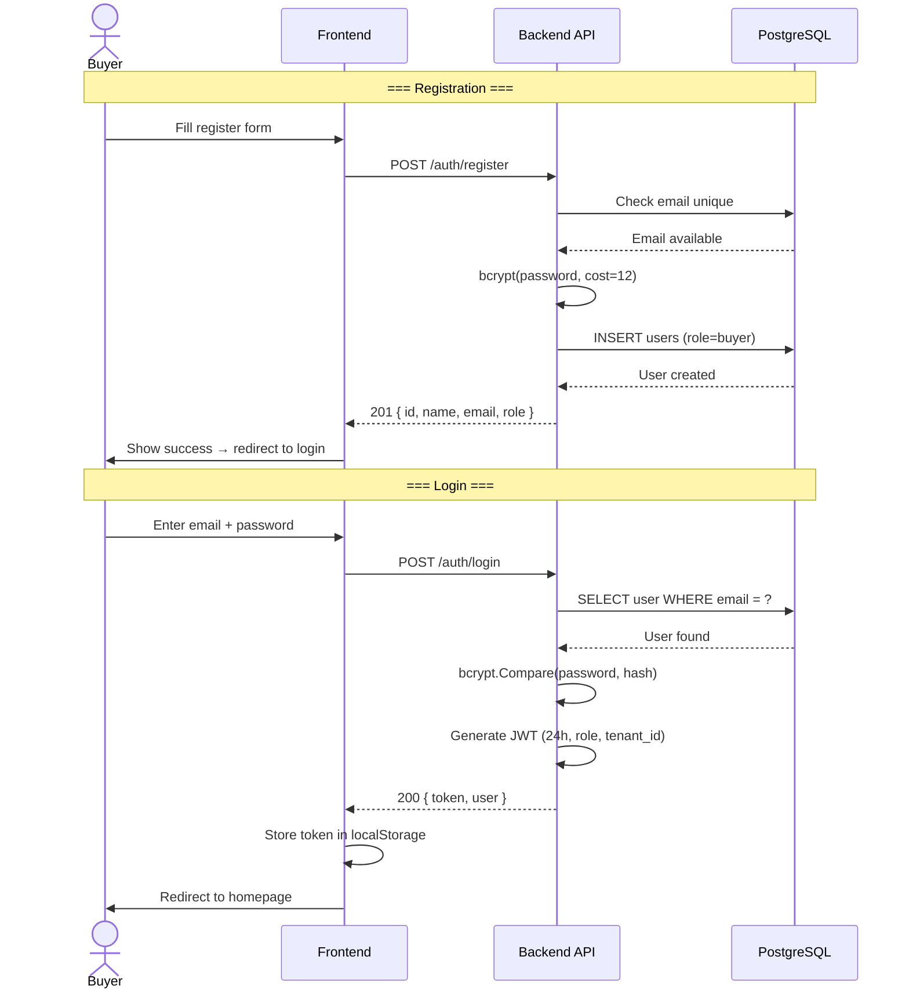
```mermaid
sequenceDiagram
    actor B as Buyer
    participant FE as Frontend
    participant API as Backend API
    participant DB as PostgreSQL

    Note over B,DB: === Registration ===
    B->>FE: Fill register form
    FE->>API: POST /auth/register
    API->>DB: Check email unique
    DB-->>API: Email available
    API->>API: bcrypt(password, cost=12)
    API->>DB: INSERT users (role=buyer)
    DB-->>API: User created
    API-->>FE: 201 { id, name, email, role }
    FE->>B: Show success → redirect to login

    Note over B,DB: === Login ===
    B->>FE: Enter email + password
    FE->>API: POST /auth/login
    API->>DB: SELECT user WHERE email = ?
    DB-->>API: User found
    API->>API: bcrypt.Compare(password, hash)
    API->>API: Generate JWT (24h, role, tenant_id)
    API-->>FE: 200 { token, user }
    FE->>FE: Store token in localStorage
    FE->>B: Redirect to homepage
```

### 1.2 Platform Admin Creates Tenant

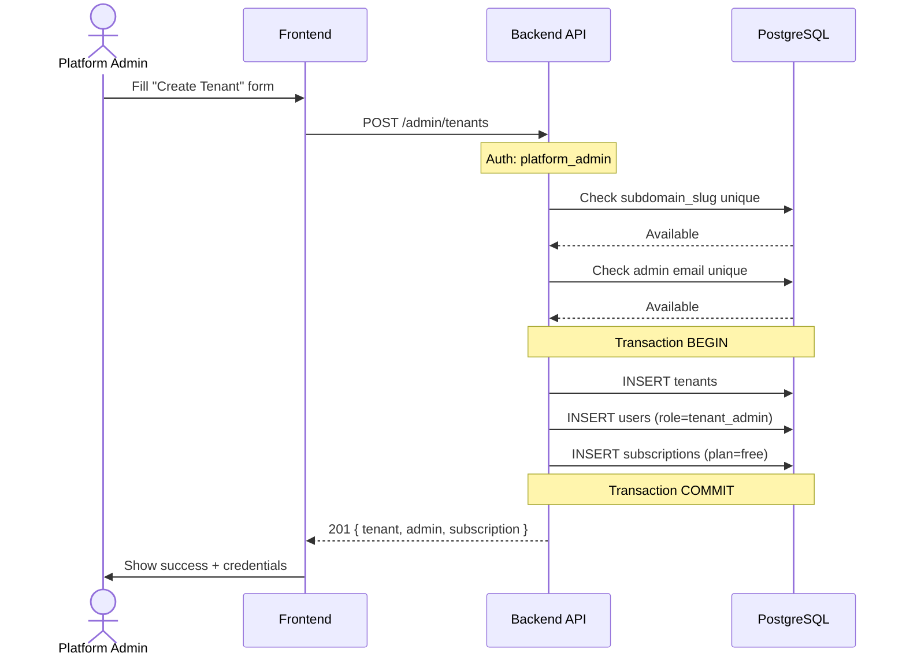
```mermaid
sequenceDiagram
    actor PA as Platform Admin
    participant FE as Frontend
    participant API as Backend API
    participant DB as PostgreSQL

    PA->>FE: Fill "Create Tenant" form
    FE->>API: POST /admin/tenants
    Note over API: Auth: platform_admin
    
    API->>DB: Check subdomain_slug unique
    DB-->>API: Available
    API->>DB: Check admin email unique
    DB-->>API: Available
    
    Note over API,DB: Transaction BEGIN
    API->>DB: INSERT tenants
    API->>DB: INSERT users (role=tenant_admin)
    API->>DB: INSERT subscriptions (plan=free)
    Note over API,DB: Transaction COMMIT
    
    API-->>FE: 201 { tenant, admin, subscription }
    FE->>PA: Show success + credentials
```

### 1.3 Tenant Admin Creates Salesman

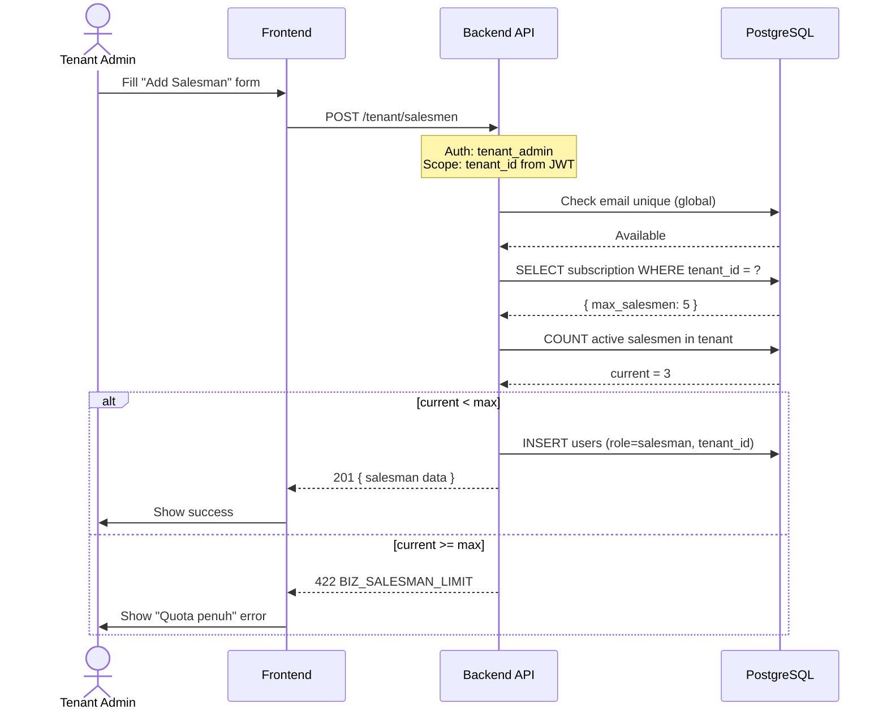
```mermaid
sequenceDiagram
    actor TA as Tenant Admin
    participant FE as Frontend
    participant API as Backend API
    participant DB as PostgreSQL

    TA->>FE: Fill "Add Salesman" form
    FE->>API: POST /tenant/salesmen
    Note over API: Auth: tenant_admin<br/>Scope: tenant_id from JWT

    API->>DB: Check email unique (global)
    DB-->>API: Available

    API->>DB: SELECT subscription WHERE tenant_id = ?
    DB-->>API: { max_salesmen: 5 }
    
    API->>DB: COUNT active salesmen in tenant
    DB-->>API: current = 3
    
    alt current < max
        API->>DB: INSERT users (role=salesman, tenant_id)
        API-->>FE: 201 { salesman data }
        FE->>TA: Show success
    else current >= max
        API-->>FE: 422 BIZ_SALESMAN_LIMIT
        FE->>TA: Show "Quota penuh" error
    end
```

---

## 2. Property Listing Lifecycle

### 2.1 Salesman Creates & Submits Listing

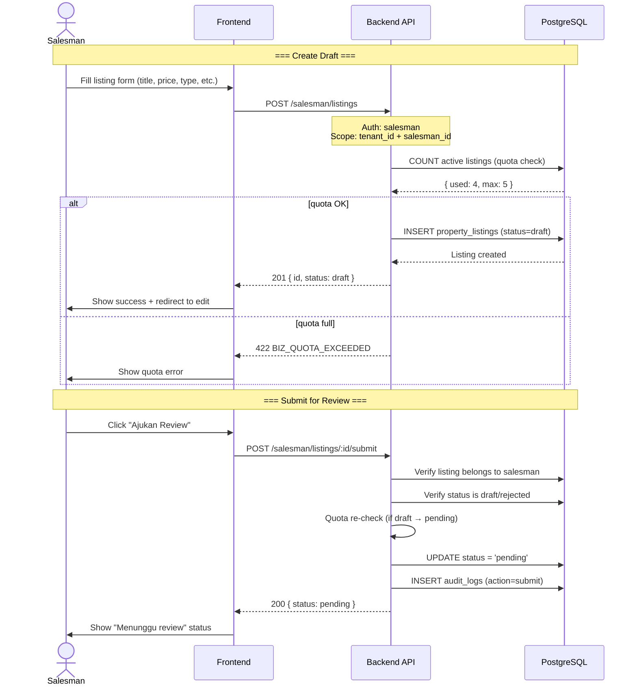
```mermaid
sequenceDiagram
    actor S as Salesman
    participant FE as Frontend
    participant API as Backend API
    participant DB as PostgreSQL

    Note over S,DB: === Create Draft ===
    S->>FE: Fill listing form (title, price, type, etc.)
    FE->>API: POST /salesman/listings
    Note over API: Auth: salesman<br/>Scope: tenant_id + salesman_id

    API->>DB: COUNT active listings (quota check)
    DB-->>API: { used: 4, max: 5 }
    alt quota OK
        API->>DB: INSERT property_listings (status=draft)
        DB-->>API: Listing created
        API-->>FE: 201 { id, status: draft }
        FE->>S: Show success + redirect to edit
    else quota full
        API-->>FE: 422 BIZ_QUOTA_EXCEEDED
        FE->>S: Show quota error
    end

    Note over S,DB: === Submit for Review ===
    S->>FE: Click "Ajukan Review"
    FE->>API: POST /salesman/listings/:id/submit
    
    API->>DB: Verify listing belongs to salesman
    API->>DB: Verify status is draft/rejected
    API->>API: Quota re-check (if draft → pending)
    API->>DB: UPDATE status = 'pending'
    API->>DB: INSERT audit_logs (action=submit)
    
    API-->>FE: 200 { status: pending }
    FE->>S: Show "Menunggu review" status
```

### 2.2 Admin Approval Workflow

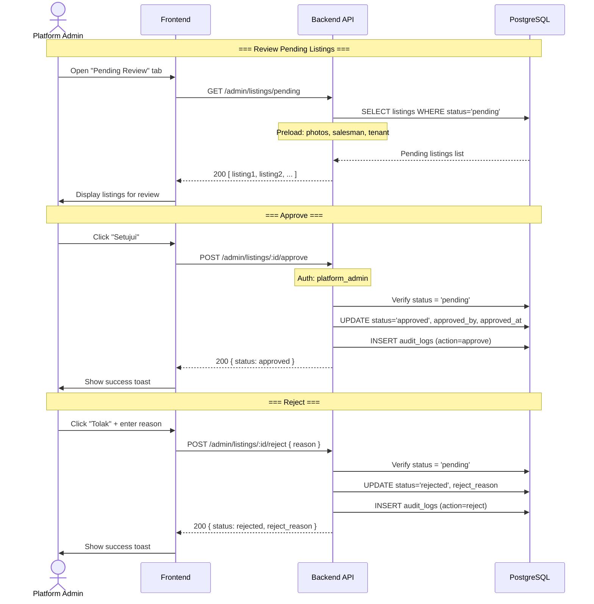
```mermaid
sequenceDiagram
    actor PA as Platform Admin
    participant FE as Frontend
    participant API as Backend API
    participant DB as PostgreSQL

    Note over PA,DB: === Review Pending Listings ===
    PA->>FE: Open "Pending Review" tab
    FE->>API: GET /admin/listings/pending
    API->>DB: SELECT listings WHERE status='pending'
    Note over API: Preload: photos, salesman, tenant
    DB-->>API: Pending listings list
    API-->>FE: 200 [ listing1, listing2, ... ]
    FE->>PA: Display listings for review

    Note over PA,DB: === Approve ===
    PA->>FE: Click "Setujui"
    FE->>API: POST /admin/listings/:id/approve
    Note over API: Auth: platform_admin
    
    API->>DB: Verify status = 'pending'
    API->>DB: UPDATE status='approved', approved_by, approved_at
    API->>DB: INSERT audit_logs (action=approve)
    API-->>FE: 200 { status: approved }
    FE->>PA: Show success toast

    Note over PA,DB: === Reject ===
    PA->>FE: Click "Tolak" + enter reason
    FE->>API: POST /admin/listings/:id/reject { reason }
    
    API->>DB: Verify status = 'pending'
    API->>DB: UPDATE status='rejected', reject_reason
    API->>DB: INSERT audit_logs (action=reject)
    API-->>FE: 200 { status: rejected, reject_reason }
    FE->>PA: Show success toast
```

### 2.3 Listing Status Lifecycle — Full State Machine

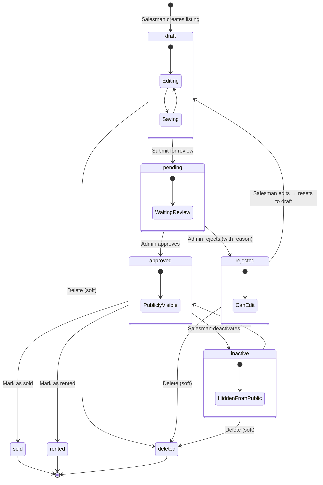
```mermaid
stateDiagram-v2
    [*] --> draft : Salesman creates listing

    state draft {
        [*] --> Editing
        Editing --> Saving
        Saving --> Editing
    }

    draft --> pending : Submit for review
    draft --> deleted : Delete (soft)

    state pending {
        [*] --> WaitingReview
    }

    pending --> approved : Admin approves
    pending --> rejected : Admin rejects (with reason)

    state rejected {
        [*] --> CanEdit
    }

    rejected --> draft : Salesman edits → resets to draft
    rejected --> deleted : Delete (soft)

    state approved {
        [*] --> PubliclyVisible
    }

    approved --> inactive : Salesman deactivates
    approved --> sold : Mark as sold
    approved --> rented : Mark as rented

    state inactive {
        [*] --> HiddenFromPublic
    }

    inactive --> approved : Reactivate
    inactive --> deleted : Delete (soft)

    sold --> [*]
    rented --> [*]
    deleted --> [*]
```

---

## 3. Public Browsing Flow

### 3.1 Guest Browses & Contacts Agent

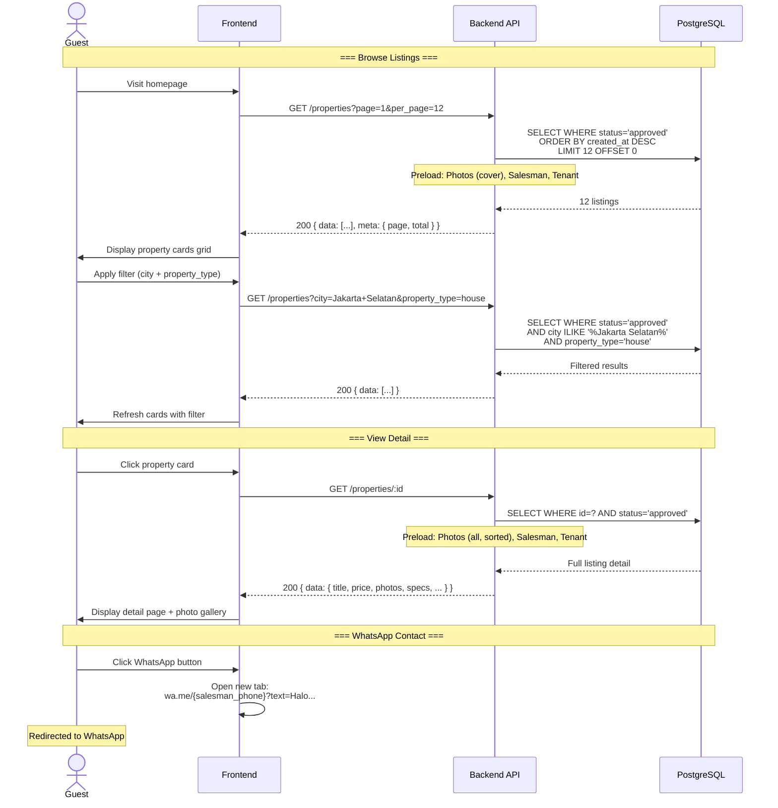
```mermaid
sequenceDiagram
    actor G as Guest
    participant FE as Frontend
    participant API as Backend API
    participant DB as PostgreSQL

    Note over G,DB: === Browse Listings ===
    G->>FE: Visit homepage
    FE->>API: GET /properties?page=1&per_page=12
    API->>DB: SELECT WHERE status='approved'<br/>ORDER BY created_at DESC<br/>LIMIT 12 OFFSET 0
    Note over API: Preload: Photos (cover), Salesman, Tenant
    DB-->>API: 12 listings
    API-->>FE: 200 { data: [...], meta: { page, total } }
    FE->>G: Display property cards grid

    G->>FE: Apply filter (city + property_type)
    FE->>API: GET /properties?city=Jakarta+Selatan&property_type=house
    API->>DB: SELECT WHERE status='approved'<br/>AND city ILIKE '%Jakarta Selatan%'<br/>AND property_type='house'
    DB-->>API: Filtered results
    API-->>FE: 200 { data: [...] }
    FE->>G: Refresh cards with filter

    Note over G,DB: === View Detail ===
    G->>FE: Click property card
    FE->>API: GET /properties/:id
    API->>DB: SELECT WHERE id=? AND status='approved'
    Note over API: Preload: Photos (all, sorted), Salesman, Tenant
    DB-->>API: Full listing detail
    API-->>FE: 200 { data: { title, price, photos, specs, ... } }
    FE->>G: Display detail page + photo gallery

    Note over G,DB: === WhatsApp Contact ===
    G->>FE: Click WhatsApp button
    FE->>FE: Open new tab:<br/>wa.me/{salesman_phone}?text=Halo...
    Note over G: Redirected to WhatsApp
```

### 3.2 Featured Properties & Nearby

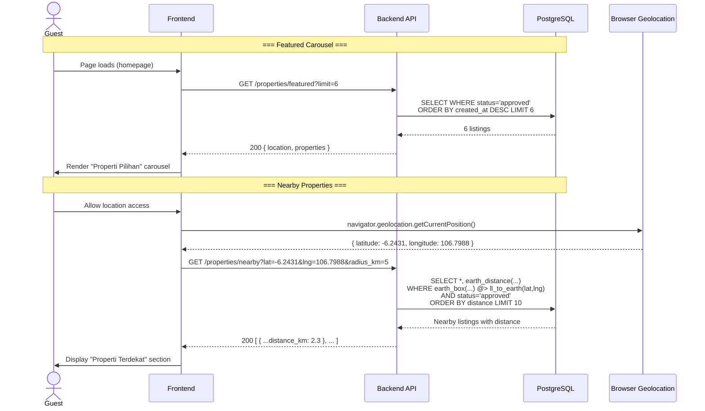
```mermaid
sequenceDiagram
    actor G as Guest
    participant FE as Frontend
    participant API as Backend API
    participant DB as PostgreSQL
    participant B as Browser Geolocation

    Note over G,DB: === Featured Carousel ===
    G->>FE: Page loads (homepage)
    FE->>API: GET /properties/featured?limit=6
    API->>DB: SELECT WHERE status='approved'<br/>ORDER BY created_at DESC LIMIT 6
    DB-->>API: 6 listings
    API-->>FE: 200 { location, properties }
    FE->>G: Render "Properti Pilihan" carousel

    Note over G,DB: === Nearby Properties ===
    G->>FE: Allow location access
    FE->>B: navigator.geolocation.getCurrentPosition()
    B-->>FE: { latitude: -6.2431, longitude: 106.7988 }
    FE->>API: GET /properties/nearby?lat=-6.2431&lng=106.7988&radius_km=5
    API->>DB: SELECT *, earth_distance(...)<br/>WHERE earth_box(...) @> ll_to_earth(lat,lng)<br/>AND status='approved'<br/>ORDER BY distance LIMIT 10
    DB-->>API: Nearby listings with distance
    API-->>FE: 200 [ { ...distance_km: 2.3 }, ... ]
    FE->>G: Display "Properti Terdekat" section
```

---

## 4. Buyer Saved Properties Flow

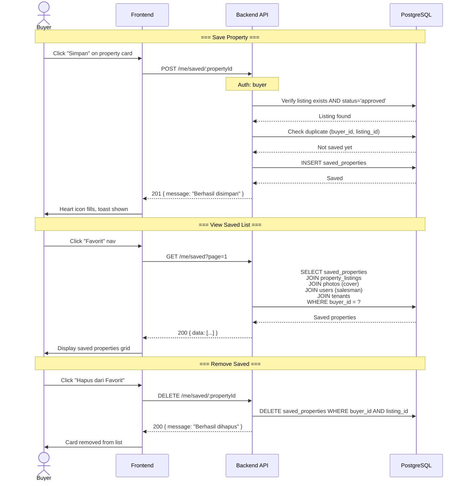
```mermaid
sequenceDiagram
    actor B as Buyer
    participant FE as Frontend
    participant API as Backend API
    participant DB as PostgreSQL

    Note over B,DB: === Save Property ===
    B->>FE: Click "Simpan" on property card
    FE->>API: POST /me/saved/:propertyId
    Note over API: Auth: buyer

    API->>DB: Verify listing exists AND status='approved'
    DB-->>API: Listing found
    
    API->>DB: Check duplicate (buyer_id, listing_id)
    DB-->>API: Not saved yet
    
    API->>DB: INSERT saved_properties
    DB-->>API: Saved
    API-->>FE: 201 { message: "Berhasil disimpan" }
    FE->>B: Heart icon fills, toast shown

    Note over B,DB: === View Saved List ===
    B->>FE: Click "Favorit" nav
    FE->>API: GET /me/saved?page=1
    API->>DB: SELECT saved_properties<br/>JOIN property_listings<br/>JOIN photos (cover)<br/>JOIN users (salesman)<br/>JOIN tenants<br/>WHERE buyer_id = ?
    DB-->>API: Saved properties
    API-->>FE: 200 { data: [...] }
    FE->>B: Display saved properties grid

    Note over B,DB: === Remove Saved ===
    B->>FE: Click "Hapus dari Favorit"
    FE->>API: DELETE /me/saved/:propertyId
    API->>DB: DELETE saved_properties WHERE buyer_id AND listing_id
    API-->>FE: 200 { message: "Berhasil dihapus" }
    FE->>B: Card removed from list
```

---

## 5. Tenant Management Flows

### 5.1 Tenant Suspend / Activate

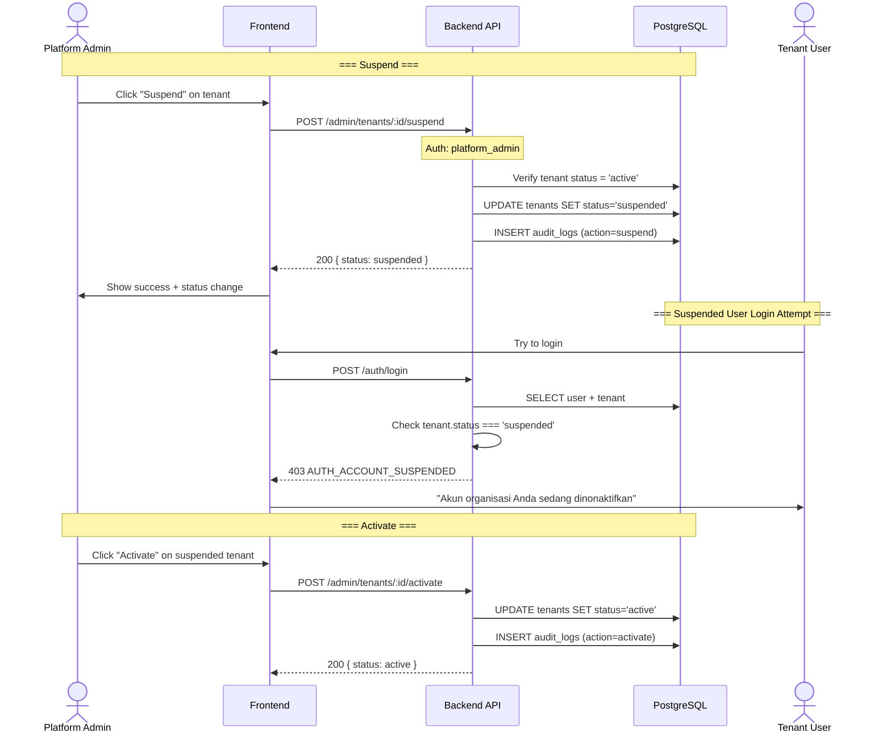
```mermaid
sequenceDiagram
    actor PA as Platform Admin
    participant FE as Frontend
    participant API as Backend API
    participant DB as PostgreSQL
    actor TU as Tenant User

    Note over PA,DB: === Suspend ===
    PA->>FE: Click "Suspend" on tenant
    FE->>API: POST /admin/tenants/:id/suspend
    Note over API: Auth: platform_admin

    API->>DB: Verify tenant status = 'active'
    API->>DB: UPDATE tenants SET status='suspended'
    API->>DB: INSERT audit_logs (action=suspend)
    API-->>FE: 200 { status: suspended }
    FE->>PA: Show success + status change

    Note over TU,DB: === Suspended User Login Attempt ===
    TU->>FE: Try to login
    FE->>API: POST /auth/login
    API->>DB: SELECT user + tenant
    API->>API: Check tenant.status === 'suspended'
    API-->>FE: 403 AUTH_ACCOUNT_SUSPENDED
    FE->>TU: "Akun organisasi Anda sedang dinonaktifkan"

    Note over PA,DB: === Activate ===
    PA->>FE: Click "Activate" on suspended tenant
    FE->>API: POST /admin/tenants/:id/activate
    API->>DB: UPDATE tenants SET status='active'
    API->>DB: INSERT audit_logs (action=activate)
    API-->>FE: 200 { status: active }
```

### 5.2 Tenant Plan Upgrade

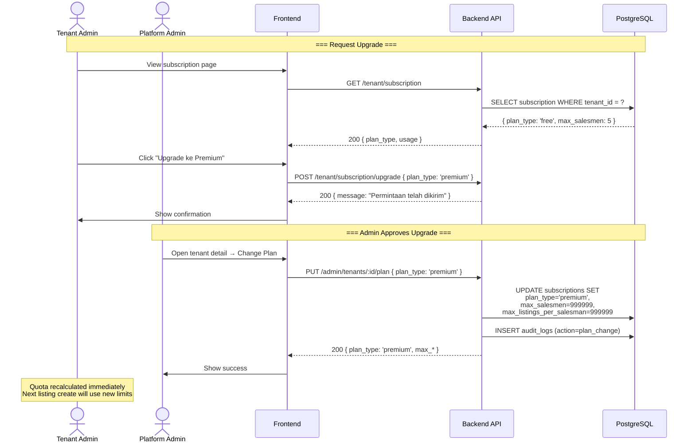
```mermaid
sequenceDiagram
    actor TA as Tenant Admin
    actor PA as Platform Admin
    participant FE as Frontend
    participant API as Backend API
    participant DB as PostgreSQL

    Note over TA,DB: === Request Upgrade ===
    TA->>FE: View subscription page
    FE->>API: GET /tenant/subscription
    API->>DB: SELECT subscription WHERE tenant_id = ?
    DB-->>API: { plan_type: 'free', max_salesmen: 5 }
    API-->>FE: 200 { plan_type, usage }

    TA->>FE: Click "Upgrade ke Premium"
    FE->>API: POST /tenant/subscription/upgrade { plan_type: 'premium' }
    API-->>FE: 200 { message: "Permintaan telah dikirim" }
    FE->>TA: Show confirmation

    Note over PA,DB: === Admin Approves Upgrade ===
    PA->>FE: Open tenant detail → Change Plan
    FE->>API: PUT /admin/tenants/:id/plan { plan_type: 'premium' }
    API->>DB: UPDATE subscriptions SET<br/>plan_type='premium',<br/>max_salesmen=999999,<br/>max_listings_per_salesman=999999
    API->>DB: INSERT audit_logs (action=plan_change)
    API-->>FE: 200 { plan_type: 'premium', max_* }
    FE->>PA: Show success

    Note over TA: Quota recalculated immediately<br/>Next listing create will use new limits
```

---

## 6. Quota Enforcement Flow

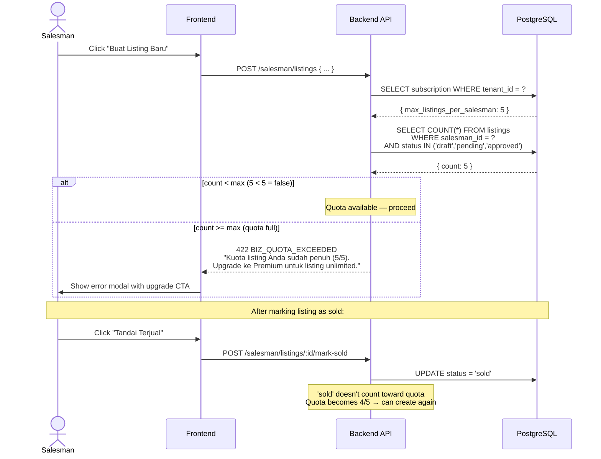
```mermaid
sequenceDiagram
    actor S as Salesman
    participant FE as Frontend
    participant API as Backend API
    participant DB as PostgreSQL

    S->>FE: Click "Buat Listing Baru"
    FE->>API: POST /salesman/listings { ... }
    
    API->>DB: SELECT subscription WHERE tenant_id = ?
    DB-->>API: { max_listings_per_salesman: 5 }
    
    API->>DB: SELECT COUNT(*) FROM listings<br/>WHERE salesman_id = ?<br/>AND status IN ('draft','pending','approved')
    DB-->>API: { count: 5 }

    alt count < max (5 < 5 = false)
        Note over API: Quota available — proceed
    else count >= max (quota full)
        API-->>FE: 422 BIZ_QUOTA_EXCEEDED<br/>"Kuota listing Anda sudah penuh (5/5).<br/>Upgrade ke Premium untuk listing unlimited."
        FE->>S: Show error modal with upgrade CTA
    end

    Note over S,DB: After marking listing as sold:
    S->>FE: Click "Tandai Terjual"
    FE->>API: POST /salesman/listings/:id/mark-sold
    API->>DB: UPDATE status = 'sold'
    Note over API: 'sold' doesn't count toward quota<br/>Quota becomes 4/5 → can create again
```

---

## 7. Audit Logging Flow

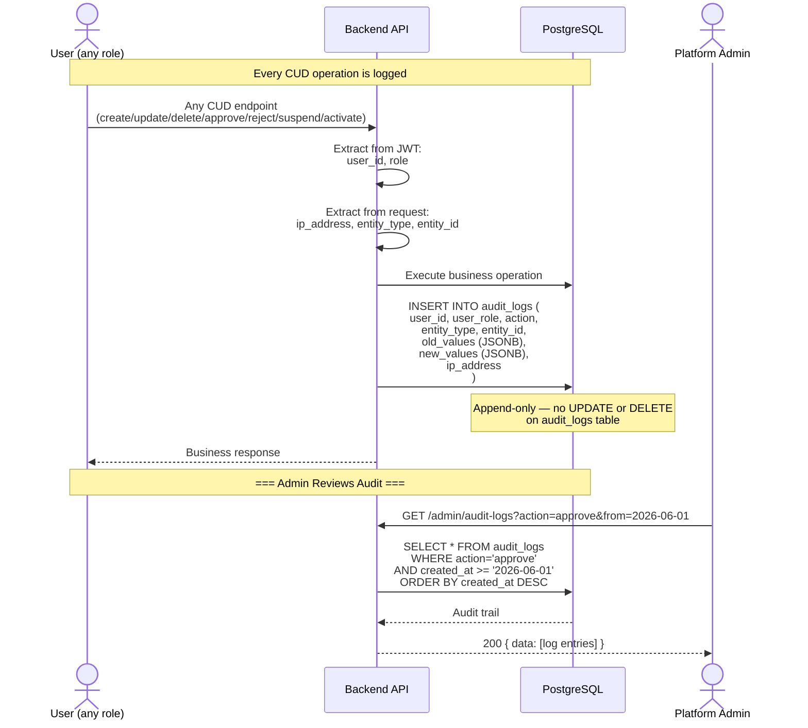
```mermaid
sequenceDiagram
    actor U as User (any role)
    participant API as Backend API
    participant DB as PostgreSQL

    Note over U,DB: Every CUD operation is logged

    U->>API: Any CUD endpoint<br/>(create/update/delete/approve/reject/suspend/activate)

    API->>API: Extract from JWT:<br/>user_id, role
    API->>API: Extract from request:<br/>ip_address, entity_type, entity_id

    API->>DB: Execute business operation

    API->>DB: INSERT INTO audit_logs (<br/>  user_id, user_role, action,<br/>  entity_type, entity_id,<br/>  old_values (JSONB),<br/>  new_values (JSONB),<br/>  ip_address<br/>)

    Note over DB: Append-only — no UPDATE or DELETE<br/>on audit_logs table

    API-->>U: Business response

    Note over U,DB: === Admin Reviews Audit ===
    actor PA as Platform Admin
    PA->>API: GET /admin/audit-logs?action=approve&from=2026-06-01
    API->>DB: SELECT * FROM audit_logs<br/>WHERE action='approve'<br/>AND created_at >= '2026-06-01'<br/>ORDER BY created_at DESC
    DB-->>API: Audit trail
    API-->>PA: 200 { data: [log entries] }
```

---

## 8. Multi-Tenant Data Isolation

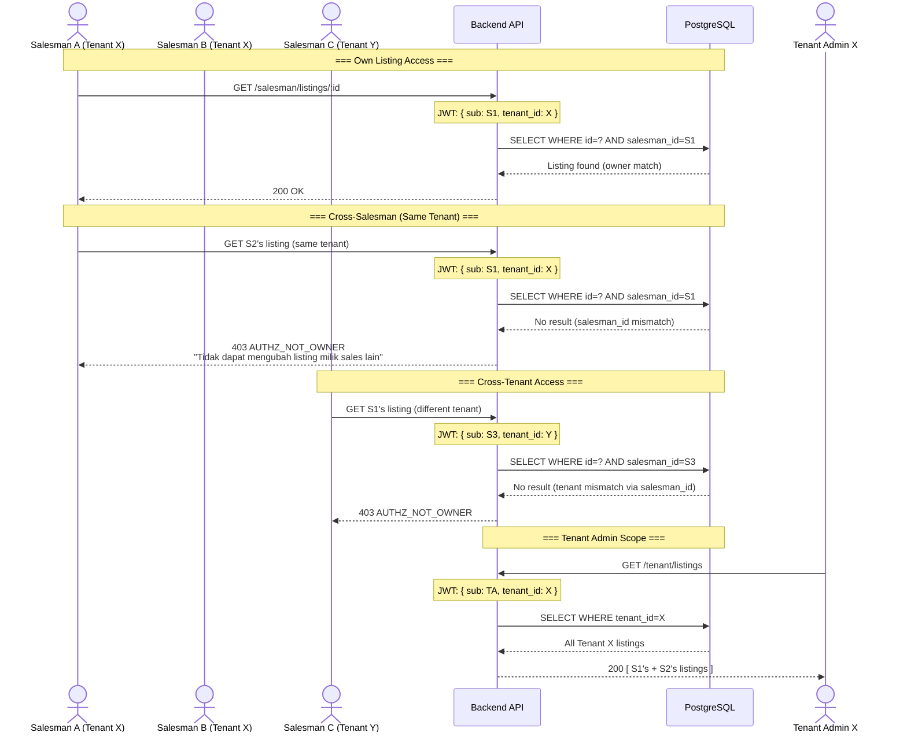
```mermaid
sequenceDiagram
    actor S1 as Salesman A (Tenant X)
    actor S2 as Salesman B (Tenant X)
    actor S3 as Salesman C (Tenant Y)
    participant API as Backend API
    participant DB as PostgreSQL

    Note over S1,DB: === Own Listing Access ===
    S1->>API: GET /salesman/listings/:id
    Note over API: JWT: { sub: S1, tenant_id: X }
    API->>DB: SELECT WHERE id=? AND salesman_id=S1
    DB-->>API: Listing found (owner match)
    API-->>S1: 200 OK

    Note over S1,DB: === Cross-Salesman (Same Tenant) ===
    S1->>API: GET S2's listing (same tenant)
    Note over API: JWT: { sub: S1, tenant_id: X }
    API->>DB: SELECT WHERE id=? AND salesman_id=S1
    DB-->>API: No result (salesman_id mismatch)
    API-->>S1: 403 AUTHZ_NOT_OWNER<br/>"Tidak dapat mengubah listing milik sales lain"

    Note over S3,DB: === Cross-Tenant Access ===
    S3->>API: GET S1's listing (different tenant)
    Note over API: JWT: { sub: S3, tenant_id: Y }
    API->>DB: SELECT WHERE id=? AND salesman_id=S3
    DB-->>API: No result (tenant mismatch via salesman_id)
    API-->>S3: 403 AUTHZ_NOT_OWNER

    Note over API,DB: === Tenant Admin Scope ===
    actor TA as Tenant Admin X
    TA->>API: GET /tenant/listings
    Note over API: JWT: { sub: TA, tenant_id: X }
    API->>DB: SELECT WHERE tenant_id=X
    DB-->>API: All Tenant X listings
    API-->>TA: 200 [ S1's + S2's listings ]
```

---

## 9. Photo Upload & Watermark Flow

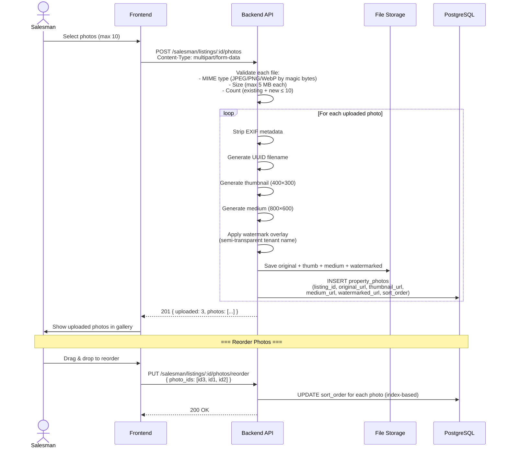
```mermaid
sequenceDiagram
    actor S as Salesman
    participant FE as Frontend
    participant API as Backend API
    participant FS as File Storage
    participant DB as PostgreSQL

    S->>FE: Select photos (max 10)
    FE->>API: POST /salesman/listings/:id/photos<br/>Content-Type: multipart/form-data

    API->>API: Validate each file:<br/>- MIME type (JPEG/PNG/WebP by magic bytes)<br/>- Size (max 5 MB each)<br/>- Count (existing + new ≤ 10)

    loop For each uploaded photo
        API->>API: Strip EXIF metadata
        API->>API: Generate UUID filename
        API->>API: Generate thumbnail (400×300)
        API->>API: Generate medium (800×600)
        API->>API: Apply watermark overlay<br/>(semi-transparent tenant name)
        API->>FS: Save original + thumb + medium + watermarked
        API->>DB: INSERT property_photos<br/>(listing_id, original_url, thumbnail_url,<br/>medium_url, watermarked_url, sort_order)
    end

    API-->>FE: 201 { uploaded: 3, photos: [...] }
    FE->>S: Show uploaded photos in gallery

    Note over S,DB: === Reorder Photos ===
    S->>FE: Drag & drop to reorder
    FE->>API: PUT /salesman/listings/:id/photos/reorder<br/>{ photo_ids: [id3, id1, id2] }
    API->>DB: UPDATE sort_order for each photo (index-based)
    API-->>FE: 200 OK
```

---

## 10. Error Handling Flow

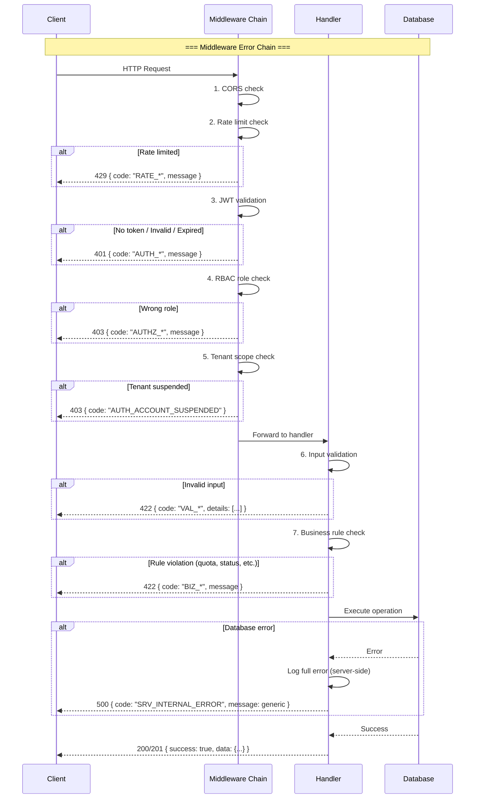
```mermaid
sequenceDiagram
    participant C as Client
    participant MW as Middleware Chain
    participant H as Handler
    participant DB as Database

    Note over C,DB: === Middleware Error Chain ===

    C->>MW: HTTP Request
    MW->>MW: 1. CORS check
    MW->>MW: 2. Rate limit check
    
    alt Rate limited
        MW-->>C: 429 { code: "RATE_*", message }
    end

    MW->>MW: 3. JWT validation
    
    alt No token / Invalid / Expired
        MW-->>C: 401 { code: "AUTH_*", message }
    end

    MW->>MW: 4. RBAC role check
    
    alt Wrong role
        MW-->>C: 403 { code: "AUTHZ_*", message }
    end

    MW->>MW: 5. Tenant scope check
    
    alt Tenant suspended
        MW-->>C: 403 { code: "AUTH_ACCOUNT_SUSPENDED" }
    end

    MW->>H: Forward to handler
    H->>H: 6. Input validation
    
    alt Invalid input
        H-->>C: 422 { code: "VAL_*", details: [...] }
    end

    H->>H: 7. Business rule check
    
    alt Rule violation (quota, status, etc.)
        H-->>C: 422 { code: "BIZ_*", message }
    end

    H->>DB: Execute operation
    
    alt Database error
        DB-->>H: Error
        H->>H: Log full error (server-side)
        H-->>C: 500 { code: "SRV_INTERNAL_ERROR", message: generic }
    end

    DB-->>H: Success
    H-->>C: 200/201 { success: true, data: {...} }
```

---

## 11. Complete End-to-End: Listing Goes Live

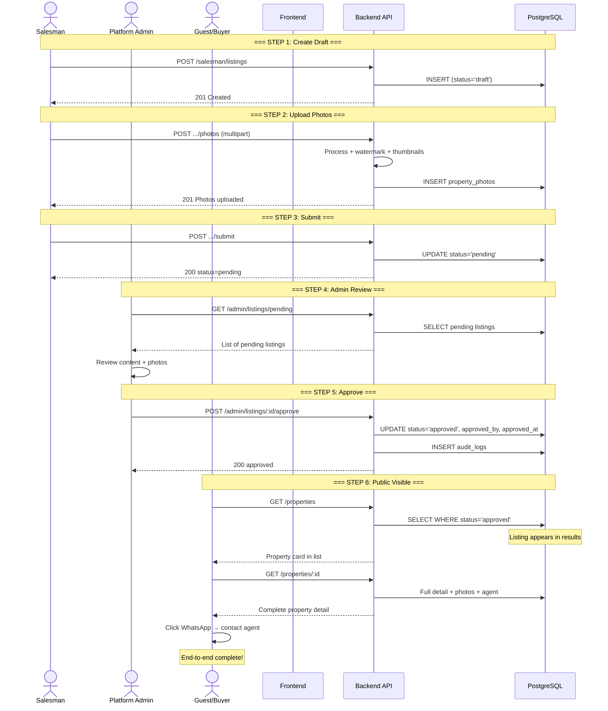
```mermaid
sequenceDiagram
    actor S as Salesman
    actor PA as Platform Admin
    actor G as Guest/Buyer
    participant FE as Frontend
    participant API as Backend API
    participant DB as PostgreSQL

    Note over S,DB: === STEP 1: Create Draft ===
    S->>API: POST /salesman/listings
    API->>DB: INSERT (status='draft')
    API-->>S: 201 Created

    Note over S,DB: === STEP 2: Upload Photos ===
    S->>API: POST .../photos (multipart)
    API->>API: Process + watermark + thumbnails
    API->>DB: INSERT property_photos
    API-->>S: 201 Photos uploaded

    Note over S,DB: === STEP 3: Submit ===
    S->>API: POST .../submit
    API->>DB: UPDATE status='pending'
    API-->>S: 200 status=pending

    Note over PA,DB: === STEP 4: Admin Review ===
    PA->>API: GET /admin/listings/pending
    API->>DB: SELECT pending listings
    API-->>PA: List of pending listings
    PA->>PA: Review content + photos

    Note over PA,DB: === STEP 5: Approve ===
    PA->>API: POST /admin/listings/:id/approve
    API->>DB: UPDATE status='approved', approved_by, approved_at
    API->>DB: INSERT audit_logs
    API-->>PA: 200 approved

    Note over G,DB: === STEP 6: Public Visible ===
    G->>API: GET /properties
    API->>DB: SELECT WHERE status='approved'
    Note over DB: Listing appears in results
    API-->>G: Property card in list

    G->>API: GET /properties/:id
    API->>DB: Full detail + photos + agent
    API-->>G: Complete property detail

    G->>G: Click WhatsApp → contact agent
    Note over G: End-to-end complete!
```

---

*Dokumen ini adalah Tahap 8. Lanjut ke Tahap 9 setelah mengetik: **LANJUT**.*
